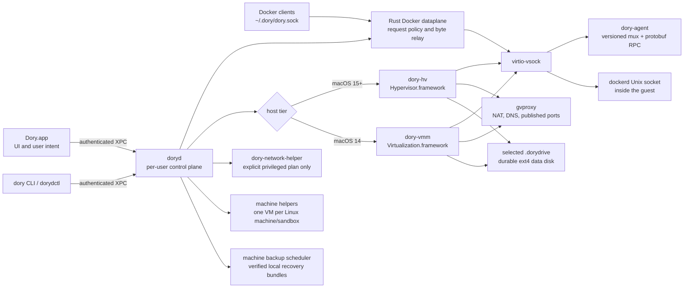

# Dory architecture

This document describes the production architecture for Dory 0.4. It is the source of truth for
which process owns a resource, how Docker traffic reaches Linux, what changes on macOS 14, and where
the security boundaries are. Prototype and historical paths are intentionally excluded.

## Supported host contract

Dory supports Apple-silicon Macs running macOS 14 or later. macOS 15 and later use Dory's
Hypervisor.framework helper. macOS 14 uses the bundled Virtualization.framework helper against the
same signed kernel, root filesystem, guest agent, data drive, Docker dataplane, and daemon control
contract. Intel builds are not published until they have dedicated physical qualification.

The normal local runtime is always owned by `doryd`. The app may also connect to an explicitly
selected external Docker-compatible Unix socket, but the app does not own a second local Dory
engine implementation.

## Production topology

## Ownership and lifecycle

| Layer | Owner | Durable state | Contract |
|---|---|---|---|
| App and settings UI | `Dory.app` | User preferences and component selection | Presents state and submits user intent; it does not bind the Docker socket or launch a competing local engine. |
| Local control plane | `doryd` LaunchAgent | `~/.dory` policy, incidents, readiness, upgrade recovery records | Owns engine lifecycle, repair budgets, machines, health, networking reconciliation, and the Docker socket. XPC peers must be the effective user and production Dory signing identity. |
| Docker dataplane | Rust `DoryCore` inside `doryd` | None | Owns `~/.dory/dory.sock`, classifies every HTTP request, applies create-time policy, preserves hijack/half-close behavior, and relays bytes over the private guest path. |
| macOS 15+ VM | `dory-hv` | Only state explicitly placed on the selected drive | Raw Hypervisor.framework VM, virtio devices, host shares, guest channels, and gvproxy integration. The helper is signed with the virtualization entitlement; the GUI app is not. |
| macOS 14 VM | `dory-vmm` | Same selected drive and workload format | Virtualization.framework fallback. It uses the same guest protocol and Docker API contract; release claims require a separate physical Sonoma gate. |
| Guest control | `dory-agent` | No host credentials; short-lived policy material is on tmpfs | One versioned handshake/multiplexer/protobuf implementation for readiness, clock, ports, telemetry, exec, mount policy, sandbox policy, and Docker byte streams. |
| Guest engine | `dockerd` and `containerd` | Docker data on the selected drive | Listens on a private Unix socket only. There is no unauthenticated guest-network TCP Docker endpoint. |
| Userspace network | provenance-pinned `gvproxy` | Runtime state only | Guest NAT/DNS, native IPv6 where available, and published ports. LAN/Tailscale source-preserving rules are explicit qualified modes. |
| Privileged host network | `dory-network-helper` | Approved resolver/PF files | Executes one re-derived, tamper-checked authorization plan. It does not accept arbitrary commands and is not used for ordinary Docker control. |
| Durable storage | selected `.dorydrive` | Images, containers, volumes, networks, machine disks, snapshots | Identified by manifest and volume identity, not by a convenient path alone. Missing, substituted, concurrent, or undersized drives fail closed. App uninstall preserves the drive unless workload deletion is separately confirmed. |
| Machine backup scheduler | `doryd` | Owner-only schedule/status database and verified local `.dorymachine` bundles | Creates scheduler-owned snapshots, verifies every exported bundle by re-import, periodically boots a disposable verifier, publishes archives atomically, recovers interrupted state, and never retains or deletes manual snapshots. |
| Optional components | signed component store on the selected drive | Current and one prior verified generation | Catalog, signature, digest, architecture, and version are checked before atomic activation. Rollback restores only a previously verified generation. |

## Docker request path

1. A Docker client connects to the same-user `0600` Unix socket at `~/.dory/dory.sock`.
2. The Rust dataplane classifies each request, including requests reused on keep-alive connections.
   It enforces Dory's host-gateway, port-binding, and unsupported-GPU rules before forwarding.
3. The dataplane opens a private forwarding stream to the selected VM helper. It never exposes
   Docker on guest TCP 2375.
4. The helper connects the stream to dockerd's guest Unix socket over the captive vsock path.
5. Hijacked streams preserve directional half-close so attach, exec, build, and stdin EOF behave
   like a native Docker Unix socket.

The GUI and CLI use the same socket and daemon state. An external backend is a separate, explicit
mode and does not receive Dory-only VM, sandbox, data-drive, or repair guarantees.

## Boot, wake, and repair

Readiness is a versioned nine-stage state machine: app, doryd, VM process, guest agent, mounts/data
disk, network, dockerd, host socket/context, and optional Kubernetes. Every stage has a reason code,
deadline, elapsed time, owner, and bounded repair. A running VM is not considered ready until the
required Docker API probe succeeds.

Automatic recovery is deliberately narrow. Dory may reconnect a stale guest-agent channel, replace
only the host socket forwarder, restart dockerd with live-restore, reconcile routes/ports, or
revalidate the selected drive. It does not delete workloads, reset the VM, prune data, or substitute
a missing drive to make a health indicator green.

## Storage and update safety

The selected data drive is outside the replaceable app bundle and transient runtime directory.
Backup, restore, growth, migration, and external-media operations verify identity and capacity before
mutation. Destructive reclaim stays preview-only until the exact object list and conservative
recovery estimate are shown.

Machine backup schedules are a separate local recovery layer owned by doryd. A scheduled run may
briefly stop a running source machine while taking a consistent snapshot, then restores its prior
state. It exports to a private partial file, fsyncs it, verifies the bundle through the production
import path, optionally boots a disposable verifier, and only then atomically publishes the archive.
Retention is namespace-scoped to scheduler-created snapshots and archives. Dory does not provide or
claim managed remote/offsite backup in 0.4.

App and component updates use a durable transaction journal:

1. validate the Sparkle feed, Ed25519 enclosure signature declaration, archive validation, free
   space, readable schema interval, selected drive, and component compatibility;
2. record the exact app, config, component generation, and verified data-snapshot reference;
3. arm the journal before Sparkle takes control and activate components atomically;
4. on the next launch, verify the Docker API, immutable volume marker, pre-existing container and
   published port, plus Kubernetes when enabled;
5. on failure, restore the exact prior app, configuration, and verified component generation only
   when the durable schema remains readable;
6. never guess at a durable-data downgrade. If schema rollback is unsafe, stop and produce an
   owner-only recovery export and guided recovery state.

## Trust boundaries

- **User to daemon:** XPC is same-user and production-signature authenticated. Plist-safe messages
  are validation inputs, not authority to execute arbitrary host commands.
- **Daemon to VM helpers:** helpers are exact signed release payloads selected by OS capability.
  Private sockets are owner-only; handoff messages and file descriptors are accepted only on the
  daemon-owned channel.
- **Host to guest:** one Rust handshake/mux/protobuf protocol is shared by raw-HV, VZ, and remote
  transports. Size, version, deadline, and identity checks fail closed.
- **Container boundary:** containers can reach Docker only through normal in-guest client access
  explicitly mounted by the user. An ordinary container and LAN peer cannot reach an unauthenticated
  host or guest Docker control endpoint.
- **Privileged boundary:** the GUI has no virtualization, JIT, or unsigned-executable entitlements.
  Virtualization is confined to VMM helpers; root-owned network mutations require an explicit,
  re-derived authorization plan.
- **Host filesystem boundary:** the Docker VM shares only configured paths. Agent sandboxes share no
  host files by default and use read-only mounts unless a writable grant is explicit.
- **Credential boundary:** credentials are never ambient sandbox state. Scoped secrets, SSH-agent
  grants, registry CAs, and proxy material are explicit, ephemeral, owner-only, and redacted from
  support evidence.

See [`SANDBOX_THREAT_MODEL.md`](SANDBOX_THREAT_MODEL.md) for the adversarial agent-workload model and
[`MACHINE_IMAGE_CONTRACT.md`](MACHINE_IMAGE_CONTRACT.md) for custom Linux machine image limits.

## Capability status

| Capability | Status | Exact boundary |
|---|---|---|
| Docker/Compose/Buildx on Apple silicon | **Supported** | Dory-owned local engine on macOS 14+; exact release qualification is required for each candidate. |
| macOS 15+ raw-HV engine | **Supported** | Apple-silicon releases; Hypervisor.framework helper. |
| macOS 14 VZ fallback | **Supported** | Same product contract, separately qualified on a physical Sonoma Mac. |
| External Docker-compatible socket | **Supported** | Docker UI/client operations only; Dory VM, storage, sandbox, and repair guarantees do not transfer to the external engine. |
| Agent sandbox VM | **Supported** | Dedicated VM, non-root default, no ambient mounts/network/credentials, policy-controlled egress and caps. |
| Build Activity | **Supported** | Durable status, logs, cache use, and cancellation for builds launched by Dory; unrelated client builds are observed only through normal Docker surfaces. |
| Exact-selection migration | **Supported** | Dependency-closed selection, selected-scope validation, transactional rollback, source-drift rejection, and complete selected/verified/omitted evidence. |
| Scheduled local machine backup | **Supported** | Verified local bundles, periodic disposable boot proof, scheduler-owned retention, app/CLI status and run-now controls. |
| Managed remote/offsite machine backup | **Unavailable** | No hosted or S3 backup claim in 0.4. |
| Dory control MCP | **Supported** | Local stdio control surface; read-only mode, machine execution, waits, and events. |
| Third-party MCP catalog/gateway | **Unavailable** | The control MCP does not discover, configure, proxy, or broker third-party MCP servers. |
| Image update discovery/replacement | **Unavailable** | Pulling by reference is supported; fleet update availability and transactional replacement are post-0.4 designs. |
| mDNS/multicast relay and L2 bridge | **Unavailable** | 0.4 provides routed/source-preserving LAN access, not general broadcast-domain membership. |
| Host USB discovery | **Supported** | Read-only device discovery and diagnostics. |
| USB attach/detach/replay | **Unavailable** | Hidden and fail-closed until the guest USB/IP RPC and physical qualification exist. |
| Venus/Vulkan GPU | **Preview** | Apple-silicon raw-HV path only; opt-in and not a stable general GPU contract. |
| Remote machine over SSH | **Preview** | Host-key-pinned control and host-authoritative push exist; full workspace reconnect/conflict UX is not a supported 0.4 promise. |
| Custom Linux machine kernel/rootfs | **Preview** | Must satisfy `MACHINE_IMAGE_CONTRACT.md`; no arbitrary ISO installation or custom-kernel support promise. |
| Intel host release | **Unavailable** | No public build until dedicated physical qualification. |
| Windows/Linux host app | **Unavailable** | Dory is a macOS product. |

## Release evidence

Source tests prove contracts; they do not qualify a binary. A public release is blocked until the
notarized candidate and all bundled helpers, guest assets, components, update payload, SBOM, and
release manifest are hash-bound and pass the physical and duration gates in
[`RELEASE_READINESS.md`](RELEASE_READINESS.md). Performance methodology and publication rules live in
[`PERFORMANCE_QUALIFICATION.md`](PERFORMANCE_QUALIFICATION.md).

Designs that are intentionally outside the 0.4 capability contract—including safe custom-image
import, remote workspaces, image updates, an MCP gateway, bounded mDNS relay, and GPU stabilization—
live in [`POST_V0.4_PRODUCT_DESIGNS.md`](POST_V0.4_PRODUCT_DESIGNS.md).
