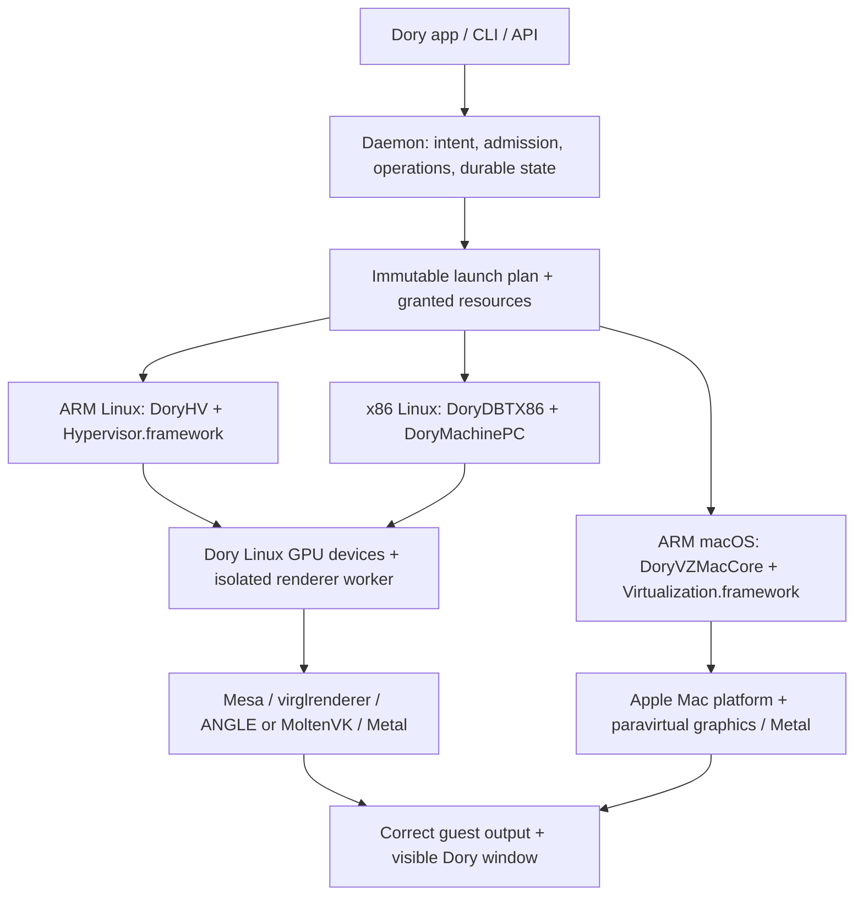

# Dory — five-part implementation plan for GPU-accelerated virtual machines

Reviewed and rewritten on **2026-09-12**, starting from commit **7425872c2** and the existing uncommitted changes. This is the single implementation guide. Historical receipts remain historical; they do not become current qualification when this document is edited.

**Finish line:** on Apple Silicon Macs, a user can install, run, update, recover and use **Linux ARM64, Linux x86_64 and macOS ARM64** virtual machines through the shipped Dory app and CLI. Both Linux architectures run their own kernels and ordinary distributions. All three guest families have demonstrated hardware GPU execution and usable graphical desktops. Dory builds and operates the infrastructure. There is **no QEMU executable, linked execution backend, image-tool dependency, hidden fallback or required QEMU service**.

The agreed ownership boundary permits Apple Hypervisor.framework, Virtualization.framework and Metal, and maintained upstream dependencies including EDK2, Mesa, virglrenderer, ANGLE and MoltenVK. Dory owns its product, daemon, Linux machine models, device integration, full-system x86 translator, resource management, lifecycle, storage and delivery. Apple supplies the supported macOS machine platform and paravirtual graphics implementation. Building dependencies from pinned source is not the same as authoring those dependencies.

This plan has exactly five main parts:

1. [Correct the baseline and finish the current review](#part-1--correct-the-baseline-and-finish-the-current-review).
2. [Complete the Linux machines and execution engines](#part-2--complete-the-linux-machines-and-execution-engines).
3. [Deliver hardware graphics on both Linux architectures](#part-3--deliver-hardware-graphics-on-both-linux-architectures).
4. [Complete macOS and the everyday VM product](#part-4--complete-macos-and-the-everyday-vm-product).
5. [Qualify, harden and ship the complete infrastructure](#part-5--qualify-harden-and-ship-the-complete-infrastructure).

Part numbers organize the work; they do not prohibit parallel work. Once 1.5 establishes the accepted review baseline, native ARM lifecycle, x86 correctness/performance, Linux GPU integration and Mac installation can advance independently while 1.6–1.8 finish artifact and campaign qualification. Integrate a working vertical slice early for each guest family. Finish Part 5 only after every required product capability passes.

## Part 1 — Correct the baseline and finish the current review

**Outcome:** a reproducible, honest starting point, reviewed current changes, a stable production configuration, an explicit list of remaining defects, and a usable engineering qualification path. “Clean slate” means known state and no untriaged regression in the admitted baseline. It does not mean deleting previous work, clearing the working tree by force, or claiming that unbuilt features are finished.

**Current status:** this review fixes bounded defects and rewrites the plan. The full Part 1 exit gate remains open until the source/build/candidate and live baseline requirements below pass. No release-qualified VM cell is established by this rewrite.

### 1.1 What is actually implemented

<!-- baseline-evidence:start -->

| Area | Current implementation and evidence | What that does not establish |
|---|---|---|
| Native ARM Linux | Production execution is DoryHV in Packages/ContainerizationEngine, launched by dory-hv. GICv3, PSCI, per-vCPU execution, virtio-mmio, direct-kernel and EDK2 boot exist. [SMP development receipt](docs/virtualization/evidence/wave0-2026-09-08/wave1-arm-smp.json) and [agent receipt](docs/virtualization/evidence/wave0-2026-09-08/wave1-arm-agent-ping.json) record successful bounded runs. | A small managed-kernel boot is not a current signed ordinary-distro install, desktop, lifecycle or performance qualification. |
| Full-system x86 Linux | DoryDBTX86 and DoryMachinePC contain the decoder, interpreter, ARM64 JIT, paging, exceptions, PC devices and firmware integration. Sparse memory, inline translation support, protected-code invalidation, precise checkpoints, generational caches and selectable chaining experiments exist. Production currently selects Tier1 emission with **Tier1 direct chaining only**. vCPUs still execute serially. | The translator is not complete, fast enough, parallel-SMP qualified or ready for every distribution. Individual chain experiments cannot be combined merely because each passed separately. |
| EFI fault | [Current-firmware investigation](docs/virtualization/evidence/wave0-2026-09-08/pc-efi-runtime-current-firmware.json) attributes the previous runtime-services fault to stale produced firmware. | The old “bisect the current CPU regression” assignment is no longer an accurate starting point. Reproduce with current source-derived firmware before changing CPU semantics. |
| x86 timing | [Historical tier comparison](docs/virtualization/evidence/p06-pc-2026-09-06/tier-comparison-rpcdiag.json) records extremely slow boots/RPC and incomplete historical attachments. Later local PVH/chaining runs are different fixtures and boundaries. | Neither historical UEFI timings nor later PVH timings can be presented as current ordinary-distro boot performance. This receipt is reacquisition-only. |
| Linux GPU | Renderer workers, VirGL/ANGLE and Venus/MoltenVK integrations, blob mappings, ARM and PC display consumers, shared-texture/linear-memory imports and lease retirement exist. [Container compute](docs/virtualization/evidence/p06-container-2026-09-05/container-standard-gpu-shader.json) records real Venus shader output; [concurrent compute](docs/virtualization/evidence/p06-container-2026-09-05/container-concurrent-shader-compute.json) extends that development evidence. | Container compute does not qualify a Linux desktop, PC GPU, presentation latency, stock-kernel fence contract or renderer-loss recovery. |
| macOS ARM64 | DoryVZMacCore/DoryVMMKit implement restore/install, VZ configuration, graphical interaction and saved-state plumbing. [Guest Metal observation](docs/virtualization/evidence/p07-macos-2026-09-05/macos-metal-observation.json) records Apple Paravirtual device and 1,048,576 verified compute outputs inside a 4-CPU/8-GiB guest. | That result was transcribed from screenshots; raw guest capture and retained replayable probe source are missing. [Host Metal control](docs/virtualization/evidence/p07-macos-2026-09-05/host-metal-compute.json) remains host-only evidence. |
| Mac lifecycle | [Managed suspend/restore history](docs/virtualization/evidence/p07-macos-2026-09-05/actual-managed-suspend-restore.json) describes development work. Share primitives also exist in the configuration builder. | The historical receipt is reacquisition-only. Production user-share authority is not wired through the adapter; policy explicitly rejects it. |
| ARM installers | [Installer/detach/cold-reopen history](docs/virtualization/evidence/p05-arm-2026-09-05/actual-manager-desktop-installer-detach-cold-reopen.json) records earlier development activity. | Its incomplete portable payload cannot close fresh ordinary-installer qualification. Reacquire it with owned blank disks and complete attachments. |
| Trust and candidate | [Signed handoff verification](docs/virtualization/evidence/wave0-2026-09-08/verification.json), [negative PC catalog admission](docs/virtualization/evidence/wave0-2026-09-08/pc-gpu-daemon-test-root-rejection.json), and [signed development preview](docs/virtualization/evidence/wave0-2026-09-08/current-source-bound-gate-preview.json) provide bounded security/build evidence. | The negative catalog run never launched a guest. The preview is a dirty development snapshot, explicitly not release qualification. No qualified final candidate is established. |

<!-- baseline-evidence:end -->

Source evidence and live evidence answer different questions. A function proves that an implementation path exists; it does not prove that the shipped launcher reaches it. A receipt proves only its recorded inputs, observations and boundary. Missing portable raw output reduces what can be concluded even when a summary says “pass.”

### 1.2 Review findings that change the engineering direction

| Finding | Required correction | Owner in this plan |
|---|---|---|
| Old summaries say there is no Tier1, chaining, inline TLB or code protection despite subsequent implementations. | Keep established infrastructure; profile the currently enabled path. Replace bottlenecks with measured changes, not a second wholesale engine rewrite. | 2.5–2.11 |
| The last assignment still asks for an EFI regression fix after the plan records a stale-firmware resolution. | Build current firmware; retain the minimized reproduction and source-binding check. Reopen CPU diagnosis only if current bytes reproduce it. | 1.6, 2.3 |
| The old GPU conclusion quotes rejection of the separate hostAcceleratedDisplay tier as rejection of hardwareAccelerated3D. | Trace the admitted typed 3D path and existing display consumers; fix integration and prove physical output. | 3.1–3.5 |
| The container off/venus enum was used as an inventory of all desktop GPU modes. | Treat container and desktop capability models separately; derive each from its resolved runtime plan. | 3.9, 4.8 |
| Mac Metal evidence was called entirely host-only. | Preserve the actual guest observation with its weaker screenshot-transcription status; rebuild a retained probe and collect raw guest evidence. | 4.4 |
| Shared-folder code exists, but the Mac production adapter exposes only a tools share and the manager rejects user-share authority. | Connect validated grants to the existing builder; do not implement a duplicate filesystem device. | 4.3 |
| “All stock kernels with blob support work” ignores Dory's managed producer-fence contract. | Qualify exact kernel/Mesa synchronization behavior; support explicit managed and stock profiles. | 3.4, 3.7 |
| Literal “zero-copy everywhere” conflates CPU pixel copies with valid GPU format/layout blits. | Measure CPU copies, shared mappings, GPU blits and presentation separately; preserve correct VirGL and Venus backing paths. | 3.3–3.5 |
| Fixed JIT instructions/register recipes are described as architectural truth. | Keep semantic, fault, ordering and ABI invariants mandatory; make optimization choices conditional on evidence. | 2.6–2.10 |
| Legacy SSE was described as zeroing YMM upper halves. | Legacy SSE generally preserves them; VEX.128 forms generally zero them according to instruction semantics. Test each form. | 2.12 |
| “One vCPU permits relaxed memory ordering” ignores DMA, devices, renderer and other host observers. | Define ordering by all observers and memory types, with a justified x86-to-Arm mapping. | 2.8 |
| Independent x86 references came after major JIT changes. | Establish independent decoder/semantic vectors before promoting more CPU features or optimizing fault behavior. | 2.4 |
| Test counts and successful marker commands were used as substitutes for integration proof. | Make assertions about actual state, faults, shader outputs and presented pixels. Record skips and substitutions. | All parts |
| Final catalog admission needs qualification, while qualification needs a launchable candidate. | Add an explicit, restricted candidate-campaign authority and after-assembly evidence producer without relaxing normal production trust. | 1.7, 5.6 |
| Performance targets were treated like facts or guaranteed outcomes. | Keep ambitious engineering objectives, measure a baseline first and freeze release budgets before running the qualification campaign. | 2.5, 5.2 |

### 1.3 Current-change review and repair ledger

The starting dirty patch is preserved locally under .dory-build/review-2026-09-12/tracked-before.patch; the previous PLAN.md is preserved there as PLAN.before.md. Existing unrelated files and evidence are not removed or silently committed.

Retained results: [CPU review and passing build log](docs/virtualization/evidence/review-2026-09-12/x86-review.json), [gate/script review](docs/virtualization/evidence/review-2026-09-12/gates-review.json), and [atomicity before/after reproduction](docs/virtualization/evidence/review-2026-09-12/cmpxchg16b/receipt.json). The clean isolated DBT/PC build passed **1,600 tests in 182 suites**. The retained atomicity reproduction observed **956 overwritten concurrent stores before the fix and zero after**, over 500,000 failed comparisons. Matrix/evidence/release-host/no-QEMU/source-binding and component-packaging checks passed; the actual matrix correctly remains review-pending. No physical VM campaign or full app qualification ran in this review.

| Change under review | Disposition |
|---|---|
| x86 REX/legacy-prefix ordering | Correct the decoder and the new test that previously blessed the wrong order. A later legacy prefix cancels an earlier REX prefix's effect. |
| New RDRAND/RDSEED decoding | Make operand size depend on execution mode and operand-size override; reject inappropriate encodings/aliases. Keep unimplemented entropy features out of public and persisted admission. |
| Feature-gating negative vectors | Correct invalid or mislabeled SSE3, VEX and MMX encodings so an invalid opcode is not mistaken for evidence that a valid unadvertised feature is gated. |
| Profile-promotion helpers | Retain useful assessment logic while marking reserved future profile names as unimplemented registry/migration work. A name is not a promoted CPU profile. |
| Added chain-invariant detector | Reject its claim of per-edge ABI proof: its boundary sampling and vacuous test do not establish the invariant. Remove the newly added detector and preserve the reviewed patch; implement a real edge/trampoline oracle under 2.9. |
| Matrix input paths and dates | Reject symlinked parent paths as well as unsafe leaf paths; validate real calendar dates. |
| Public release preflight | Restore host/toolchain-policy validation before matrix approval, retaining both mandatory gates. |
| PC daemon smoke | Canonicalize launchd-bound paths; bind command, resources and attachments; classify a command-marker pass as runtime-selection smoke. Leave GPU execution/pixels/presentation/worker loss unverified. |
| Plan evidence audit | Support one explicit baseline-evidence marker pair; reject ambiguous, empty or malformed regions; preserve old heading support for historical inputs. |
| CMPXCHG16B atomicity | Fixed the aligned native helper with one lock-free 128-bit CAS and a concurrent ordinary-store regression; retained compiler output confirms ARM64 CASPAL. A helper-only mutex could not protect nonparticipating accesses. Cross-page/MMIO/interpreter fallbacks, DMA lifetime and the broader ordering campaign remain required in 2.8. |

Review all remaining dirty files before creating a baseline commit. Classify each as accepted implementation, experiment kept disabled, historical evidence, generated output, or unresolved defect. Do not blindly stage the large evidence tree. Include provenance, intended ownership and meaningful behavioral validation for accepted changes.

### 1.4 Stable architecture and source ownership

| Layer | Existing source home | Responsibility |
|---|---|---|
| User interface | Dory/Features/Machines, Dory/Features/Sheets/NewMachineSheet.swift | Submit user intent; display daemon truth and actionable failures. |
| Control plane | dory-core-swift/Sources/DorydKit and DoryOperations | Definitions, admission, operations, lifecycle authority, persistence, resource leases, updates. |
| Shared contracts | DoryExecutionContracts, DoryVMContracts, DoryRendererWorkerWireContracts | Versioned plan/wire/device identities and checked serialization. |
| Native Linux machine | Packages/ContainerizationEngine/Sources/DoryHV and dory-hv | ARM CPU execution, guest memory, board, devices and desktop orchestration. |
| ARM board contract | dory-core-swift/Sources/DoryMachineARMVirt | Shared address/IRQ layout, DT and boot state for dory.armvirt@1. |
| x86 engine and PC | DoryDBTX86, DoryJITRuntimeC, DoryMachinePC | Full-system x86 semantics, translation, PC platform and execution. |
| Shared Linux devices | DoryVirtio plus DoryHV/PC adapters | Semantic device behavior with distinct MMIO/PCI transport code. |
| Linux renderer | DoryRendererWorkerServiceCore, DoryRendererWorkerVirglBackend, DoryRendererWorkerMetalTransport and XPC service | Bounded renderer execution, resources, fences, imports and output leases. |
| Mac backend | DoryVZMacCore, DoryVZMacCompatibility, DoryVMMKit, dory-vmm | Supported Apple Mac configuration, install, display and lifecycle. |
| Linux guest services | dory-core/agent, dataplane, sync, runc-wrapper; guest/ | Agent, container plumbing, tools, reproducible kernel/Mesa inputs. |
| Firmware and delivery | Firmware/DoryARMVirt, Firmware/DoryPC, Config/, scripts/, workflows | Pinned producers, board firmware, artifacts, manifests, signatures and qualification. |

The daemon authorizes an immutable resolved launch plan and grants only needed resources. Runners own volatile machine state; renderer/filesystem workers own their isolated work. Children do not choose a different ISA, backend, image or graphics tier. Definitions are durable intent; observed state is runtime fact. An operation identifier and generation bind every asynchronous result.

DoryNativeHVArm64 remains a probe, not a replacement production machine. Generic Linux VZ/custom-GPU experiments remain bounded research/legacy code until explicitly admitted. FEX remains an x86 userspace/container compatibility subsystem; it is not the full-system x86 VM implementation.

### 1.5 P1-01 — Establish the reviewable source baseline

**Code/work:** repository state, package graphs, build scripts and evidence tooling.

1. Inventory tracked and untracked changes, existing running builds/helpers, disk space and toolchains. Preserve patches before editing.
2. Read each changed function and its callers, not just its new tests. For CPU vectors, independently verify the encoding and expected architecture behavior.
3. Fix demonstrated regressions with the smallest meaningful behavioral tests. Keep unproven performance paths disabled; do not combine optimizations during baseline repair.
4. Run targeted package and script suites, then relevant subsystem integration checks. Use an isolated build directory if another user build owns SwiftPM's normal directory.
5. Build the affected product targets. Record any unavailable FFI/runtime/media prerequisite explicitly; a successful isolated test package is not an app build.
6. Separate generated caches and incomplete local evidence from source. Preserve user VMs, fixtures and unrelated work.
7. Produce a review receipt and a focused baseline commit once the accepted patch is ready. The receipt must identify any dirty inputs; do not call it clean-source reproducibility before the committed build is repeated.

**Acceptance:** every current change has a disposition; accepted changes have relevant passing checks; no untriaged failure in the admitted configuration; experiments remain visibly disabled. The working tree may contain deliberately retained user work, but the candidate source set must be unambiguous.

**Local environment observed during review:** Apple Silicon/macOS 27.0 development host; Xcode 26.6 RC installed; global xcode-select points to CommandLineTools; the proposed matrix instead names macOS 26.6.2. These are different environments. Use a per-command DEVELOPER_DIR, not a global host change. A pre-existing long-running SwiftPM process owned the normal package build directory, and free storage was about 27 GiB; full live-disk campaigns need separately budgeted capacity.

### 1.6 P1-02 — Reproduce artifacts and record one current baseline

**Code/work:** inventory-wave0-candidate.py, preflight-wave0-fixtures.py, build-components.py, development source binding, firmware and renderer producers.

1. Inventory every producer: app, daemon, runners, FFI, workers, firmware, kernel, initfs, Mesa, tools, network helper and renderer dependencies.
2. Pin source revisions, patch digests, configuration, compiler/SDK versions and deployment floors. Include local platform firmware sources, not only the upstream EDK2 revision.
3. Build in an owned clean directory from the accepted source set; verify the produced firmware's runtime services and memory-map attributes against the previous minimized failure.
4. Record content hashes for source inputs and unsigned payloads separately from signed/notarized containers. Reproducible code does not imply identical signature timestamps.
5. Verify all bundle paths, dependencies and signing identities. Keep production keys in the existing signing infrastructure; never put them in receipts.
6. Run one current bounded development boot per guest path that is actually available: native ARM agent handshake, x86 frozen boot milestone, Mac installed guest boot/Metal replay once its retained probe exists.
7. Record exact stops: firmware entered, kernel entered, root mounted, init started, tools ready, user session ready, first frame presented. Do not compress these into “boot passed.”

**Acceptance:** a second clean build either reproduces the relevant payloads or reports understood nondeterministic fields; all boot results bind the exact inputs; old source-bound previews are not reused as current qualification. Missing media/hardware remains a named qualification dependency, not a reason to invent results.

### 1.7 P1-03 — Make real candidate qualification possible

**Code/work:** DoryDaemonVirtualMachineProductionTrust/Activation, planning composition, launch handoff, signed catalogs, scripts/release.sh and the physical campaign scripts.

The existing MachineManager diagnostic bootstrap is DEBUG-only, and its PC authority admits software graphics only. The unused bootstrap environment property is not Release authority. Reuse the production planning/controller and runtime descriptor checks; do not compile the old diagnostic bypass into Release.

The current qualification bootstrap cycle is an engineering issue: normal production admission requires a qualified catalog, but the final catalog needs physical results from the candidate. A test-root rejection is correct behavior and does not solve that cycle.

1. Define a **candidate-campaign authorization** distinct from a public support qualification. Bind the exact app/daemon/runner/worker hashes, component digests, host constraints, permitted guest cells, campaign identifier and owned state root.
2. Implement the smallest explicit admission path through the same production resolver, planner, authenticated handoff and device setup. Its permission is to execute a bounded qualification campaign, not to announce support. It must not construct DoryVerifiedVirtualMachineQualificationAuthority, persist public eligibility or authorize normal user machines.
3. Restrict authority to immutable staged candidate bytes, campaign-owned disks and declared resources. Normal user launches must not accept a forged campaign token, environment variable, alternate trust root or stale development receipt.
4. Reuse the existing production signing/verifier infrastructure with a distinct payload purpose and reviewable issuer policy. Verify lifetime/revocation/replay behavior and artifact binding. A previous release's qualification must not bless new runtime bytes.
5. Run positive and negative admission cases, including absent/malformed/expired authority, mismatched bytes, wrong identity and wrong signing team. An ad-hoc signature is an unsigned/untrusted category, not a substitute for a genuine different-team certificate.
6. Execute physical campaigns after assembly and final component signing, then finalize the public qualification/catalog from their results. Do not edit/re-sign executable payloads afterward without rerunning affected evidence.
7. Keep the existing release block until the after-assembly producer and verifier are wired. Publication must consume verified evidence, not just an approved matrix.

**Acceptance:** an immutable staged candidate can run a real guest through the normal runtime graph without pretending to be qualified; ordinary production trust still rejects unauthorized inputs; the final catalog is issued only after real campaign success.

### 1.8 P1-04 — Freeze truthful capabilities and evidence rules

**Code/work:** Config/DoryWave0QualificationMatrix.json, guest catalog, profile registry, daemon capability planner, app/CLI projection, evidence validators.

1. Keep the matrix review-pending until the intended host/guest/resource/API tuples and review records are complete. Reconfirm vendor support dates at selection time.
2. Split dimensions that are currently conflated: host OS/SoC, guest ISA, guest release, kernel/page size, CPU profile, graphics API/path, memory/CPU/display resources, tools version and lifecycle operations.
3. Record declared capability, admitted configuration, observed readiness and release qualification separately. Reject required unsupported capabilities before mutating a VM.
4. Audit historical citations and attachments with the baseline marker region. “Audit complete” means the evidence was classified; it never means every referenced feature passed.
5. Preserve host-only, screenshot-observed, diagnostic, development, reacquisition-only and candidate-qualified categories. Retain failed, timed-out, skipped and unavailable states separately.
6. Ensure website, help, settings and platform picker use the same support vocabulary. Experimental x86/GPU paths may remain usable as development features with explicit status; they must not claim full support.
7. Add portable raw logs and guest identity to new receipts; avoid absolute /tmp paths as the only copy of required evidence.

**Acceptance:** a user or engineer can identify exactly what is expected to work and why. Every support claim points to current applicable evidence. No stale “starting point,” historical high-water performance number or checkbox overrides the registry.

### 1.9 The Part 1 exit checklist

- [ ] Current dirty implementation changes reviewed, repaired and assigned a disposition; focused review receipt retained.
- [ ] A reproducible accepted source set and coherent build inventory exist.
- [ ] Current source-derived firmware clears the historical EFI reproduction.
- [ ] Stable x86 production selection is retained; failed chain combinations remain disabled.
- [ ] CPU atomicity and feature-policy issues have regression coverage; unsupported guarantees remain unadvertised.
- [ ] Real candidate campaigns can launch through constrained, authenticated authority without circular qualification.
- [ ] One current baseline per available guest path is captured with exact inputs and explicit limits.
- [ ] Capability/matrix/evidence state agrees with the actual code and collected observations.
- [ ] Remaining work is assigned to Parts 2–5; no unresolved item is hidden behind a completed checkbox.

Part 1 is complete only when these conditions hold. Until then, finish the open baseline work while independent feature development proceeds against the documented invariants.

### 1.10 Traceability from the old plan

Old IDs remain useful for finding history; they are not a second active ordering.

| Former work | New owner |
|---|---|
| A00–A01 trust, source, fixtures, matrix | 1.5–1.8; 5.6 |
| A02 measurement/EFI; A03 coverage; A04 memory; A05 JIT; A06 SMP | 2.3–2.11 |
| A07 scalar/system; A08 FP/SIMD/XSTATE; A09 optimizer; A10 oracle | 2.4, 2.7–2.13 |
| A11 presentation; A12 shared GPU; A13 PC BAR; A14 GL/desktops; A15 recovery | Part 3 |
| A16 FEX; A17 container GPU | 3.10, 5.4 |
| A18 ARM; A19 installs; A20 devices | 2.1–2.3, 2.14–2.16 |
| A21–A22 Mac | 4.1–4.5 |
| A23 storage; A24 network/shares; A25 tools; A26 product | 4.6–4.10 |
| A27 security; A28 retirement; A29 performance; A30 release | Part 5 |
| Old P00–P15 / D01–D16 / R01–R22 / Q01–Q08 | Scope is retained in these work packages; unsafe prescriptive recipes are superseded by the explicit invariants here. |
| C01–C11 existing container regression obligations | Retained in 5.4; full-system VM qualification remains separate. |

## Part 2 — Complete the Linux machines and execution engines

**Outcome:** Dory's native ARM64 machine and translated x86_64 PC each run ordinary installed Linux systems reliably, with correct CPUs, firmware, memory, interrupts and daily I/O. GPU integration follows in Part 3 and shares these memory/device contracts.

**Entry dependencies:** accepted source/configuration from 1.5; immutable development fixtures. Artifact/campaign work in 1.6–1.8 continues alongside this part. Positive release campaigns additionally need 1.7. CPU semantic work does not wait for release signatures.

### 2.1 P2-01 — Freeze the two virtual hardware platforms

**Source:** DoryMachineARMVirt, DoryMachinePC, DoryVMContracts, DoryHV/Machine.swift, board firmware.

1. Maintain one versioned description of each board: CPU profile, RAM ranges, ROM, MMIO/PCI apertures, interrupt routes, timer frequencies, firmware variables and device instances.
2. Preserve dory.armvirt@1 and dory.pc@1 compatibility for existing definitions. A reserved ECAM/USB/GPU range is a reservation until a device and discovery path exist.
3. Derive runtime construction, device tree/ACPI, firmware tables and diagnostic topology from the same checked contract. Validate overlaps, integer overflow, alignment and address-width limits before allocating or mapping.
4. Separate guest-physical layout from host mappings. Specify 4-KiB guest pages versus the actual host mapping granule, including 16-KiB hosts, huge pages and shared-memory apertures.
5. Define the supported boot routes: direct-kernel/PVH for controlled engineering fixtures; UEFI and ordinary installer media for the final user journey.
6. Define migration behavior for persisted board/CPU versions. Reject unsupported newer versions before disk mutation; never silently reinterpret an old machine as a different platform.

**Acceptance:** firmware and guest discovery agree with instantiated devices; historical definitions reopen; malformed topology fails before VM creation; all advertised ranges have a concrete owner.

### 2.2 P2-02 — Finish native ARM CPU and lifecycle correctness

**Source:** DoryHV/Machine.swift, VCPU.swift, ARMPSCICPUState.swift, ARMSystemRegisterTrap.swift, GICv3MMIO.swift, timer and memory shims.

1. Audit ownership of every Hypervisor.framework VM/vCPU handle. Create, run, interrupt and destroy through the required threads/queues; preserve valid cancellation across partial construction.
2. Enumerate implemented system registers and advertised CPU features. Return architectural values, explicit RAZ/WI where specified, or a guest undefined exception. Do not treat unknown system-register operations as success.
3. Complete the admitted PSCI/SMCCC contract: version/features, CPU_ON/OFF, affinity, system reset/off and a deliberate CPU_SUSPEND policy. Validate entry addresses/context values and duplicate CPU_ON requests.
4. Exercise GIC distributor/redistributor state, pending/active transitions, edge/level IRQs, SGIs, timer PPIs and priority/EOI behavior. Have one authority for each interrupt state, including hardware-backed GIC integration.
5. Make WFI/idle wait for work without busy polling. Ensure device IRQ, timer, stop and pause wake the correct vCPU without losing a notification.
6. Define a lifecycle rendezvous: stop new submissions, exit vCPUs, settle/cancel device operations, drain callbacks, then release mappings and handles. Stop must work while CPU_ON, WFI, MMIO, renderer or disk I/O is active.
7. Preserve clock semantics across pause and host sleep. Decide whether guest time advances during suspension and expose a consistent clocksource.
8. Verify dirty tracking covers guest CPU stores, DMA, filesystem and GPU/shared mappings before claiming live snapshots.

**Acceptance:** guest-executed register/PSCI tests; repeated 1/2/4/8-vCPU boot and CPU state transitions; IRQ/timer storms; 1,000 randomized cancellation points in an owned stress campaign; no orphan threads, stale callbacks or DMA after quiescence.

Use the actual host API availability rather than an invented universal hardware floor. [Apple Hypervisor framework](https://developer.apple.com/documentation/hypervisor) defines the host interface; [Linux ARM64 boot requirements](https://docs.kernel.org/arch/arm64/booting.html) define the kernel-entry contract.

### 2.3 P2-03 — Finish firmware, loaders and ordinary boot

**Source:** Firmware/DoryARMVirt, Firmware/DoryPC, DoryFirmware, direct-kernel/PVH loaders, media inspector, guest catalog.

1. Rebuild both firmware platforms from pinned EDK2 and Dory platform sources. Retain the firmware compiler/linker inputs and reproducible bundle manifest.
2. Audit UEFI memory types, runtime-service ownership, ExitBootServices, SetVirtualAddressMap, variable services, GOP/console, boot order and reset. Preserve the stale-firmware regression fixture without hardcoded kernel addresses.
3. Make NVRAM/variable writes atomic and recoverable, with per-VM ownership and versioned upgrade behavior. Never share a mutable variable store across clones.
4. Validate ELF/PE/kernel header lengths, segment ranges, BSS, alignment, relocation, initrd placement, overlaps, entry state and command-line limits. Avoid address masking that converts invalid media into plausible addresses.
5. Implement only the promised PVH/hypercall contract. Do not advertise broad Xen compatibility or silently accept unsupported hypercalls merely to get past a boot check.
6. Validate ISA and media format before install/import. Originals are read-only; downloads stream to owned temporary storage, verify digests/signatures where available and atomically enter the cache.
7. Keep raw images as the first fully supported disk format. If QCOW2/VMDK import is promised, implement an owned bounded offline converter with explicit version/compression/encryption support, sparse/overflow checks and hostile-input tests. Never call qemu-img. Do not make format conversion a dependency for booting a raw disk.
8. Retest kernel relocation/KASLR and EFI runtime calls on current firmware. Record firmware/kernel/root mount/init milestones separately.

**Acceptance:** both firmware platforms boot current managed fixtures and ordinary EFI media; malformed inputs fail safely; variables survive reopen; installed disks boot without fixture-specific address patches.

Implement to the current [Linux x86 boot protocol](https://docs.kernel.org/arch/x86/boot.html), applicable PVH entry specification and [UEFI specifications](https://uefi.org/specifications). Pin the revisions used in the implementation ledger.

### 2.4 P2-04 — Establish an independent x86 conformance system

**Source:** dory-x86-decode-audit, DoryDBTX86Tests, guest/diagnostics/p02-x86-reference, new retained reference fixtures.

The interpreter is a useful differential implementation, but it shares decoder and helpers with the JIT. Agreement between them cannot detect a shared error.

1. Create a machine-readable instruction ledger keyed by encoding map/opcode/prefix/form, operand and address sizes, mode, privilege, feature prerequisites, fault behavior and memory ordering.
2. Track distinct states: recognized, decoded, interpreted, lowered by Tier1, lowered by Tier2, independently verified and workload-qualified. A generic family checkbox must not cover untested operand forms.
3. Build an owned user-mode reference generator for real Intel/AMD hardware. Generate defined registers/flags, touched memory, exceptions and permitted nondeterministic outcomes.
4. Build a minimal owned privileged test kernel/harness for control registers, descriptor tables, paging, interrupts and exception priority on real x86 hardware. A remote x86 test host may generate references; it does not become a Dory runtime dependency.
5. Verify encoding vectors with primary instruction manuals and, where helpful, an independent decoder. Label valid unsupported instructions separately from malformed byte streams.
6. Run each retained vector through interpreter, current production Tier1 and any candidate Tier2; compare only architecturally defined outputs, including exact partial progress and fault metadata.
7. Fuzz decoder boundaries, page walks and execution transitions, minimize failures and retain seeds. Apply explicit bounds to instruction count, allocations and guest-controlled lengths.
8. Require independently verified vectors before promoting a CPU feature; run the minimized regression and affected real workload after every semantic fix.

**Acceptance:** the corpus catches a deliberately injected shared decoder bug; user and privileged references are replayable from pinned source; failure reports identify the first divergent instruction/state rather than just a final checksum.

Primary reference: [Intel architecture manuals](https://www.intel.com/content/www/us/en/developer/articles/technical/intel-sdm.html). Record the exact manual revision, section and relevant defined/undefined behavior with each tricky vector.

### 2.5 P2-05 — Profile the accepted engine before redesigning it

**Source:** DoryPCQualification, DoryPCDirectKernelMachine, DoryDBTX86 counters, dory-pc-tier-qualification, benchmark scripts.

1. Freeze the currently admitted configuration: Tier1 plus Tier1-direct-only, conservative CPU profile, serialized scheduling, current firmware and unchanged kernel/initrd/disk.
2. Collect wall time, retired guest instructions, compilation time, translation-cache occupancy, Tier1 decline reasons, dispatcher entries, chain hits/misses, helper calls, TLB misses, page walks, memory fault slow paths, device time and RPC stages.
3. Attribute Tier1 declines by executed guest work, not only compile attempts. Prioritize the forms causing most runtime exits.
4. Separate host orchestration/RPC latency from guest execution. Measure command submitted, daemon accepted, transport delivered, guest scheduled, command started, process exited and reply received.
5. Compare interpreter/Tier1/Tier2 only on identical fixtures, clocks, resources, logging and exit criteria. Keep timed-out runs and use a real time limit; do not compare UEFI install with PVH minimal userspace.
6. Preserve native-code dumps, source maps and raw timings for failed chain candidates. Historical ~36% avoidance or ~231-second local runs are diagnostic starting points, not product budgets.
7. Make one optimization change at a time, then measure the relevant cost and whole-workload effect. Accept a change only if correctness holds and its intended benefit appears.

**Acceptance:** a ranked cost report explains where time goes and identifies the next three optimizations. No architecture change is justified solely by a microbenchmark or an old plan sentence.

### 2.6 P2-06 — Complete guest memory, translation and code invalidation

**Source:** DoryX86MmapMemory, DoryX86Paging, DoryJITRuntimeC, generated memory accesses, PC DMA and GPU mapping adapters.

1. Retain the existing sparse reservation and explicit RAM/ROM/MMIO/blob classification. Use checked offsets and lengths; reserve only a justified address range. PROT_NONE holes are containment, not an implicit safe device interpreter.
2. Define software TLB keys for address/mode/access permissions, relevant CR3/PCID/global state and mapping generation. Ensure permission-changing controls invalidate the right entries.
3. Keep read/write/execute distinctions, canonical-address checks, alignment checks, accessed/dirty behavior, reserved-bit faults and privilege checks in the architectural translation contract.
4. Handle cross-page accesses through a precise slow path. Preflight the required translations before an operation that must not partially commit; preserve permitted partial progress for restartable instructions.
5. Give host-visible GPU mappings and device DMA the same lifetime/generation validation as CPU memory. Revoke translations before backing can be reused.
6. Preserve host-granule SMC protection with explicit pre-store slow paths where it is already correct. On a 16-KiB host page, account for every affected 4-KiB guest page and alias.
7. Invalidate translated code after guest CPU writes, DMA, loader writes, remap and shared backing mutation. Keep a generation/byte-check fallback until all writers and cross-vCPU retirement are covered.
8. Define a code publication/reclamation protocol that prevents any vCPU from jumping to retired memory. Unlinking an edge is not enough if another CPU already loaded its target.
9. Use signal/Mach exception recovery only if a demonstrated benefit justifies it; restrict handlers to safe operations and proven recovery metadata. Never call arbitrary Swift/device code from an asynchronous fault handler.
10. Measure fast-path cost, miss rate and host memory use; do not prescribe a fixed six-instruction TLB sequence as a correctness requirement.

**Acceptance:** fault/permission/alias/SMC/DMA vectors pass; no stale code executes after invalidation; backing reuse is safe under concurrent access; cache churn and mapping exhaustion remain bounded.

### 2.7 P2-07 — Finish baseline scalar and privileged x86 semantics

**Source:** DoryX86Decoder, DoryX86Interpreter, Tier1 lowering, CPU state/profile, paging and exception delivery.

1. Finish prefix order, instruction-length limits, ModRM/SIB/displacement/immediate forms, address overrides, high-byte registers and mode-specific operand widths.
2. Validate partial-register writes and zero extension; arithmetic/carry/borrow/overflow/auxiliary/parity flags; shifts/rotates with masked counts; multiply/divide faults; bit operations and endian moves.
3. Make REP/string operations restartable at every memory/fault/interrupt boundary, with correct RCX/RSI/RDI/RIP, direction and zero-count behavior.
4. Finish segmentation, descriptor privilege/limit checks, stack switching, TSS/IST where advertised, control/debug registers, MSRs, syscall/sysret/sysenter/sysexit and iret behavior for the supported profile.
5. Audit exception priority and delivery: #UD/#GP/#SS/#NP/#PF/#AC, CR2/error codes, fault/trap RIP, nested delivery, double/triple fault and interrupt shadows.
6. Implement page-table formats and invalidation only as advertised: legacy/PAE/long mode, admitted huge pages, NX/WP/global/PCID/SMEP/SMAP behavior. Mask unsupported physical-address features such as unimplemented PSE-36 combinations.
7. Make CPUID, MSRs, control-state acceptance, decoder policy and saved CPU state agree. Missing features fail architecturally; they do not become no-ops.
8. Exercise kernel alternatives, glibc, dynamic linking, signals, futexes, mmap/mprotect, fork/exec, threads and application JITs. Turn boot-specific fixes into architecture-level regressions.

**Acceptance:** the declared baseline profile passes independent vectors and ordinary userspace/kernel workloads; unsupported features remain masked; exceptions preserve correct restartability.

### 2.8 P2-08 — Prove atomics and the x86 memory model

**Source:** DoryJITRuntimeC atomic helpers, emitted loads/stores, memory adapters, vCPU scheduling and DMA.

1. Inventory every observer: translated CPUs, interpreter, page walker, devices, block/network DMA, renderer mappings and host debugging/inspection. One vCPU still has concurrent observers.
2. Specify ordering for normal RAM, device MMIO, host-visible shared regions and instruction publication. Keep MMIO accesses explicit and ordered according to device contracts.
3. Choose a justified mapping for x86 loads/stores/fences/locked operations on Arm. Feature-detect LSE/RCpc and provide correct fallbacks. Do not substitute LDAPR/STLR solely because the mnemonics sound like TSO.
4. Validate natural atomic widths, alignment, mixed-width overlap and CMPXCHG8B/16B. An aligned 128-bit operation needs real atomic implementation or a protocol obeyed by all overlapping accesses; a helper-only mutex is insufficient.
5. Define split/unaligned locked operations and fallback admission. Preserve fault priority and avoid partial memory updates on rejection.
6. Build concurrency tests for locked versus ordinary accesses and DMA, compare failure paths, mixed-width contention, publication and SMC. Test the implementation actually used by generated code.
7. Derive allowed/forbidden outcomes from the x86 model using appropriate formal/litmus tools, then stress on supported Apple hardware. Passing finite hardware runs supplements the model; it does not prove all executions.
8. Document lock order, memory barriers, backing lifetime and stop/quiesce rules before adding parallel CPUs.

**Acceptance:** the memory mapping has a reviewed rationale, meaningful concurrency regressions and no known forbidden outcome; host mappings never undermine guest atomicity. [Arm's RCpc ordering discussion](https://developer.arm.com/community/arm-community-blogs/b/architectures-and-processors-blog/posts/when-a-barrier-does-not-block-the-pitfalls-of-partial-order) explains why partial ordering requires care.

### 2.9 P2-09 — Make chaining and the JIT ABI reliable

**Source:** DoryARM64BaselineJIT, DoryARM64Tier1Boundary, DoryJITRuntimeC dispatcher/cache, DoryDBTX86/ABI.md.

1. Retain Tier1-direct-only as the accepted production source class until a replacement configuration passes. Isolated IBTC/shadow success does not authorize a combined configuration.
2. Write a real boundary harness that seeds and checks host callee-saved registers, SP alignment, frame/link state, callback arguments, vCPU context, return addresses, cache generation and recovery maps.
3. Capture edge identity and first-divergence data in storage independent of the potentially corrupted frame. Preserve emitted code and host-PC-to-guest-PC maps for a crash.
4. Cover every source/target pairing: legacy/Tier1, direct/conditional/indirect/return, helper exits, budget exits, interrupts, faults, invalidation, cache eviction and mode changes.
5. Define one checked chain contract: published guest state, lazy flags, pending-work polling, callable entry ABI, target generation and retirement. Do not combine incompatible entry conventions.
6. Fix the first causal divergence before enabling another predictor. Require repeated current-fixture runs plus boundary stress; a zero-valued counter with an unarmed precondition is not proof.
7. Expand Tier1 coverage for dominant decline reasons. Reduce context/frame traffic only after correctness is established.
8. If measurements justify keeping guest registers across blocks, add a distinct internal-entry ABI with explicit helper shims and deoptimization maps. Preserve Darwin x18 and host calling convention. Do not assign registers from a diagram without testing actual prologues, callbacks and every exit.
9. Implement lazy flags with per-bit semantics and preservation of unaffected flags. Use NZCV only where the x86 condition mapping is valid; materialize correct state at architectural boundaries.
10. Bound cache size, compilation work, predictor tables and pending-work latency. Cancellation must remain responsive in a hot loop with perfect chain hits.

**Acceptance:** all admitted chain compositions pass the boundary harness, SMC/eviction/interrupt stress and full current boot/workload runs; no unexplained host crash remains; enabled-path performance improves on matched measurements.

### 2.10 P2-10 — Add true parallel vCPUs and coherent time

**Dependencies:** 2.6–2.9 memory/atomicity/cache invariants. Source: DoryPCDirectKernelMachine, per-vCPU execution state, APIC/IOAPIC/PIC/PIT/HPET and runtime synchronization.

1. Give each vCPU its own host thread, architectural state, TLB, predictor state, pending-work flags and local metrics. Share immutable code safely; synchronize shared devices/memory metadata.
2. Replace round-robin execution with runnable/halted/stopped state machines, bounded waits and explicit wakeups. Avoid a global interpreter lock that makes the new threads effectively serial.
3. Implement INIT/SIPI, IPIs, NMI/IRQ priority, interrupt shadows, AP startup and reset under actual concurrent execution.
4. Use a consistent host-monotonic production time domain with documented guest frequency/offset/scaling. Keep deterministic test clocks separate. Handle TSC/RDTSCP ordering and advertised invariance correctly.
5. Deliver timers through deadlines and pending work. Ensure a halted vCPU wakes for timer/IRQ/cancel; avoid both lost wakeups and polling.
6. Rendezvous all CPUs and devices for pause/snapshot/reset; reject timeout safely without unmapping live memory.
7. Add cross-vCPU TLB/code invalidation and safe cache retirement. Prove behavior when one CPU is inside a target being unlinked.
8. Run memory-model litmus, Linux SMP boot, futex contention, parallel compilation, timers, CPU hotplug if admitted and repeated teardown under I/O.

**Acceptance:** real work overlaps on host threads; 2/4-vCPU scaling is measured; time and interrupts remain correct; no race or use-after-free appears in stress/sanitizers. Performance targets are in 5.2 and do not override correctness.

### 2.11 P2-11 — Optimize the proven Tier1 path

1. Work from 2.5's cost ranking: inline common memory accesses, expand hot scalar/system forms, reduce needless helper calls, cache repeated translations and cut guest-state publication where the ABI permits.
2. Keep precise fault/interrupt state and bounded pending-work checks. Larger blocks are useful only if they preserve latency, restartability and cache behavior.
3. Improve direct/indirect dispatch only for admitted configurations. Keep predictor misses and pathological branch patterns bounded.
4. Attribute improvements to compilation latency, execution cost, memory traffic and code size as well as whole workloads. Retain regressions and rollback paths.
5. Re-run ordinary kernel/userspace workloads after each material lowering/ABI change. A faster minimal loop does not close the server or desktop boot objective.

**Acceptance:** the baseline is reliable and practically usable for continuing PC GPU/installer work; no new instruction, CPU bit or optimization is admitted without the relevant proof.

### 2.12 P2-12 — Complete floating point, SIMD and versioned profiles

**Source:** x87/soft-float, SIMD lowering, XSTATE, CPU profile registry, saved-state serialization.

1. Specify the exact baseline and v2/v3 dependency sets. Keep implementation, user-selectable profile and saved-state identity separate; replace reserved names with a real versioned registry and migration rules.
2. Complete x87 80-bit behavior, stack/tags, control/status, exceptions, NaNs, denormals and rounding. A host Double conversion is not full x87 emulation.
3. Verify SSE/SSE2 and v2 additions: SSSE3, SSE3, SSE4.x, POPCNT/CX16 and all required dependencies. Preserve MXCSR, DAZ/FTZ and defined exception behavior.
4. Implement AVX/AVX2/F16C/FMA and required BMI/LZCNT/MOVBE/OSXSAVE/XSTATE dependencies before v3 promotion. Using two NEON halves is an implementation option; lane operations, rounding and cross-half permutations still need exact semantics.
5. Preserve upper YMM state for legacy SSE forms; apply VEX zeroing per instruction. Test mixed legacy/VEX sequences, partial lanes and signal/context-switch restoration.
6. Implement XGETBV/XSETBV and XSAVE/XRSTOR variants, component layouts, alignment, masks, init/modified state and fault ordering for the exact advertised set.
7. Test Linux signal frames, thread context switching, fork, debuggers and suspend/restore with vector state actively in use.
8. Promote baseline, then v2, then v3 only after independent conformance and selected real software pass. AVX-512 is outside the initial required profile unless explicitly added later.

**Acceptance:** each selected profile is complete for its advertised contract, persisted by version and rejected safely when unsupported; tools cannot promote a profile merely by setting a string.

### 2.13 P2-13 — Add an optimizing tier when justified

**Source:** decoder/IR/compiler modules in Swift, code publication/runtime support in C.

1. Add hot-region profiling and selection after Tier1 reliability and dominant costs are understood.
2. Build typed SSA with explicit guest side effects, memory ordering, fault points and architectural recovery state.
3. Implement constant propagation, dead-code removal, common expressions and register allocation before speculative cross-instruction memory optimizations.
4. Add region scheduling and SIMD lowering with side-exit maps for every possible fault/interrupt/deoptimization boundary. Do not move visible effects across a fault boundary without a proof.
5. Compile asynchronously against immutable source bytes/generations, revalidate at publication and safely retire obsolete code.
6. Bound code-cache memory, compilation CPU and pause times. A failed optimization falls back to a correct admitted tier and records why.
7. Compare whole workloads and tail latency, not only integer microbenchmarks; test code that thrashes the cache or changes itself.

**Acceptance:** Tier2 passes the same conformance and lifecycle gates as Tier1 and improves selected workloads without unacceptable code-size, startup or latency cost. If it does not, keep Tier1 as production rather than shipping a nominally “optimizing” slower tier.

### 2.14 P2-14 — Complete shared device correctness

**Source:** DoryVirtio, VirtioMMIO, DoryPCVirtioPCI, PCI/interrupt controllers, guest-memory providers, network/filesystem workers.

1. Extract common semantic device behavior incrementally behind checked guest-memory and queue interfaces. Keep MMIO and PCI configuration/interrupt plumbing separate.
2. Implement negotiated features, FEATURES_OK/DRIVER_OK/reset, queue size/alignment, indirect descriptors, loop detection, wraparound, event suppression and exactly-once completion.
3. Reject out-of-range/overflowing DMA, invalid descriptor direction, reused buffers and stale queue generations. Limit guest-controlled allocations and outstanding work.
4. Finish block geometry/read/write/flush/discard/write-zeroes/read-only/short-I/O/ENOSPC behavior. Honor the meaning of an acknowledged flush through the host storage layer.
5. Exercise network MTU/offload negotiation, checksum validation, backpressure, link changes and queue reset. RNG uses a real cryptographic source; vsock handles flow control, half-close, reset and bounded framing.
6. Audit PCI enumeration, BAR sizing/reassignment, capability chains, INTx/MSI/MSI-X, masks and pending bits under real firmware. Shared-memory GPU capabilities belong here and in 3.6.
7. Add balloon/memory-pressure behavior only with an exact ownership protocol. Never reclaim pages while CPU/DMA/GPU leases still reference them.
8. Reset/stop during outstanding requests, then verify no late DMA, duplicate completion or cross-VM access.

**Acceptance:** common device vectors pass over MMIO and PCI; real guest I/O survives reset/pressure and durable data checks; duplicate implementations are removed only after parity is demonstrated. Use the [VIRTIO specification](https://docs.oasis-open.org/virtio/virtio/v1.2/virtio-v1.2.html) as the negotiated transport/device contract.

### 2.15 P2-15 — Complete input, audio and optional bus devices

1. Make keyboard press/release, modifiers, layouts, focus loss, pointer capture, relative/absolute motion, wheel and tablet scaling work in installers and desktops.
2. Handle audio formats, buffering, drift, underruns, mute, device changes and permissions; input/output are separate capabilities.
3. Add an ARM PCIe root/ECAM implementation only through the versioned board contract; preserve current virtio-mmio machine definitions.
4. If USB is promised, implement xHCI registers, rings, transfer/event handling, port changes, control/bulk/interrupt transfers, reset and detach before attaching host devices. Add isochronous/video support only when required and qualified.
5. Keep host-device forwarding in an explicit permission broker. Device removal, permission revocation and host sleep must not strand requests.
6. Treat camera, arbitrary USB and advanced audio as separately admitted features; their absence does not invalidate basic Linux boot, but advertised support requires their own real-guest tests.

**Acceptance:** installers and desktop sessions remain controllable after focus/device changes; every advertised interactive feature has a real guest pass and bounded revocation behavior.

### 2.16 P2-16 — Install and maintain ordinary Linux on both ISAs

**Dependencies:** enough CPU/firmware/devices for installation; do not wait for Tier2 or every optional device.

1. Freeze two supported distribution families per ISA, initially Ubuntu LTS and Fedora candidates from the catalog. Select desktop variants explicitly; a server ISO plus a managed test initrd does not prove desktop installation.
2. Create blank owned disks via app and CLI; validate media, boot installers, partition, configure bootloader and complete installation.
3. Detach media, restart the daemon, cold boot offline and verify the guest is running from its installed disk. Persist firmware variables and boot order.
4. Install signed/versioned Dory tools through a documented supported path. Keep the guest kernel/profile choice explicit, particularly when GPU acceleration requires a managed tuple.
5. Exercise package, kernel, bootloader and initramfs updates; reboot into updated and recovery kernels. Preserve the last usable boot path.
6. Test encrypted root disks if advertised, non-US keyboard input, resource changes and serial/recovery console access.
7. Record installation and boot timings separately, with cold-cache definitions. Retain failures from interrupted installation, full disk, bad media and lost network.
8. Run a normal developer workload: shell, editor, package manager, compiler, Git, networking and sustained filesystem activity.

**Part 2 exit:** fresh install → detached-media cold boot → tools/workload → guest update → recovery passes for both Linux architectures; the x86 guest demonstrably runs an x86 kernel under DoryDBT. CPU profiles and optional device limitations are explicit. Hardware desktop completion continues in Part 3.

## Part 3 — Deliver hardware graphics on both Linux architectures

**Outcome:** ARM64 and x86_64 Linux guests execute real OpenGL/Vulkan workloads on the host GPU and display correct, responsive frames in Dory. The path works through the shipped daemon and runtime, survives bounded failure, and has an explicit supported kernel/Mesa/API matrix.

**Starting point:** there is substantial renderer and presentation implementation. This part audits, completes and qualifies it. It does not start a replacement renderer project.

### 3.1 P3-01 — Trace one complete production graphics path

**Source:** dory-hv/DesktopMode.swift, DesktopMetalDisplay.swift, DoryHV/VirtioGPU.swift, DoryPCVirGLRendererAuthority, renderer worker modules and wire contracts.

1. Trace app/CLI request → daemon capability resolution → authenticated runtime/worker launch → guest device discovery → driver/context creation → commands → scanout → Dory window.
2. Record the actual selected graphics tier. Desktop hardwareAccelerated3D is distinct from the rejected hostAcceleratedDisplay tier; container off/venus is a separate configuration model.
3. Inventory current ARM and PC display consumers, linear-memory imports, shared Metal texture imports, resource generations, producer-fence waits, Metal completion and lease retirement.
4. Build a trace schema binding machine/operation/worker generations, context/resource IDs, frame sequence, fence, dimensions/stride/format and host submission/completion times.
5. Make every silent drop, unsupported import, timeout and stale generation visible in bounded diagnostics. Preserve errors across process boundaries.
6. Run an existing managed ARM shader/frame fixture as soon as candidate authority allows it, then use its first failing boundary to guide code changes.

**Acceptance:** a trace can identify the first missing or incorrect step; the actual process tree and loaded renderer dependencies are known; a launch/marker smoke is never labeled a shader/presentation pass.

### 3.2 P3-02 — Establish a shared semantic GPU core

**Source:** DoryHV/VirtioGPU.swift, DoryVirtio, DoryPCVirtioPCI, renderer wire/service core.

1. Inventory duplicated MMIO/PCI behavior and separate transport-specific queue/IRQ/configuration code from GPU command semantics.
2. Define checked interfaces for queue elements, guest-memory access, resource backing, host-visible aperture, worker channel and scanout sink.
3. Move context/resource/fence semantics incrementally into one owner: creation/destruction, attach/detach backing, transfer, submit, map/unmap, scanout, flush and reset.
4. Validate command lengths, integer overflow, IDs, offsets, backing entry counts, dimensions, formats, strides and resource limits before passing anything to a renderer library.
5. Define asynchronous command completion and fence ordering. A used-ring completion, RESOURCE_FLUSH request, GPU producer completion and displayed frame are different events.
6. Bound outstanding contexts, queues, commands, resources, mapped bytes and response sizes per VM. Prevent guest-driven unbounded work or allocation.
7. Keep exactly-once completion and generation rejection under reset, cancel, worker loss and resource ID reuse.

**Acceptance:** identical semantic vectors over MMIO and PCI produce the same legal effects/errors; malformed guest input cannot touch unrelated memory or crash the daemon; consolidation preserves existing behavior.

### 3.3 P3-03 — Complete memory export, mapping and lifetime contracts

1. Specify resource storage types explicitly: guest RAM, host-visible linear shared backing, imported shared Metal texture and renderer-private optimal storage.
2. For each type, define allocator, allowed processes, permissions, sizes/alignment, mapping owner, producer/consumer access and release protocol.
3. Preserve VirGL shared-texture and Venus descriptor-backed linear-memory paths until a replacement proves compatibility and benefit. A Metal bytesNoCopy buffer still has allocation/stride/cache/lifetime requirements.
4. Bind every FD/handle/lease to machine and worker generation; reject mismatched device identity, invalid texture descriptors and stale/replayed exports.
5. Handle guest 4-KiB pages on host 16-KiB mappings without exposing adjacent resources. Validate all rounded ranges and map permissions.
6. On unmap/reset/death: prevent new accesses, revoke TLB/device mappings, wait or cancel outstanding consumers safely, then release backing. Do not unmap memory while an in-flight Metal command can still read it.
7. Coordinate PC DBT aliases and code invalidation with 2.6. The renderer does not get to invent a parallel guest address map.
8. Account separately for CPU copies/uploads, shared-memory writes, GPU layout/format blits and final presentation. Optimize copies only after output and lifetime correctness pass.

**Acceptance:** map/unmap/reuse/resize/reset pressure shows no stale access, neighboring memory exposure, use-after-free or cross-VM data leak; resource accounting returns to baseline within the declared grace period.

### 3.4 P3-04 — Make producer synchronization a real guest contract

**Source:** DoryRendererWorkerIdentity, DoryRendererWorkerBootstrap, DoryRendererWorkerVirglBackend, guest kernel patches, Mesa producer scripts.

1. Document the currently accepted managedLinux612106PrepareFBV1 contract and which kernel patches establish it.
2. Trace when the guest has finished writing/rendering a framebuffer, when virtio reports it, and when the host is allowed to import/read/present it.
3. Verify producer-fence capture, wait and error propagation; do not infer completion merely from queue ordering or receiving RESOURCE_FLUSH.
4. Implement/reset timeout and device-loss behavior for unsignaled/failed fences. Avoid waiting forever in a queue callback or holding a global renderer lock.
5. Determine exact upstream kernels whose DRM/virtio behavior satisfies the contract. Kernel version or blob support alone is insufficient.
6. Freeze kernel/Mesa/worker tuples with their synchronization contract and required features. A stock profile needs its own demonstrated compatibility; a managed profile includes its patch/build provenance.
7. Test multiple queues, reordered completions, long GPU work, resource destruction, duplicate fence IDs and reset while producer work is active.
8. Distinguish Vulkan synchronization inside a context from scanout synchronization between guest, host worker and presentation consumer.

**Acceptance:** a producer cannot race presentation; errors reach the guest/product predictably; all admitted stock and managed tuples pass the same workload/fence tests.

Reference behavior: [Linux DRM framebuffer helpers](https://docs.kernel.org/gpu/drm-kms-helpers.html) and the [upstream virtio framebuffer synchronization change](https://github.com/torvalds/linux/commit/30f86b8f86ada845fbd0d853b3a3d238567ac2c2). Pin actual source ancestry instead of trusting a marketing kernel version.

### 3.5 P3-05 — Prove hardware execution and displayed pixels

**Code to retain:** extend guest/mesa/dory-vulkan-probe.c and dory-vulkan-compositor-probe.c for their existing WSI, DRM/dmabuf synchronization and pixel-check plumbing; add the missing owned compute/GL coverage, build scripts, workload inputs and guest-result schema.

1. Compute probe: deterministic input/output, more than a trivial dispatch, checked result count/hash, explicit error paths and device/API identity.
2. Render probes: known colored geometry/pattern, transformations, texture sampling, alpha and multiple frames. Include frame number and campaign nonce in visible output so stale frames are detectable.
3. Record guest ISA/kernel/Mesa/API/features/renderer, machine and operation ID, signed candidate hashes and the probe source/binary/input hashes.
4. Reject llvmpipe/lavapipe/software devices when hardware is required. Combine guest identity with host worker/Metal command evidence; a driver name alone is insufficient.
5. Capture both offscreen result pixels and the actual Dory window presentation. Shader correctness, scanout correctness and visible presentation are separate assertions.
6. Validate channel order, XRGB alpha, orientation, stride, damage rectangles, scaling and nontrivial resolutions. Include invalid geometry and device mismatch tests.
7. Test producer completion → host import → GPU submit → drawable present → completion → retirement with bounded timeouts. An IOSurface or texture handle is not itself a synchronization primitive.
8. Run cold launches through the exact production graph; keep raw guest JSON and screenshots locally with hashes. A screenshot-transcribed summary is observation, not an automated receipt.
9. Repeat for ARM first, then PC VirGL, then PC Venus after 3.6. A container result never fills a PC desktop cell.

**Acceptance:** deterministic guest shader outputs and displayed pixels match on a physical Apple GPU for each admitted API/ISA path; there is no hidden software fallback; both source and results can be replayed.

### 3.6 P3-06 — Finish the PC host-visible aperture and Venus

**Dependencies:** 2.6 memory mapping, 2.14 PCI/device correctness, 3.2–3.4 shared semantics.

1. Define the PCI shared-memory capability/BAR/aperture ABI: address width, alignment, size, probing, reassignment, guest-visible offsets and reset behavior.
2. Ensure firmware enumerates it and the guest virtio-gpu driver discovers the host-visible region. Preserve existing PC device/board identities or version an incompatible change.
3. Map authorized worker backing through the DBT memory provider with checked permissions and generation. Invalidate all cached aliases before map/unmap/reuse completes.
4. Test accesses crossing aperture/resource boundaries, read-only mappings, multiple blobs, overlapping requests and concurrent CPU/device access.
5. Expose Venus capset/features only when the full host-visible and synchronization contract is admitted. Fail required unsupported Vulkan requests before guest launch.
6. Reuse the existing PC display consumer; connect its resource/fence/lease path to Venus backing.
7. Run actual x86_64 Vulkan loader/Mesa code inside the x86 Linux VM, with a real x86 kernel, not an amd64 process in the ARM container VM.
8. Verify shader output, first frame, repeated frames, map pressure, reset and worker-loss behavior.

**Acceptance:** the x86 guest discovers/uses the aperture, executes hardware Vulkan and presents correct output through Dory; stale backing cannot survive device/worker generation changes.

### 3.7 P3-07 — Select OpenGL strategy and qualify guest drivers

1. Build pinned ARM64/x86_64 Mesa packages with correct loader/ICD/Gallium discovery and dependencies. Separate build-host tools from guest binaries.
2. Maintain VirGL2 → ANGLE → Metal and Venus → MoltenVK as existing candidate paths. Evaluate Zink → Venus → MoltenVK for OpenGL using a controlled workload comparison.
3. Check real Vulkan extensions/features/formats and Zink's requirements for the desired GL level. Do not promise full desktop OpenGL merely because Vulkan compute works.
4. Compare correctness, supported features, startup/shader compilation, frame intervals, CPU/RSS and failure modes on identical guest/host/resources.
5. Use GNOME/Mutter, KDE/KWin, GTK4, Qt, a browser WebGL scene, glmark2 scenes and an editor/application workload. Record unsupported required features as failures.
6. Select the default path per admitted profile with rationale. Retain a second path only for a named compatibility requirement; remove it only after that requirement is satisfied elsewhere.
7. Support explicit unaccelerated installation where the stock installer lacks the required driver/fence contract; offer a documented managed profile afterward. Never silently replace a user's kernel.
8. Package driver updates transactionally, with rollback to the prior working kernel/Mesa tuple. Record the effect of guest package updates on compatibility.

**Acceptance:** every advertised GL/Vulkan level has exact prerequisites and real applications behind it; the chosen defaults follow measurements and correctness, not a preference for one library.

Primary dependency constraints: [Mesa Venus](https://docs.mesa3d.org/drivers/venus.html), [Mesa Zink](https://docs.mesa3d.org/drivers/zink.html), [MoltenVK](https://github.com/KhronosGroup/MoltenVK). MoltenVK implements a Vulkan portability subset; Dory must qualify the features used by its selected guest stack, including its Darwin-specific adaptations.

### 3.8 P3-08 — Make desktops responsive and resilient

1. Run Wayland and XWayland workloads on supported compositors; qualify Xorg separately if advertised. Retain any forced-compositor workaround until its original failure is reproduced and fixed.
2. Exercise resize, scale changes, fullscreen/windowed transitions, host display changes, occlusion, minimize/restore, focus and input-to-visible response.
3. Bound queued frames and apply backpressure; avoid unlimited frame latency when the producer outruns display refresh.
4. Handle renderer loss during actual rendering/compute, not only idle. Report device loss to the guest, invalidate stale generations and permit a fresh context/job when supported.
5. Keep disk and unrelated VM state intact during GPU failure. Do not automatically restart a VM with unsaved work unless that is the explicit recovery policy.
6. Test multiple VMs with different resolutions/APIs under GPU/memory pressure; isolate contexts and budgets, and prevent one VM from starving all others.
7. Measure CPU usage, memory/handles, frame drops, p95/p99 intervals, input-to-visible and resize-to-stable after correctness passes.
8. Qualify Linux accelerated suspend only if resources, contexts, mappings and fence state have a supported restore protocol. Otherwise reject saved-state suspension for that profile before quiescing it; retain cold snapshots and guest shutdown.

**Acceptance:** supported desktops remain interactive through routine transitions; failure is bounded and accurately reported; no stale frames, leaked leases or silent software fallback closes a hardware gate.

### 3.9 P3-09 — Expose truthful graphics state

**Source:** capability planners, runtime telemetry, DoryMachineDisplayPresentationStore, app/CLI/API.

1. Store requested and admitted GPU profile separately.
2. Report runtime/worker readiness, guest driver connection, API availability, first successful shader work and first completed presentation as separate observed facts.
3. Reject “GPU required” when the catalog, host, kernel/Mesa tuple or memory/fence contract cannot satisfy it.
4. For an optional fallback, make the effective software mode explicit with its reason. Never report “GPU on” solely from a settings Boolean.
5. Deliver actionable diagnostics: unsupported API/feature, bad driver tuple, worker authentication failure, missing aperture, fence timeout or device loss.
6. Bind telemetry to current machine/worker generation so an old successful frame cannot keep a replacement runtime marked ready.

**Acceptance:** app, CLI and API agree about effective acceleration and failures; users can distinguish a configured device from a functioning accelerated desktop.

### 3.10 P3-10 — Preserve and finish container GPU/FEX compatibility

This is an existing-product obligation, not an alternative route to full-system x86 Linux.

1. Retain normal Docker device/GPU requests through runc-wrapper and the guest runtime. Use documented architecture-correct driver packages; diagnostic environment recipes are not the product interface.
2. Reproduce and fix default-mode FEX/Go async-preemption behavior using retained guest diagnostics. A workaround such as disabling async preemption does not qualify the default.
3. Resolve the 4-KiB FEX requirement against the legacy container compute-only 16-KiB Venus profile with an explicitly supported combined tuple, or keep that combination unavailable. The accelerated desktop kernel already has a 4-KiB override; qualify whether its complete kernel/Mesa/runtime tuple can serve the combined container case rather than assuming all GPU kernels require 16 KiB.
4. Test native and amd64 container compute on the same admitted profile, with correct Vulkan loader/ICD discovery and deterministic output.
5. Kill the renderer during in-flight container work; observe device loss, recover with a fresh job and verify volume checksums.
6. Test GPU setting changes, two independent contexts/containers, sustained load and permission isolation.
7. Retain current container performance/reliability obligations under 5.4. Do not change its default GPU policy until the corresponding combined gates pass.

**Part 3 exit:** both Linux ISAs pass real hardware shader and visible-desktop campaigns through Dory, with a documented GL/Vulkan/driver matrix, measured usability and bounded recovery. Existing container functionality remains correct.

## Part 4 — Complete macOS and the everyday VM product

**Outcome:** macOS ARM64 is installed and operated through Dory with in-guest Metal, while all three guest families have coherent lifecycle, recoverable storage, networking, sharing, tools and app/CLI behavior.

**Parallelism:** 4.1–4.5 can start after the accepted review baseline in 1.5, while 1.6–1.8 continue, without waiting for the x86 optimizing tier. Common storage, networking and operation contracts should be developed against all three backend adapters.

### 4.1 P4-01 — Finish production Mac installation and identity

**Source:** DoryVZMacCore, DoryVZMacCompatibility, DoryVZMacSDKInventory, DoryVMMKit/DoryVZMacAdapter, MachineManager, Mac install/bundle/recovery journals.

1. Keep the supported backend on Apple Virtualization.framework and signed dory-vmm. Do not route Mac installation through the Linux renderer or full-system x86 engine.
2. Resolve user IPSW or supported restore download using Apple's compatibility requirements. Verify image provenance, hardware-model support and minimum CPU/RAM before creating durable VM state.
3. Cache downloads atomically with resumable/cancellable transfer and integrity verification; preserve the original restore image.
4. Create hardware model, machine identifier, auxiliary storage, disk, effective configuration and install journal as one owned machine bundle. Retries use the same identity.
5. Install through the real daemon operation, authenticated helper and approved resource grants. Persist stage/progress/errors so daemon/app restarts reconnect rather than duplicate installation.
6. Support interactive Setup Assistant and first login; do not declare installed readiness from the installer callback alone.
7. Shut down, detach dependency on the original IPSW path/cache and cold reopen from the installed machine bundle.
8. Define clone identity semantics explicitly. Do not blindly duplicate unique machine identifiers; validate Apple's requirements for auxiliary storage, machine identity and supported cloning.
9. Exercise disk-full, cancel, helper crash, host restart and incompatible IPSW at every durable stage. Incomplete installation must remain recoverable or safely removable without touching originals.

**Acceptance:** a fresh Mac VM completes install → Setup Assistant → workload → shutdown → offline cold reopen through shipped Dory surfaces, with stable identity across retry and explicit clone behavior.

Apple documents the Mac platform/restore requirements in [Installing macOS on a virtual machine](https://developer.apple.com/documentation/virtualization/installing-macos-on-a-virtual-machine) and [Running macOS on Apple silicon](https://developer.apple.com/documentation/virtualization/running-macos-in-a-virtual-machine-on-apple-silicon).

### 4.2 P4-02 — Finish Mac lifecycle and saved-state recovery

**Source:** DoryVZMacSavedState, DoryVZMacManagedSavedStateOperation, DoryVZMacRecovery, DoryVZMacMachineLease, MachineManager.

1. Implement one operation state machine for start, shutdown request, force stop, restart, pause, save, restore and failure. Respect VZ's valid states and queue/callback requirements.
2. Bind each callback to machine/operation/generation. Cancellation must prevent a late successful callback from publishing a stale state.
3. Save through reserve → quiesce/pause → write temporary state → validate manifest/digests → publish atomically → commit operation.
4. Bind saved state to host/guest compatibility, hardware model, effective CPU/RAM/devices, auxiliary storage, disk lineage and required external resources.
5. Restore through admission → validate → instantiate matching configuration → restore → durably establish one-shot consumption/replay prevention → resume → guest workload verification. Prevent reuse before execution can advance disk/auxiliary state, with explicit recovery for a crash during that durable transition. Consumed RAM must never replay against advanced disks. A reusable checkpoint requires restoring its matching immutable disk/auxiliary snapshots together; post-resume workload verification does not decide whether the old RAM remains reusable.
6. Inject failures before/after every durable transition, including full disk, helper death and host restart. Startup recovery reconciles journal, disk and state files exactly once.
7. Verify guest application state, a known file checksum, a running clock/task and Metal work after restore.
8. If a saved state is incompatible after update, preserve data and offer a supported cold boot/recovery path; do not pretend an incompatible state resumed.
9. Test host sleep/wake, display changes, user-session changes and shutdown while the app is closed.

**Acceptance:** real saved-state drills preserve guest work on supported tuples; incompatible/corrupt state fails safely; restart recovery is idempotent and leaves no orphan leases.

Use supported [VZVirtualMachine state APIs](https://developer.apple.com/documentation/virtualization/vzvirtualmachine); save/restore availability and restrictions are part of each admitted host/guest tuple.

### 4.3 P4-03 — Wire Mac shares, tools and policy through production authority

**Source:** DoryVZMacConfigurationBuilder, DoryVZMacSharedDirectory, DoryVZMacAdapter, MachineManager.appendVZMacResolvedDevicePolicyArguments, GuestTools/.

1. Reuse the existing VZSharedDirectory/VZMultipleDirectoryShare/VZVirtioFileSystemDeviceConfiguration construction.
2. Extend durable intent and resolved grants with named share roots, read-only/read-write policy, ownership and replacement/revocation behavior.
3. Carry approved grants through daemon planning, authenticated launch and the Mac adapter. Remove the current production rejection only when the authority is actually present and tested.
4. Resolve canonical roots safely and handle bookmarks/permissions, symlink/root replacement, drive loss and host access changes. Do not let the guest infer access from an arbitrary path string.
5. Separate the tools distribution share from user shares; sharing a tools folder does not implement general user sharing.
6. Reuse the existing GuestTools app/camera components where relevant, then add a versioned general capability/health channel for guest identity, workload execution or result collection, time and desktop integration.
7. Choose a transport demonstrably supported in the Mac guest configuration; authenticate and bind sessions to machine/operation identity. Do not assume Linux agent/vsock behavior is already available unchanged.
8. Implement tools packaging/signing, installation, upgrade, rollback and uninstall. User-session agents and privileged helpers have different responsibilities.
9. Test RO/RW mounts, concurrent file operations, host rename/delete, revocation, saved-state compatibility and disconnected tools.
10. Keep unsupported clipboard directions/camera authority rejected until implemented. Existing bidirectional SPICE clipboard behavior is not evidence for every directional or privacy policy.

**Acceptance:** a user-selected share reaches the guest with the requested permissions through production launch; revocation works; tools report their actual version/capabilities; unavailable features stay visibly unavailable.

Reference: [VZVirtioFileSystemDeviceConfiguration](https://developer.apple.com/documentation/virtualization/vzvirtiofilesystemdeviceconfiguration).

### 4.4 P4-04 — Retain and qualify in-guest Metal

**Source/work:** DoryVZMacConfigurationBuilder graphics configuration, DoryVZMacDesktopApplication, new retained Metal probe sources and guest-result transport.

1. Preserve the historical guest Metal observation as development evidence. The missing historical probe source means its hashes alone do not provide replayability.
2. Check in a small compute probe and graphical Metal probe with deterministic inputs, expected outputs, build instructions and a stable result schema.
3. Execute the probes inside the Mac guest. Bind results to a host-issued nonce, machine ID, guest OS/build/resources, observed Metal device, probe hash and current candidate.
4. Retain raw guest JSON rather than transcribing screenshots; use a trusted result-collection path or an explicitly audited manual export during early development.
5. Verify all compute outputs, command-buffer completion/error status and a rendered pattern in the actual Dory VM window.
6. Record host Metal control measurements separately. Apple Paravirtual device in the guest is useful identity evidence, but identity plus actual work/output is required.
7. Repeat with resize/scale, background/foreground, sustained load, sleep/wake and supported save/restore. Include error/timeout handling.
8. Measure frame pacing and input-to-visible at the product boundary. Linux virtio-gpu worker results cannot fill this Mac cell.

**Acceptance:** current candidate-bound raw guest evidence proves Metal compute and visible graphics, with retained source and reproducible workloads.

Apple explicitly describes in-guest Metal through VZMacGraphicsDeviceConfiguration in [Create macOS or Linux virtual machines](https://developer.apple.com/videos/play/wwdc2022/10002/). Apple's Mac platform/GPU implementation is the supported dependency here. Public [ParavirtualizedGraphics](https://developer.apple.com/documentation/paravirtualizedgraphics) is not a substitute for proving an entire custom Mac platform, and such a replacement is outside this agreed delivery path.

### 4.5 P4-05 — Finish Mac desktop/device policy

1. Qualify the supported one-display VZMac configuration, resizing/scaling, pointer capture, keyboard layouts and focus release. Check SDK limits instead of assuming arbitrary display count.
2. Carry audio input/output policy through configuration, host permissions and runtime behavior; test device loss and permission changes.
3. Test supported clipboard formats/directions and clear state on revocation. Never claim unimplemented selective policies.
4. Complete any camera bridge only with explicit authority, extension/tool installation and guest proof. Preserve current rejection until those prerequisites exist.
5. Qualify USB mass-storage or other supported public-device integrations separately; do not expose unsupported generic passthrough UI.
6. Build a capability table from runtime API availability and demonstrated host/guest behavior. Rosetta, nested virtualization, account services and other optional features must not be described with stale universal “always/never” claims.
7. Keep advanced/nested virtualization outside the required finish line unless separately selected and qualified.

**Acceptance:** each visible Mac device option affects the actual VZ configuration and guest behavior; public-API limits produce clear explanations before launch.

### 4.6 P4-06 — Make disks, snapshots, clones and backups recoverable

**Source:** MachineManager, operation/artifact authority, snapshot/clone/backup stores, Mac bundles, block backends and storage-provider code.

1. Inventory every advertised mutation and its durability boundary: create, install, resize, snapshot, clone, move, import/export, backup, restore and delete.
2. Define ownership/leases for disks, firmware variables, identity, saved state, external drives and shared resources. Prevent concurrent writers from attaching the same writable disk.
3. Journal multi-file changes with temporary names, checksums, fsync/directory sync where required and atomic commit/recovery. Failure at any step must leave a known old or new state.
4. Distinguish cold disk snapshots, crash-consistent snapshots, guest-quiesced filesystem snapshots and full saved VM state. APFS cloning alone does not prove guest/application consistency.
5. For live snapshot claims, quiesce CPU/device/DMA/GPU writers and account for every dirty source. Until then expose only the actually supported cold operation.
6. Define clone behavior for disks, network identity, Mac identity, firmware variables, keys and guest-tools identity. Never share mutable backing accidentally.
7. Make backups portable and self-validating with manifests, digests, format/schema versions and required component identities. Encrypt/authenticate if the product offers it.
8. Test backup restore into a fresh location and, where supported, a second admitted host. Verify boot and application/file checksums, not just archive extraction.
9. Handle full disk, quota, external-drive disappearance, short writes, host crash and interrupted migration. Do not replace a missing drive with a new empty disk under the same VM identity.
10. Apply retention only after a newer backup is complete and verified; failed backups must not delete the last good copy.
11. Make deletion explicit about what is owned versus referenced external media/shares. A VM delete must not delete user-selected source images or host share contents.

**Acceptance:** restore drills succeed for each guest family; acknowledged durable writes survive injected failure; every incomplete operation is reconciled once; no supported data operation depends on an unimplemented runtime snapshot.

### 4.7 P4-07 — Finish networking and filesystem sharing

**Source:** gvproxy/network helper producers, DoryVMMGVProxyNetwork, daemon routing/port registry, Rust dataplane/sync, DoryFSWorker and host permission brokers.

1. Define supported NAT, isolated/disconnected, host-only and bridged modes per backend. Require actual entitlement/API support for bridging; never silently turn isolation into NAT.
2. Implement per-VM address/MAC identity, DHCP/DNS, IPv4/IPv6 policy, MTU and route changes; specify host/LAN reachability and cross-VM isolation.
3. Persist port-forward intent with ownership, conflict detection, localhost/public bind policy and rollback when helper setup fails.
4. Handle VPN, host interface/DNS changes, sleep/wake and offline launch. Keep long-lived TCP connections correct within documented lifecycle limits.
5. Use bounded workers and queues for packet/flow handling; limit guest-controlled memory and prevent cross-VM route/resource leakage.
6. For Linux shares, verify path traversal defenses, symlinks, RO/RW access, ownership/modes, case sensitivity, xattrs, rename/unlink and directory enumeration.
7. Specify cache coherence and invalidation for guest and host edits; test mmap, file locks, fsync, watchers and executable permission behavior.
8. Test shared-folder root replacement and access revocation while requests are in flight. Finish Mac sharing through 4.3, using the same product policy vocabulary.
9. Measure metadata-heavy builds, many small files, large streaming I/O and network throughput/latency after correctness. Optimize the actual bottleneck without weakening durability or permissions.

**Acceptance:** documented connectivity/share semantics hold across all admitted backends; isolation and revocation tests pass; host changes recover without corrupting guest data.

### 4.8 P4-08 — Unify app, CLI and API operations

**Source:** DoryOperations definitions/plans, DorydKit planning controller/composition/resolver, MachineManager, dorydctl, MachinesView and NewMachineSheet.

1. Keep one durable machine definition, one resolved immutable launch plan and one operation record. UI state is a projection, not a second lifecycle authority.
2. Expose create/install/import/start/shutdown/force-stop/pause/save/restore/snapshot/clone/backup/update through the same daemon operations for app and CLI.
3. Use operation IDs for retries and reconnect. Repeated requests are idempotent where promised and cannot duplicate disks, installs or workers.
4. Bind completion/progress to current operation and generation. Cancellation and app closure must not corrupt durable operations or allow stale callbacks to change status.
5. Separate running, tools connected, user session ready, GPU initialized and desktop presented. “Process exists” is not “VM ready.”
6. Build the platform picker and settings from admitted host/backend/profile capabilities; explain experimental/unavailable combinations before creating data.
7. Preserve settings intent while showing effective resource/graphics/device decisions. Runtime children cannot reinterpret approved values.
8. Refactor large MachineManager/DesktopMode/AppStore files by operation or authority boundary only when it reduces ambiguity; do not create more parallel state models.
9. Add end-to-end app/CLI parity tests for the same definition and failure. Include app-closed operation, daemon restart, cancel/retry and reconnect.

**Acceptance:** equivalent app/CLI/API requests create the same resolved plan and outcome; no duplicate lifecycle owner remains in the critical path; failures provide a useful recovery action.

### 4.9 P4-09 — Deliver versioned guest tools and integration

**Source:** Rust Linux agent, GuestTools/, DoryGuestIntegrationPackage/Health, desktop clipboard/resize/time/file-transfer adapters.

1. Build signed/versioned packages for each guest ISA/family and maintain reproducible source/binary manifests.
2. Define a capability handshake with protocol version, guest identity, lifecycle generation and requested permissions. Bound messages, payloads and command deadlines.
3. Keep privileged services, user-session integration and GPU probe execution separate. Do not grant arbitrary host filesystem/command access through a convenience channel.
4. Complete time sync, graceful shutdown, display/resize notification, clipboard, file transfer and open-URL/path behavior only where the backend actually supports them.
5. Implement transactional upgrades, rollback and compatibility negotiation. Older supported tools must either work within their contract or get an explicit upgrade requirement.
6. Reconnect after suspend/restart without replaying stale privileged requests.
7. Test spoofed peers, malformed framing, oversized messages, replay, revoked permissions and lost user session.
8. Package diagnostics that identify the failing boundary without collecting secrets or entire guest files unnecessarily.

**Acceptance:** tools installation/update/reconnect works in ordinary installed guests; reported capabilities match reality; essential VM lifecycle remains usable when tools are absent.

### 4.10 P4-10 — Upgrade and migrate existing Dory installations

1. Inventory legacy definitions, backend names, Intel-host/x86-macOS remnants, launch agents, storage layouts and component catalogs.
2. Preserve supported users through a single versioned migration with dry-run validation, backup/rollback and idempotent recovery.
3. Reject unsupported legacy ISA/backend requests with a specific explanation before touching their disk. Never translate them into a different guest silently.
4. Preserve container volumes, VM disks, snapshots, external-drive references, credentials and policy.
5. Test app update → daemon/component update → VM reopen for all guest families, including stopped, running and saved machines.
6. Keep a bounded compatibility adapter only while a real installed-user path needs it. Give each remaining adapter an owner and removal condition.
7. Update README/help/website/CLI examples to match the actual support matrix and migration behavior.

**Part 4 exit:** all three families complete ordinary user journeys with coherent control, tools and recoverable data; Mac Metal is proven in-guest; upgrades and failure recovery do not depend on manual repair of hidden state.

## Part 5 — Qualify, harden and ship the complete infrastructure

**Outcome:** the exact signed/notarized Dory candidate passes the declared three-family VM matrix, preserves existing container behavior, ships with truthful support claims and recoverable updates, and has no QEMU dependency or fallback.

Passing a package test suite, rendering one frame or producing a signed app is not this finish line. Qualification is the final integration work on immutable candidate bytes.

### 5.1 P5-01 — Freeze the actual support matrix

**Source:** guest/qualification catalogs, budget profiles, host-policy scripts and evidence schema.

1. Select supported Apple Silicon host classes and macOS versions from real available qualification machines: oldest admitted class, a representative midrange/high class and a deliberate memory-pressure case.
2. Give every host an exact OS/build, SoC/model, RAM and toolchain/build-host policy. A macOS 27 development host cannot fill a frozen macOS 26.6.2 execution cell.
3. Define required guest cells: two supported Linux families on ARM64, the same on x86_64, and selected supported macOS ARM64 restore builds.
4. Expand each into explicit CPU/profile, kernel/Mesa, GL/Vulkan/Metal, display, resources, tools and lifecycle dimensions. The existing four graphics profiles do not yet include a qualified x86 Venus path.
5. Include 1/2/4/8-vCPU coverage where admitted, low/typical/high RAM, internal/external storage, offline launches and concurrent VMs. Use a reviewed coverage design rather than an undocumented selective subset.
6. Reserve host memory/CPU/GPU headroom; a 12-GiB guest on a 16-GiB host is a pressure scenario, not automatically a sensible default.
7. Freeze workload hashes, command lines, sampling counts, cache state, deadlines, cleanup budgets and expected output before the campaign.
8. Record matrix review identities and evidence under the existing validator policy. A human review record is not a cryptographic workload attestation.

**Acceptance:** every final claim maps to a required tuple and a defined producer; the matrix validator accepts the approved plan; no required cell is implicit or substituted with another ISA/OS.

### 5.2 P5-02 — Set and measure performance budgets

These are **engineering objectives**, retained to guide the work rather than promises that the current code meets them. Calibrate and freeze per-host release budgets before the final campaign. Changing a budget after a failure requires an explicit revised product/support decision and a new campaign; do not rewrite a failed result as a pass.

| Dimension | Initial objective | Required measurement boundary |
|---|---|---|
| ARM native execution overhead | Within 10% of a matched minimal owned native-HV reference on selected whole workloads; investigate larger gaps. | Same guest binary, CPU/RAM, host, kernel and I/O policy. Host-native cross-OS comparisons are secondary diagnostics. |
| x86 server/desktop cold boot | ≤90 s to tools-ready server; ≤150 s to usable desktop/greeter on frozen installed images. | Cold installed-disk launch through daemon; separate firmware/kernel/tools/session milestones. |
| x86 ready-guest command | /bin/true RPC p50 ≤300 ms with no backlog. | Host submission through guest exit and returned response; p95/p99 also retained. |
| x86 execution throughput | Explore ≥150 M retired guest instructions/s on a specified workload. | Diagnostic only: instruction mix, REP accounting, helpers and device time must be defined. It cannot replace real-workload gates. |
| x86 compute | Investigate ≥25% and later ≥40% of matched native ARM algorithm throughput for Tier1/Tier2. | Same algorithm/data/compiler settings where possible; report cross-ISA/compiler differences. Freeze application budgets separately. |
| x86 parallel scaling | ≥1.7x at 2 vCPUs and ≥3x at 4 on a suitable parallel fixture. | Same total work and memory limits, no I/O bottleneck; correctness and all timings retained. |
| ARM Linux/Mac 1080p60 | Aim for stable refresh pacing: p95 near one refresh interval, p99 ≤two intervals, ≤1% missed presents in the frozen workload. | Actual completed presentation, not command submission; allow defined timestamp tolerance. |
| x86 Linux desktop | p95 frame interval ≤33 ms at 1080p on the selected hardware workload. | Report separately from ARM; no software renderer. |
| Input and resize | Input-to-visible p95 ≤50 ms/p99 ≤100 ms; resize-to-stable p95 ≤250 ms. | Injected event to correct new visible frame. |
| Installed cold boot | ARM Linux ≤30 s; Mac ≤60 s, with precise readiness endpoint. | Same disk/cache/network state; Setup Assistant excluded and separately tested. |
| Idle and memory | Aim ≤5% of one core desktop/≤2% headless; bounded per-profile caches and reclaim grace. | Entire process tree including workers, not only the app. |
| Storage/network/shares | Within 10% of agreed matched baseline on primary workloads, with explained tail regressions. | Same durability, permissions, networking and sharing semantics. |

Implementation campaign:

1. Check correctness before collecting accepted timings.
2. Measure cold/warm separately and use balanced interleaved repeated samples. Retain raw samples, confidence intervals and outliers.
3. Account for host power/thermal state, background load, display refresh, memory pressure and compilation caches.
4. Include boot, package install, compiler build, compression, database/filesystem work, browser/editor desktop and sustained graphics.
5. Attribute CPU, RSS/physical footprint, GPU memory/time, handles, queues and disk bytes across daemon/runners/workers.
6. Keep failed/time-limited runs as censored/failure observations rather than dropping them.
7. Optimize only when a remaining metric explains a user-visible problem or required budget gap.

**Acceptance:** every required budget has reproducible measured results; no benchmark claim is borrowed from a different tier/fixture or from a successful isolated experiment.

### 5.3 P5-03 — Run reliability and recovery campaigns

1. Run at least 100 start/shutdown/reboot cycles per required cell, with preserved failure counts and bounded cleanup.
2. Run a 48-hour mixed desktop/development workload for each release-critical composition. Include sustained GPU work, filesystem activity, network flows and tool reconnect.
3. Exercise pause/save/restore only for profiles where it is admitted, with active guest application state and post-restore output verification.
4. Inject runner/worker/daemon loss, device reset, full disk, read-only/removed drive, corrupt saved state, host sleep/restart and interrupted update.
5. Test concurrent ARM/x86/Mac VMs and the container runtime within admitted resource budgets. Observe isolation and starvation, not just individual success.
6. Check durable data before/after every relevant failure using real file/application checksums and restore drills.
7. Inventory processes, threads, FDs, ports, mappings, renderer resources and temporary disk usage before/after. Cleanup cannot delete live backing to manufacture a leak-free result.
8. Triage every unexpected crash/hang/corruption. A fix reruns the minimized failure plus the affected integration/campaign cell.

**Acceptance:** zero unexplained corruption or unexpected crashes in the accepted campaign; all injected failures have bounded, tested recovery; retained results include retries and initial failures.

### 5.4 P5-04 — Retain existing container obligations

The C01–C11 obligations remain traceable:

| Gate | Required behavior |
|---|---|
| C01 | Bind container results to the same immutable candidate and component tuple. |
| C02 | Preserve matched 6-vCPU/6-GiB comparison conditions where historical competitor claims are continued; pin external versions/backend/resources. Comparators are optional claim controls, never Dory runtime dependencies. Do not introduce QEMU to satisfy a comparison. |
| C03 | At least nine balanced interleaved rounds for retained performance claims. |
| C04 | Real developer workloads, not only synthetic loops. |
| C05 | Correctness/output verification before timing. |
| C06 | Reuse existing benchmark and qualify-container-engine-performance owners; fix harness defects rather than invent parallel passing summaries. |
| C07 | Retain claim rules: parity within 10% of medians; a win requires >10% and non-overlapping bootstrap confidence intervals. Scope claims to the measured setup. |
| C08 | Account for all host/guest/worker resources. |
| C09 | Eight-hour endurance and a greater-than-24-hour TCP connection where that continuity is promised. |
| C10 | Produce durable, validated evidence archives. |
| C11 | Download and reverify published artifacts/results against the released candidate. |

Also rerun default FEX behavior, native/amd64 image execution, standard Docker GPU requests, active-worker loss, volume preservation and settings flows. If an external comparison cannot be repeated, remove the unsupported comparative claim; that absence must not silently weaken Dory's correctness/reliability gates.

### 5.5 P5-05 — Harden boundaries and retire obsolete code

**Security/integration work:**

1. Audit production environment/argument overrides. Remove authority-changing seams, test roots and debug shortcuts from the release path.
2. Verify authenticated peers and granted descriptors before reading or using resources. Test wrong identity/team, unsigned/absent/malformed messages, replay and revoked components on packaged bytes.
3. Keep renderer/filesystem/network/device privileges isolated. Review sandbox/entitlements and process-spawn arguments; children get only necessary resources.
4. Fuzz guest-controlled CPU/media/device/graphics/agent parsers with allocation/deadline bounds; run supported address/undefined/thread sanitizers and dedicated race stress.
5. Harden JIT W^X/MAP_JIT usage, thread write-protect transitions, code publication, instruction-cache synchronization and executable-cache lifetime. Never disable hardened-runtime protections just to make a test pass.
6. Audit per-VM quotas, cross-VM resource IDs, mapping leases, kernel/driver trust and update revocation.
7. Keep SBOM/licenses and patch provenance for maintained upstream components. Being built locally does not eliminate dependency risk or ownership obligations.

**Retirement work, with prerequisites:**

| Candidate for removal/consolidation | Required prerequisite |
|---|---|
| Hardcoded kernel PCs/address tracing and bring-up shortcuts | Structured diagnostics and retained architecture-level regressions. |
| Broad Xen/no-op hypercall claims, ELF address masks | Exact supported boot contract with negative tests. |
| Fixture-less tests and source-spelling “proofs” | Behavioral assertions and required-fixture admission. |
| Intel-host/x86-macOS choices | Explicit legacy-definition rejection/migration. |
| DoryNativeHVArm64 as a production dependency | DoryHV remains production; probe still available to engineering tests. |
| Duplicate virtio/GPU/LE-wire helpers | Shared checked owner plus MMIO/PCI parity. |
| Old in-process renderer/test doubles | Worker-boundary tests and no production dependent. |
| Competing lifecycle/planning stores | One migrated durable operation authority with recovery. |
| Generic VZLinux/custom-device GPU experiments | Keep only a named legacy/research dependency; exclude from target support claims. |
| Unmeasured x86 predictors/old optimized paths | Proven replacement, current workload benefit, rollback and debugging coverage. |
| Losing GL strategy | All named compatibility dependencies covered by the retained path. |
| Hand-curated historical pass summaries as release authority | Candidate-bound producers/verifiers and portable raw evidence. |
| Probe executables in shipped dependency graph | Separate development targets and clean production artifact inventory. |
| Unsupported camera/USB/network/share options | Implement and qualify, or remove their product exposure with a reason. |

Do not delete the interpreter oracle, PC renderer authority, generation fallback or legacy migration code merely because an old R-number said “retire.” Remove code only when its actual dependency and safety role have been replaced.

**No-QEMU audit:** inspect build manifests, linked libraries, bundled executables, scripts, dynamic process launches and observed live process trees. Classify historical/protocol names separately: a gvproxy “qemu” wire-format name or an EDK2 upstream reference does not itself launch QEMU. Conversely, renaming an executable does not remove a backend dependency. Include no-qemu-production regression checks and physical candidate process/dependency evidence.

**Acceptance:** no runtime/build-image-tool fallback requires QEMU; no authority bypass reaches normal launches; removed code has a validated replacement/migration; hostile guest input is bounded and isolated.

### 5.6 P5-06 — Build the after-assembly qualification and release pipeline

**Source:** scripts/release.sh, publish-release.sh, build-components.py, candidate import/finalization, signing/notarization workflows and evidence bundle validators.

1. Build one clean accepted revision using pinned producers. Assemble app, daemon, runners, workers, firmware, kernel/initfs, guest Mesa/tools and network/FFI artifacts.
2. Generate an SBOM and content manifest; sign executable components and the bundle; notarize/staple according to the existing supported release pipeline.
3. Verify signatures, entitlements, deployment targets, source bindings, dependency identities and artifact hashes before physical execution.
4. Issue the restricted campaign launch authority from 1.7 for these exact staged bytes. Keep it separate from public qualification and regular user-machine eligibility.
5. Run every required matrix/correctness/GPU/performance/recovery campaign through the real production runtime graph. Do not recompile a debug helper or swap a renderer halfway through.
6. Collect raw portable results and validate schemas, digests, command exit states, expected outputs, machine identity and candidate applicability.
7. Sign qualification only after the required results pass, then finalize the public catalog/component metadata against the same payloads.
8. Keep the current hard failure for a missing physical producer until this entire path is implemented. A matrix approval alone cannot clear it.
9. Reverify the final distribution container. If signing/packaging changed executable or runtime-relevant bytes, rerun affected qualification.
10. Publish only through the supported release entrypoint when release publication is explicitly authorized. For this planning/review task, do not publish a release.
11. Download the published app/components/catalog/evidence, verify signatures/hashes and exercise a fresh installation.
12. Verify every public surface points to the same release: app update metadata, component metadata, GitHub assets, website/help and Homebrew distribution where maintained.

**Acceptance:** final publication is mechanically blocked by missing/failed/skipped required evidence; downloaded bytes match the qualified candidate; recovery/rollback remains available for a failed update.

### 5.7 P5-07 — Use one evidence contract and execution workflow

A work package is the assignable unit: P1-01–P1-04, P2-01–P2-16, P3-01–P3-10, P4-01–P4-10 and P5-01–P5-07. Assign a smaller numbered implementation step when useful, with the package's acceptance criterion still visible.

Each implementation receipt contains:

- Package/step, concrete change, owner/reviewer and source revision; dirty-patch/source manifest when applicable.
- Exact commands, toolchain/SDK, source/dependency/configuration digests, workload/fixture identities.
- Tests run and assertions checked; passed/failed/skipped/unavailable counts, exit codes, deadlines and cancellation.
- For live work: host and guest identities, resolved plan, component signatures/hashes, runtime/device/renderer selection, operation/generation and actual output checks.
- Raw local attachments with hashes; screenshots supplement raw results rather than replacing them.
- Performance samples and resource measurements when relevant, including failed/time-limited runs.
- Cleanup/process/backing inventory, before/after disk usage, known limits and candidate applicability.
- Status: implementation complete, integration open, qualification open, or qualified for an exact tuple. Never one undifferentiated “done.”

Do not append an endless narrative to PLAN.md. Update the current state of the relevant package and link a compact receipt. Historical failed candidates remain searchable without becoming the next assignment.

**Useful existing local entrypoints:**

    scripts/build.sh
    scripts/test.sh swift
    scripts/test.sh app
    scripts/test.sh ui
    scripts/test.sh rust
    scripts/test.sh gvproxy
    scripts/test.sh build

Focused examples, using the installed toolchain explicitly:

    DEVELOPER_DIR=/Applications/Xcode-26.6.0-Release.Candidate.app/Contents/Developer \
      xcrun swift test --package-path dory-core-swift --jobs 4 \
      --filter 'DoryDBTX86Tests|DoryMachinePCTests'

    DEVELOPER_DIR=/Applications/Xcode-26.6.0-Release.Candidate.app/Contents/Developer \
      xcrun swift test --package-path Packages/ContainerizationEngine --jobs 4 \
      --filter 'DoryHVTests|DoryRendererWorkerServiceCoreTests|DoryRendererWorkerVirglBackendTests'

    DEVELOPER_DIR=/Applications/Xcode-26.6.0-Release.Candidate.app/Contents/Developer \
      xcrun swift test --package-path dory-core-swift --jobs 4 \
      --filter 'DoryVZMacCoreTests|DoryVZMacCompatibilityTests|DorydKitTests'

    python3 -B scripts/test-audit-plan-evidence.py -v
    bash scripts/test-build-components.sh
    python3 .github/scripts/test-release-host-policy.py
    python3 .github/scripts/test-no-qemu-production.py
    python3 -B scripts/audit-plan-evidence.py --require-complete --output /tmp/dory-plan-audit.json

Use a distinct --scratch-path if SwiftPM's normal build directory is owned by another run. Required entitled/live tests need a signed executable and owned fixtures; plain package success does not exercise Hypervisor or guest GPU execution. Read each live script's current required inputs before running it. The PC script is currently a runtime-selection/command smoke; extend it with real producers instead of interpreting its name as proof.

**Execution order from this rewrite:**

1. Finish P1-01's accepted review baseline and start P1-02 artifact reproduction. Retain this review's repaired source and test evidence.
2. Once P1-01 is accepted, continue P1-02/P1-04 in parallel with P1-03 campaign authority; P2-04 independent x86 vectors and P2-05/P2-09 reliable JIT profiling; P2-02 ARM lifecycle; P3-01 current GPU trace; P4-01 Mac production installation.
3. Integrate a first current ARM hardware frame and raw Mac Metal replay early. Complete PC memory/atomic/PCI prerequisites before PC Venus.
4. Complete ordinary Linux installs and common data/operation/tool flows while x86 performance and graphics compatibility improve.
5. Add parallel x86, promoted CPU profiles and Tier2 only through their prerequisites. Do not let optional compiler sophistication delay an already-correct product integration task.
6. Finish desktop/recovery/upgrade journeys, freeze supported tuples and run the entire Part 5 campaign on the final candidate.

Suggested task prompt:

> Execute [package and step] from PLAN.md against [source revision and accepted configuration]. Own [source modules], coordinate [shared contracts], and preserve [existing behavior]. Implement through [production entrypoint]. Verify [behavioral regression] and [integration/guest workload]. Use owned bounded fixtures, retain raw results, and update the package's status with a receipt. Report remaining qualification gaps without widening claims or substituting a different ISA/backend.

### 5.8 Final completion checklist

The programme is complete only when all required rows pass on the released candidate.

| Gate | Completion evidence |
|---|---|
| DONE-01: ownership/no-QEMU | Dependency, packaging and observed process audits show the agreed Dory/Apple/upstream composition and no QEMU dependency/fallback. |
| DONE-02: ARM Linux | Ordinary fresh installs, native SMP execution, update and detached-media cold boot pass. |
| DONE-03: x86 Linux | Ordinary fresh installs run an x86 kernel under DoryDBT with admitted CPU profiles, correct SMP and usable performance. |
| DONE-04: Mac ARM64 | Production IPSW installation, stable identity, Setup Assistant, cold reopen and updates pass. |
| DONE-05: ARM GPU | Real guest hardware GL/Vulkan output and visible desktop presentation pass for every advertised path. |
| DONE-06: x86 GPU | Real x86 guest GL/Vulkan output, PCI/host-visible behavior and visible presentation pass for every advertised path. |
| DONE-07: Mac GPU | Retained raw in-guest Metal compute/render evidence and visible desktop behavior pass. |
| DONE-08: lifecycle | Admitted start/stop/pause/save/restore/reset paths pass repeated and failure-injection campaigns. |
| DONE-09: data | Disk durability, snapshots, clone identity, backup/restore and migration drills preserve data. |
| DONE-10: devices/tools | Advertised network/shares/input/audio/optional devices and versioned tools pass real-guest policy/recovery tests. |
| DONE-11: product coherence | App/CLI/API share one operation/definition/plan model with truthful capability and readiness state. |
| DONE-12: security/resources | Authentication, isolation, parsers, JIT hardening, quotas, revocation and cleanup pass. |
| DONE-13: performance/reliability | Frozen VM budgets, long campaigns and retained container obligations pass without omitted failures. |
| DONE-14: release integrity | Exact signed/notarized bytes, public catalog, evidence, downloaded artifacts and all distribution surfaces agree. |

**Review boundary:** the 2026-09-12 code review and plan rewrite establish corrections and retained test evidence. They do not mark Parts 1–5 complete, approve the pending matrix, execute a physical guest campaign or publish a release. Completion is determined by the gates above, not by how much code or documentation exists.
