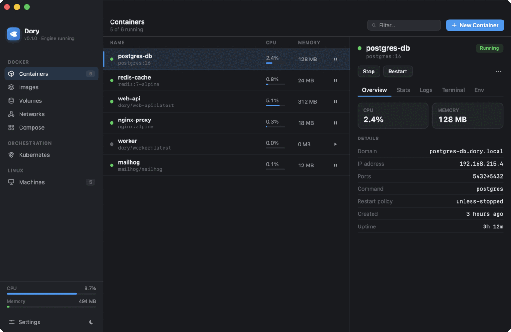

# Dory

A native, lightweight macOS app for running Docker and Linux containers — a free, open-source
alternative to OrbStack and Docker Desktop. Built in pure Swift/SwiftUI with a Docker-compatible
runtime layer, plus an Apple `container` / `containerization` standalone engine when the host
supports it.

[](https://github.com/Augani/dory/stargazers)
[](https://github.com/Augani/dory/releases/latest)
[](https://github.com/Augani/dory/releases)
[](LICENSE)


> ⭐ **If Dory saves you memory (or money), please [star the repo](https://github.com/Augani/dory) — it genuinely helps others find it.**



## Why Dory

- **Standalone and lean.** The default **Shared VM** backend runs one persistent Linux micro-VM
  for *all* your containers (OrbStack-style), instead of one VM per container — measured ~4.7×
  less memory than per-container VMs (2 containers: ~122 MB vs ~574 MB), with the gap widening as
  you add containers.
- **Drop-in Docker API.** Dory hosts a Docker-compatible socket at `~/.dory/dory.sock`, so the
  real `docker` and `docker compose` CLIs drive it unchanged.
- **Native, not Electron.** A single SwiftUI app — menu bar + main window, light and dark.
- **Free and open source** under the GPL-3.0.

## What's inside

- **Containers** — list with live Overview / Stats / Logs / Terminal / Env; create (image, ports,
  volumes, env); start / stop / restart / delete; exec into a shell.
- **Images** — pull, **build** (from a context folder), run, delete, prune, **registry sign-in**,
  and **inspect** (layers, entrypoint, exposed ports, env, labels).
- **Volumes & Networks** — create / delete / prune, browse volume contents, **inspect** networks
  (subnet, gateway, connected containers).
- **Compose** — open a `compose.yaml` and `up` / `down`: variable interpolation + `.env`,
  `depends_on` ordering, and `service_healthy` waiting via exec health probes.
- **Kubernetes** — one-click k3s in the shared VM, `kubectl apply`, live pod list and health.
- **Linux machines** — create / start / stop / delete Ubuntu, Debian, Fedora, or Alpine VMs.
- **Networking** — `localhost` published ports, automatic `*.dory.local` domains with local HTTPS
  (issued by a local CA), all consent-gated for system-wide install.
- **Migration** — import images and containers from Docker Desktop / OrbStack.

See [COMPATIBILITY.md](COMPATIBILITY.md) for the honest, per-feature status matrix.

## Engine backends

Dory selects a backend with the `DORY_RUNTIME` environment variable; all share one
`ContainerRuntime` protocol.

| `DORY_RUNTIME` | Backend | Model |
|---|---|---|
| `shared` *(default on supported hosts)* | **Shared VM** | One persistent `dockerd`-in-VM for all containers (OrbStack-style). Standalone — no Docker required. Requires macOS 26+ on Apple silicon. |
| `apple` | **Apple `container`** | One lightweight micro-VM per container. Requires macOS 26+ on Apple silicon. |
| `docker` | **Docker Engine API** | Transparent proxy to an existing Docker-compatible socket (Docker Desktop, OrbStack, Colima, Rancher Desktop, Podman). Works on older macOS and Intel when the host engine does. |
| `mock` | **Mock** | In-memory sample data for UI development. |

## Requirements

- macOS 15 or later for the app and Docker-compatible host-engine mode
- macOS 26 (Tahoe) or later on Apple silicon for Dory's standalone Shared VM / Apple `container` backends
- Xcode 27 or later (to build)

## Build & run

```sh
scripts/build.sh        # compile-check
scripts/test.sh         # full test suite
scripts/shot.sh         # build, launch, and screenshot the window
```

Or open `Dory.xcodeproj` in Xcode and Run.

## Optional system integration

These need a one-time admin grant (the same one OrbStack asks for) and are run by you, never
silently:

```sh
scripts/enable-networking.sh    # *.dory.local domains + trust the local CA
scripts/enable-kubernetes.sh    # bootstrap k3s in the shared VM
```

## Install (release builds)

```sh
brew install --cask Augani/dory/dory
```

…or download the latest notarized `.app` from [Releases](https://github.com/Augani/dory/releases).

## Architecture

```
Dory.app (SwiftUI)
      │
      ▼
ContainerRuntime protocol ──► { Shared VM · Apple container · Docker API · Mock }
      │
      ├─ doryd shim          Docker REST API over ~/.dory/dory.sock
      ├─ Compose engine      YAML → dependency DAG → reconcile
      ├─ engine services     health state machine · event synthesis · anon-volumes
      └─ Net                 LocalCA (TLS) · DomainRouter (*.dory.local) · port forwarding
```

Everything is dependency-free — the HTTP / unix-socket transport, YAML parser, and Docker-API
client and server are all hand-rolled, so the build stays small and deterministic. The
`Packages/ContainerizationEngine` package links Apple's `containerization` framework to boot the
Linux VM in-process.

## Contributing

Contributions are welcome — see [CONTRIBUTING.md](CONTRIBUTING.md).

## License

[GPL-3.0](LICENSE) © 2026 Dory contributors.
