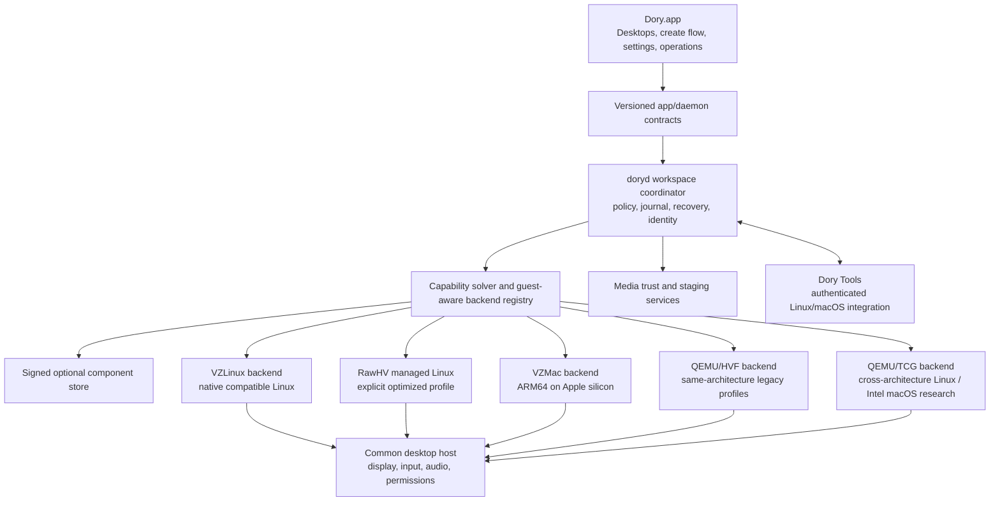

# Archived evidence: prior Linux and macOS virtualization plan

> **Superseded on 2026-08-30.** The current delivery plan is
> [`linux-and-macos-virtualization-delivery-plan.md`](linux-and-macos-virtualization-delivery-plan.md).
> This file is retained because its repository audit, Tart/VirtualBuddy issue corpus, failure
> taxonomy, and prevention requirements remain evidence inputs. Its QEMU-led execution decisions,
> estimates, support matrix, and definition of done are not normative.

- **Status:** Archived/superseded evidence only; no implementation is authorized by this document
- **Date:** 2026-08-29
- **Owners:** Dory platform, desktop, release, and quality teams
- **Scope:** distro-neutral Linux and macOS guests on supported Mac hosts, using native
  virtualization when architectures match and separately qualified full-system emulation when
  they do not
- **Parent architecture:**
  [`virtual-workspace-platform.md`](virtual-workspace-platform.md), especially Milestone 5
- **Product constraint:** VM runtimes remain optional components; Linux and macOS installation
  media is not required by the base Dory application, and macOS media is never redistributed

## 1. Executive decision

Dory should position its VM product around one sentence:

> **Run Linux and macOS on Dory. Install the VM runtime you need, then bring a compatible ISO,
> disk image, or Apple restore image.**

This requires replacing distribution-led execution with image-led execution. Ubuntu, Debian,
Fedora, Kali, and future templates remain optional conveniences; none is a hidden runtime
dependency. The guest operating system, architecture, boot format, workload, and required devices
are facts resolved from a versioned definition and trusted media inspection.

Dory should implement five independently qualified execution paths:

1. **Native ARM64 Linux:** arbitrary compatible ARM64 Linux EFI/ISO and disk images on
   Apple-silicon Macs through `VZLinuxBackend`; Dory's direct-kernel backend remains an optional
   managed-image optimization, not the generic compatibility path.
2. **Native x86_64 Linux:** compatible x86_64 Linux EFI/ISO and disk images on Intel Macs through
   Virtualization.framework, with QEMU/HVF considered only where it supplies a required legacy
   machine model.
3. **Cross-architecture Linux:** x86_64 Linux on Apple silicon and ARM64 Linux on Intel Macs through
   an optional QEMU/TCG full-system emulation component. Rosetta remains a separate optimization
   for x86_64 applications inside a native ARM64 Linux guest; it is not an ISO backend.
4. **Native Apple-silicon macOS:** ARM64 macOS guests on Apple-silicon Macs through Apple's
   Virtualization.framework and a new `VZMacBackend`.
5. **Intel macOS research paths:** x86_64 macOS on Intel Macs through QEMU/HVF, or on Apple silicon
   through QEMU/TCG. These are separate feasibility programmes and cannot inherit the native Mac
   graphics, security, or device claims.

All paths share Dory's definition, lifecycle, storage, operations, diagnostics, UI, component, and
qualification contracts. They do not share a boot implementation or make identical capability
claims. Backend selection is deterministic and visible; Dory never substitutes CPU emulation,
software graphics, or another machine ABI after a native plan fails.

The following path is not presently viable and must remain unavailable:

- **ARM64 macOS on an Intel Mac.** Virtualization.framework executes a guest of the same
  architecture as the host, and there is no production-quality emulator for the complete Apple
  silicon Mac platform, boot chain, GPU, and security devices. The capability model should retain
  this combination as explicitly unsupported so it can be reconsidered if a legitimate backend
  appears; Dory must not invent a fake fallback.

This plan deliberately does not equate “bring any image” with “execute arbitrary bytes under any
backend.” Dory accepts media only when it can establish architecture, boot compatibility, storage
format, required firmware, and a support level. Unknown media can enter an explicitly unqualified
expert flow only after it passes safety inspection; incompatible media is rejected before disk
allocation. macOS native installation uses IPSW restore images, not ISO files.

It also does not equate “runs macOS” with “identical to a physical Mac.” Native Apple-silicon
guests can provide Apple's accelerated Mac graphics, display, input, audio, NAT, and sharing path.
Current public QEMU technology does not provide a supported accelerated macOS guest GPU for Intel
Mac machine profiles. Camera forwarding has no stable general VZ camera device, while seamless
clipboard requires Dory Tools in the guest. Those limitations remain first-class capability facts.

### 1.1 Overall effort and staffing expectation

The repository audit shows that this is a controlled platform rewrite, not a backend feature added
to the existing creation path. The planning envelope is therefore **85–145 engineer-weeks** for the
guest-neutral control plane rewrite, distro-neutral native Linux, native Apple-silicon macOS,
cross-architecture Linux, unified portability, tools, diagnostics, release hardening, and a bounded
Intel macOS feasibility programme. With five to seven experienced engineers, a realistic elapsed
programme is **approximately nine to fifteen calendar months** after the pre-code design gate. The
schedule is recalculated after legal, media, QEMU, device, and physical performance evidence.

A custom camera bridge, if required and technically supportable, adds roughly **6–12
engineer-weeks**. A new accelerated Intel macOS guest GPU stack is not part of the estimate; public
technology does not currently supply one, and a serious driver/graphics translation programme could
add **40–100+ engineer-weeks** with no guaranteed success.

| Deliverable | Incremental effort | Expected public level |
|---|---:|---|
| Pre-code architecture, performance model, and feasibility decisions | 4–7 engineer-weeks | Approved design gate |
| Shared guest-neutral contracts, media, and control-plane rewrite | 18–28 engineer-weeks | Internal foundation |
| Distro-neutral native Linux image path | 12–22 engineer-weeks | Supported v1 |
| Cross-architecture Linux QEMU path | 12–20 engineer-weeks | Compatibility tier if qualified |
| Native ARM64 macOS backend and product integration | 18–30 engineer-weeks total | Supported v1 |
| Native Intel-on-Intel QEMU/HVF feasibility/product | 12–24 engineer-weeks | Supported only if qualified |
| Intel-on-Apple-silicon QEMU/TCG feasibility/product | 16–30 engineer-weeks | Compatibility tier only if qualified |
| Generic Linux/macOS tools, diagnostics, portability, hardening, and release | 18–30 engineer-weeks | Required for graduation |

The ranges overlap because the UI, component, definition, diagnostics, tools, and release work is
shared. They must not be added arithmetically. Estimates are deliberately wider than a backend-only
project because completion includes deleting superseded paths, migrating existing machines,
measuring near-native paths on physical hardware, and proving clean installation and rollback.

## 2. Product promise and definition of completion

For Dory, a Linux or macOS runtime is complete only when every supported combination has all of
the following:

- transactional creation, installation, cancellation, retry, cleanup, and recovery;
- durable machine identity that survives app, daemon, host, and component updates;
- repeatable boot, stop, pause, resume, host sleep/wake, and guest OS update behavior;
- responsive display and correct keyboard, mouse, and trackpad semantics;
- the exact advertised graphics level, with no silent software fallback;
- working speakers, microphone, networking, time, storage, and supported sharing paths;
- safe snapshot, backup, clone, import, and export semantics for that backend;
- clear support state for clipboard, camera, USB, iCloud, Rosetta, nested virtualization, and
  shared folders;
- signed, notarized, digest-bound runtime components and guest integrations;
- diagnostics that identify the host, guest, backend, media, virtual-hardware ABI, components,
  entitlements, permissions, and failed operation;
- physical-machine qualification across the declared host and guest matrix;
- licensing and third-party dependency review completed before public distribution.

Completion also requires these product-level outcomes:

- no runtime path depends on a particular Linux distribution;
- a user can create a blank VM, install from compatible local media, import a compatible installed
  disk, or choose an optional verified template;
- desktops, headless servers, and agent sandboxes use the same machine foundation but remain clear
  workload types with different default devices and integrations;
- distribution identity controls labels, optional provisioning providers, and qualification cells,
  not core lifecycle or backend dispatch;
- the base application starts and runs its container features with every VM component absent;
- installing or removing one guest/runtime component never requires an unrelated Linux
  distribution or macOS runtime.

“Fully run” does **not** permit Dory to claim a device or acceleration level that the selected
backend cannot provide. It means a reliable, honest product under a declared capability contract.
If a cross-architecture or Intel path cannot meet the release thresholds in this plan, it remains
an internal experiment and is not exposed as a public checkbox.

## 3. Support matrix and product tiers

### 3.1 Host and guest architecture matrix

| Host | Guest | Candidate backend | CPU execution | Product decision |
|---|---|---|---|---|
| Apple-silicon Mac | ARM64 Linux | VZLinux; managed RawHV only for its explicit profile | Hardware virtualization | Generic native Linux GA target |
| Apple-silicon Mac | x86_64 Linux | QEMU/TCG | CPU translation | Optional compatibility target |
| Apple-silicon Mac | ARM64 macOS | VZMac | Hardware virtualization | Native macOS GA target |
| Apple-silicon Mac | x86_64 macOS | QEMU/TCG research | CPU translation | Expected no-go for full desktop; research only until all gates pass |
| Intel Mac supported by Dory | x86_64 Linux | VZLinux or QEMU/HVF | Hardware virtualization | Legacy native Linux target if host support remains viable |
| Intel Mac supported by Dory | ARM64 Linux | QEMU/TCG | CPU translation | Optional compatibility target if demand justifies it |
| Intel Mac supported by Dory | x86_64 macOS | QEMU/HVF research | Hardware virtualization | Legacy research/beta; no native Mac GPU claim |
| Intel Mac supported by Dory | ARM64 macOS | No viable production backend | None | Unavailable |
| Non-Apple host | Linux | Future host-platform programme | Undecided | Outside this plan |
| Non-Apple host | macOS | None | None | Out of scope and license-restricted |

Apple documents that `VZVirtualMachine` runs a complete machine of the same architecture as the
underlying Mac. QEMU documents TCG as its cross-architecture emulation engine, while UTM documents
HVF as same-architecture virtualization only. These are architectural constraints, not UI policy:

- [Apple: `VZVirtualMachine`](https://developer.apple.com/documentation/virtualization/vzvirtualmachine)
- [QEMU: Emulation](https://www.qemu.org/docs/master/about/emulation.html)
- [UTM architecture](https://github.com/utmapp/UTM/blob/main/Documentation/Architecture.md)

### 3.2 User-facing support levels

| Level | Meaning | Allowed wording |
|---|---|---|
| Supported | Exact signed tuple passed the complete physical qualification matrix | “Supported” |
| Compatibility | Correct and stable, but materially slower or missing a declared optional device | “Intel emulation — compatibility mode” |
| Preview | Opt-in candidate with bounded support and known exclusions | “Preview” |
| Experimental | Developer-only evidence gathering; never enabled by default | “Experimental” |
| Unavailable | No legitimate or qualified backend exists | Explain the missing capability |

Backend presence, a successful boot, or an upstream project's demo is never sufficient to assign a
support level.

### 3.3 Initial guest and media policy

Dory must not promise “every OS version” or use a hand-maintained distribution allowlist as the
runtime. The qualification catalog, not marketing copy, defines exact supported host, media,
backend, and guest combinations.

- Compatible native Linux ARM64 EFI installer ISOs and raw installed disks are the first generic
  media target. Qualification begins with representative Debian-family, Fedora-family, SUSE-family,
  Arch-family, Alpine, and immutable/desktop distributions, but passing one distribution never
  becomes a requirement for another.
- QEMU-backed Linux adds x86_64 and cross-architecture media after ISO, UEFI, storage, network, and
  display profiles are independently qualified.
- Native ARM64 macOS begins with the current and two previous host-compatible restore releases,
  subject to Apple's `VZMacOSRestoreImage.isSupported` and configuration requirements.
- Intel virtualization begins with a deliberately small set of Intel macOS releases chosen after
  the Phase 0 spike. The first target should favor modern APFS installers with security updates and
  known QEMU CPU/device behavior.
- Intel emulation uses the same or a smaller guest set. Every version requires a pinned emulated CPU
  profile and boot/device manifest.
- Older Intel and pre-Intel Mac OS versions are an archival-emulation program and are not part of
  this delivery plan.

## 4. Non-negotiable feasibility and release gates

The following gates are resolved before public promises or release dates:

1. **Apple licensing gate:** specialist counsel approves the local virtualization UX, media flow,
   Intel boot dependencies, active-instance policy, import/export language, and marketing claims.
2. **Apple-branded host gate:** macOS guests are launchable only on Apple-branded Macs that satisfy
   the applicable macOS license and Dory host requirements.
3. **Media gate:** Dory neither bundles nor mirrors macOS. Native restore images come directly from
   Apple or from a user-selected local IPSW. Intel media is user-obtained through an approved Apple
   channel and inspected before use.
4. **Protected-material gate:** Dory does not ship, hardcode, fetch from third parties, or log Apple
   firmware, SMC material, recovery secrets, serial identities, or account credentials. Any
   host-derived Intel boot requirement needs written legal approval and a reviewed implementation.
5. **QEMU licensing gate:** distribution of QEMU and all linked libraries satisfies their licenses,
   including complete corresponding source and notices where required. QEMU itself is GPLv2:
   [QEMU license](https://www.qemu.org/docs/master/about/license.html).
6. **Intel performance gate:** cross-architecture emulation must pass the published responsiveness,
   reliability, thermals, memory, and workload budgets. If it fails, Dory does not ship it merely
   because Setup Assistant can boot.
7. **Graphics-truth gate:** only native VZMac may claim hardware-accelerated macOS graphics unless
   the Intel backend later gains a separately reviewed guest driver and passes graphics
   qualification. A Metal host presentation layer is not guest GPU acceleration.
8. **Host-lifetime gate:** Intel-host support requires an actively supportable Dory application,
   daemon, toolchain, signing chain, and physical CI host. A backend is retired before its host OS
   can no longer be safely supported.
9. **Pre-code performance architecture gate:** no production rewrite begins until Phase 0A fixes
   native near-native budgets, traces every high-rate data path, chooses candidate graphics/device
   architectures, and approves the migration/deletion map. Phase 0B then measures disposable
   physical-machine proofs; a backend with no measured path to its target is removed before product
   implementation.
10. **Simplicity gate:** the replacement must converge to one definition, plan, journal, event
    stream, component manifest, tools manifest, and diagnostic vocabulary. A phase cannot ship with
    two authorities for new writes, a speculative plugin/microservice layer, or an unowned legacy
    façade.

The current macOS license permits a limited number of additional virtual macOS instances on an
Apple-branded Mac for specified uses and constrains service-bureau and similar operation. The exact
shipping license must be reviewed at release time; this plan is not legal advice:
[macOS Tahoe 26 software license](https://www.apple.com/legal/sla/docs/macOSTahoe.pdf).

## 5. Current Dory position

### 5.1 Foundations that remain

Dory already has valuable operating-system-neutral foundations:

- Linux and macOS guest families, ARM64/x86_64 guest architectures, macOS restore media, VZ backend
  identity, compatibility failures, and capability negotiation in
  [`DoryVirtualMachineCapabilities.swift`](../dory-core-swift/Sources/DoryOperations/DoryVirtualMachineCapabilities.swift);
- a versioned definition covering guest platform, media, resources, virtual hardware, identity,
  integrations, and lifecycle in
  [`DoryVirtualMachineDefinition.swift`](../dory-core-swift/Sources/DoryOperations/DoryVirtualMachineDefinition.swift);
- daemon lifecycle, events, admission, journaling foundations, recovery, backups, components, and
  incident reporting;
- a Virtualization.framework runner and `VZVirtualMachineView` desktop host in
  [`DoryVMMKit`](../dory-core-swift/Sources/DoryVMMKit);
- bounded ARM64 Linux EFI/ISO inspection, exact-media hashing, managed installed-boot evidence, and
  VZLinux/RawHV adapter foundations;
- an optional, signed, digest-verified component catalog and content-addressed store;
- the platform direction and virtual-hardware ABI principles in
  [`virtual-workspace-platform.md`](virtual-workspace-platform.md), plus the deeper Linux analysis
  in [`linux-virtual-workspace-architecture.md`](linux-virtual-workspace-architecture.md) and
  [`linux-virtual-workspace-delivery-plan.md`](linux-virtual-workspace-delivery-plan.md).

### 5.2 Blocking gaps that must be removed at the root

| Boundary | Current limitation | Required outcome |
|---|---|---|
| Backend registry | Keyed only by broad backend identity, so VZLinux and VZMac collide | Dispatch by guest-aware backend key or a typed adapter descriptor |
| Production trust | Rejects macOS restore images and hard-codes macOS support facts false | Entitled, daemon-owned trust evidence for exact restore/runtime tuples |
| VZ runtime | Linux kernel/EFI specification and builder only | Separate Mac platform/install specification and configuration builder |
| Linux product model | Creation and cards still lead with Debian/Ubuntu/Kali and “Linux desktop” | Image-first Linux creation; templates become optional catalog entries |
| Linux media | Portable inspection and launch are principally ARM64 ISO/EFI | Typed ISO/disk inspection for ARM64/x86_64, native/emulated routing, and safe conversion |
| Linux provisioning | In-place update and recipes encode three distros and mainly `apt`/`apk` | Guest-agent capability providers with distro/package-manager plugins |
| Daemon persistence | Legacy kernel/rootfs/ISO assumptions remain authoritative | Make the versioned VM definition and resolved plan authoritative |
| App/daemon API | Cannot faithfully carry macOS family, restore, identity, or install phase | Versioned guest-neutral request, event, and status DTOs |
| UI models | EFI is interpreted as “Custom Linux”; creation is distro/ISO-first | Guest-family-first desktop creation and capability-driven cards/settings |
| Snapshot/export | Does not preserve all virtual Mac identity artifacts | Backend-specific portability manifest and validated cold export |
| Components | Runtime, prebuilt distro payloads, and qualification are coupled | Independent desktop core, backend runtimes, optional templates, and guest-tools authorities |
| Release tooling | Assumes Linux kernels/root files and ARM64 desktop assets | Host/guest-typed component build, sign, notarize, publish, install, and rollback |

This split is visible in production code today. Definition schema 5 and the resolved-plan types can
represent macOS and multiple architectures, but
[`DoryDaemonVirtualMachineProductionTrust.swift`](../dory-core-swift/Sources/DorydKit/DoryDaemonVirtualMachineProductionTrust.swift)
rejects macOS restore media,
[`DoryDaemonVirtualMachineProductionPlanningController.swift`](../dory-core-swift/Sources/DorydKit/DoryDaemonVirtualMachineProductionPlanningController.swift)
does not bind Mac platform/firmware artifacts, and
[`DoryDaemonVirtualMachineProductionActivation.swift`](../dory-core-swift/Sources/DorydKit/DoryDaemonVirtualMachineProductionActivation.swift)
routes Virtualization.framework activation into the Linux adapter. The existing
[`DoryVMM.swift`](../dory-core-swift/Sources/DoryVMMKit/DoryVMM.swift) builds Linux or generic EFI
machines with a generic platform; it is not a hidden VZMac implementation. The rewrite must make
the already-richer contracts executable and remove the legacy collapse rather than add another
Boolean beside it.

The root fix is to finish adopting `DoryVirtualMachineDefinition` and one immutable resolved launch
plan. Adding more optional fields to legacy `MachineSettings` or interpreting Intel support through
environment variables would deepen the current migration debt.

### 5.3 Rewrite and simplification decision

Dory should deliberately rewrite the VM vertical slice from media selection through launch and
recovery. This is not permission for an unbounded whole-repository rewrite. Container, image,
network, volume, Compose, Kubernetes, account, update, and unrelated UI code remain outside the
boundary unless a shared contract demonstrably blocks the new VM platform.

| Treatment | Scope |
|---|---|
| Keep and harden | Versioned VM definitions/capability vocabulary, daemon ownership, signed component store, event/journal foundations, VZ runner foundation, existing sandbox policy/session ideas, and `DoryGuestIntegrationPackage` |
| Rewrite | New-machine flow, media import/inspection, operation API, backend registry/selection, production trust/planning/activation, VZ launch builders, persistence/artifact ownership, snapshot/clone/import/export, component identity/catalog, tools installation, diagnostics/repair, and desktop device host |
| Convert to temporary compatibility façade | `MachineManager`, legacy `machineCreate(NSDictionary)`, old definition/plan decoders, and current Linux machine activation while migration is proven |
| Delete after cutover | New writes to `MachineSettings`/`DoryMachineConfiguration`, distro runtime enums/defaults, Ubuntu media exceptions, environment-variable launch behavior, duplicate provisioning paths, global manager-ready flags, and backend-specific UI truth |
| Defer | Windows guests, non-Mac hosts, public plugin SDK, clustered schedulers, remote macOS hosting, speculative device emulation, and any Intel GPU project that fails Phase 0 gates |

The rewrite uses a vertical-slice cutover rather than a big-bang branch:

1. freeze legacy behavior and add characterization tests without extending it;
2. introduce the new contracts and daemon-owned stores beside the legacy read path;
3. build one complete native Linux EFI slice through the new API, including diagnostics and
   rollback;
4. migrate existing definitions losslessly and run old/new differential tests;
5. switch all new machine creation to the new path;
6. add VZMac and QEMU as separate adapters using the already-proven contracts;
7. stop writing legacy schemas, measure a compatibility window, then delete the façades and dead
   assets in the same programme—not a future cleanup promise.

### 5.4 Simplicity rules

The clean design should be smaller than the combined code it replaces. These rules prevent the
rewrite from becoming a second over-engineered platform:

- one canonical VM definition, one resolved plan, one operation journal, one lifecycle state
  machine, one event stream, one component manifest format, one tools manifest, and one diagnostic
  vocabulary;
- plain immutable value types and explicit `switch` statements at stable domain boundaries;
  abstraction is introduced only when at least two real backends need the same contract;
- backend-specific launch construction stays backend-specific—there is no universal bag of device
  options or inheritance hierarchy that erases VZMac, VZLinux, RawHV, or QEMU differences;
- keep orchestration modules inside `doryd` unless privilege separation, untrusted parsing, JIT,
  display/media permission, or crash containment requires a helper process;
- helpers are single-purpose and receive preopened resources plus an immutable plan; they do not
  become independent microservices, databases, or plugin hosts;
- data-driven identifiers replace closed distribution enums, but Dory does not build a general
  third-party plugin platform in this programme;
- no speculative Windows abstraction, distributed scheduler, generic workflow engine, or model-led
  repair system is allowed onto the critical path;
- no backend selection logic, filesystem path construction, media trust, or support truth lives in
  SwiftUI views;
- no per-frame, per-audio-buffer, or per-input-event JSON/Codable/XPC work; the high-frequency data
  plane bypasses the control plane;
- every migration adapter and feature flag has an owner, removal release, test, and deletion issue;
- code and dependency growth are reviewed per phase: adding a dependency requires measured value,
  a license/security owner, update policy, and a smaller in-house alternative comparison.

At each phase review, the team records lines/modules deleted, duplicate concepts removed, new
dependencies, public contracts added, and runtime processes introduced. A phase does not graduate if
it leaves two authoritative paths for new writes or makes the user-visible flow depend on hidden
compatibility switches.

## 6. Target architecture

### 6.1 Module boundaries

The implementation should converge on these logical modules. Exact target names can follow the
existing package layout, but their ownership must remain separate.

| Module | Owns | Must not own |
|---|---|---|
| VM contracts | Definitions, capabilities, backend keys, resolved plans, events, migrations | Framework objects, UI, process launch |
| Workspace control plane | Durable operations, reconciliation, policy, identity, resources | Guest-specific configuration construction |
| Media trust | Bounded inspection, provenance, download staging, compatibility evidence | VM lifecycle or UI policy |
| VZLinux adapter | Generic native Linux EFI/direct-boot mapping and VZ lifecycle | Distribution provisioning |
| RawHV Linux adapter | Managed direct-boot profile and its explicitly qualified devices | Generic ISO/EFI claims |
| VZMac adapter | Apple Mac configuration, installer, native devices, VZ lifecycle | QEMU or Linux boot logic |
| QEMU adapters | Versioned machine ABIs, QMP lifecycle, firmware/boot configuration | Product support decisions |
| Desktop host | Window/display/input/audio host presentation | Guest OS assumptions |
| Guest integration | Authenticated protocol and capability providers | Required boot path |
| Component supply chain | Builds, SBOMs, signatures, qualification, activation, rollback | macOS installation media |
| Product UI | Intent, progress, capability explanation, permission flows | Backend selection or hidden fallback |

### 6.2 Backend identity and selection

The registry key must include enough identity to distinguish implementations that share a host
framework. At minimum it binds:

- mechanism (`vz-linux`, `rawhv-linux`, `vz-macos`, `qemu-hvf`, `qemu-tcg`);
- guest family and architecture;
- host architecture and minimum host OS;
- boot/platform family;
- virtual-hardware ABI revision;
- runtime component identity and qualification receipt.

The capability solver selects only an exact compatible and qualified adapter. “Automatic” is a
policy that chooses among valid plans; it is not a backend and it may not silently downgrade GPU,
devices, isolation, or performance class.

### 6.3 Authoritative workspace bundle

Every macOS workspace is a transactional bundle containing common metadata plus backend-specific
identity. The bundle is private to the Dory data drive and uses atomic manifests and durable
operation journals.

Common contents:

- canonical VM definition and immutable resolved plan;
- primary and auxiliary disks with stable logical IDs;
- installation-media provenance and digest, without requiring the media to remain after install;
- stable network identity, share bookmarks, and permission references;
- backend/component/firmware/tool versions and virtual-hardware ABI;
- operation journal, lifecycle state, health facts, backups, and incidents;
- snapshot/export compatibility manifests.

Native VZMac identity:

- serialized `VZMacHardwareModel` selected from the restore requirements;
- unique persistent `VZMacMachineIdentifier`;
- matching `VZMacAuxiliaryStorage`;
- disk image and optional local saved-state file;
- installed macOS build and restore-image identity.

Intel QEMU identity:

- pinned QEMU machine type and CPU model;
- UEFI code digest and private mutable NVRAM store;
- approved bootloader/configuration digest and version;
- stable SMBIOS/board/serial identity policy approved by legal and security review;
- stable disk controller, NIC, audio, display, USB, and PCI ordering;
- accelerator (`hvf` or `tcg`) and exact CPU feature manifest;
- QEMU, display frontend, and guest-tools component identities.

No machine may start if required identity files are missing, mismatched, shared by a concurrently
running clone, or incompatible with the resolved host. Repair may restore from validated backup but
must never fabricate replacement identity silently.

### 6.4 Performance-first architecture

Near-native performance is a design requirement for **same-architecture hardware-virtualized**
Linux and macOS paths, not a late optimization target. Dory must not use that wording for QEMU/TCG
cross-architecture guests: CPU translation has unavoidable overhead and Intel macOS additionally
lacks a proven accelerated guest GPU. Those paths ship under a measured Compatibility label or not
at all.

Performance has two comparison baselines:

1. **Framework floor:** a minimal, release-built VZ/QEMU harness using the identical guest resources
   and device profile. Dory's coordination, runner, and UI should add no more than a small measured
   overhead to this floor.
2. **Host ceiling:** the same architecture and workload run natively on the host, normalized for
   allocated CPU, memory, storage, thermal state, and power mode. This establishes whether the whole
   virtual stack is credibly near-native rather than merely competitive with Dory's previous build.

Preliminary native-path budgets, to be finalized with physical measurements before implementation:

| Dimension | Initial design budget |
|---|---|
| Dory overhead over minimal backend harness | no more than 3% CPU/workload throughput and no persistent extra frame of latency |
| CPU compute throughput | at least 90% of normalized native host for sustained representative workloads; document unavoidable topology effects |
| Guest-native disk throughput | at least 85% sequential and 75% random of the qualified host-volume baseline without unsafe cache semantics |
| NAT network throughput | at least 85% of the matched host path with stable latency under load |
| Desktop frame delivery | sustained display refresh target on qualified resolution, p95 frame interval within one refresh period, no periodic micro-freeze |
| Local input-to-visible-response | p95 below 50 ms for the qualified interactive workload, with correct high-resolution trackpad events |
| Audio | no audible dropout in a one-hour mixed CPU/I/O/display soak and bounded end-to-end latency |
| Idle overhead | no busy polling; runner/host CPU and memory remain within a versioned per-backend budget |
| Thermal stability | no progressive throughput collapse beyond the matched native/harness thermal baseline |

The design keeps high-frequency paths direct:

- display frames use Virtualization.framework's view/IOSurface path or a measured Metal-backed
  QEMU presentation path; never screenshot polling, image encoding, or app/daemon round-trips;
- coordinate transforms are computed once per display generation, and pointer/trackpad events are
  injected directly with only correctness-preserving coalescing;
- audio uses bounded real-time-safe ring buffers with conversion outside the callback and no
  blocking IPC, allocation, logging, or file access on the audio thread;
- guest disks use the narrowest safe direct asynchronous path, qualified cache/flush/discard
  semantics, and no transparent copy-on-write layer that has not earned its latency and integrity
  cost;
- the normal network data path avoids user-space proxies; port forwarding and inspection are
  explicit optional features with separate budgets;
- lifecycle, telemetry, and tools traffic stay off display, input, audio, disk, and network data
  planes; telemetry is sampled and bounded;
- release builds use production signing, sandboxing, logging levels, and component layout during
  performance tests so debug results cannot hide shipping overhead.

Before production code begins, the team must produce a performance architecture dossier containing
the workload suite, physical host tiers, guest resource normalization, measurement tools, trace
points, statistical method, budgets, regression thresholds, and a predicted cost model for every
copy, context switch, IPC boundary, conversion, cache, and renderer hop. Only after this review is
approved should disposable backend proofs measure disputed assumptions. Their code is not merged as
the product implementation; the chosen design is then built cleanly against the canonical contracts.

The dossier must compare candidate Linux desktop graphics paths on physical hosts rather than
assuming that “Virtualization.framework” implies the APIs an application needs. Each candidate is
measured for guest-visible Vulkan and OpenGL versions/extensions, Wayland and X11 presentation,
compositor smoothness, cursor/input synchronization, resize, video playback, WebGL, context loss,
and sustained thermals. Zed, a browser WebGL workload, GNOME and KDE sessions, and a repeatable
graphics benchmark form the initial application set. The selected GA profile is the smallest path
that meets the API and latency gates; other profiles remain explicitly qualified alternatives or are
deleted. Environment variables may appear as typed, documented per-machine compatibility controls
only after a qualification receipt proves their effect—they are never hidden global fixes.

## 7. Optional component and supply-chain design

The base Dory application continues to install without any macOS guest runtime or operating-system
media.

| Proposed component | Contents | Host filter | Dependencies |
|---|---|---|---|
| `vm-runtime-core` | Guest-neutral contracts, machine coordinator support, common signed helpers | Supported macOS hosts | Base Dory engine |
| `desktop-host-core` | Common signed display runner, input/audio host layer | Supported macOS hosts | `vm-runtime-core` |
| `linux-native-runtime` | VZLinux adapter, qualified EFI/device profiles, media inspector | Matching host/guest architecture | `vm-runtime-core`; `desktop-host-core` for desktops |
| `linux-managed-runtime` | RawHV managed Linux adapter, managed boot assets, exact device qualification | Apple silicon | `vm-runtime-core`; `desktop-host-core` for desktops |
| `cross-architecture-runtime` | Minimized QEMU/TCG system emulators, firmware, QMP adapter, display frontend | Host-specific slice | `vm-runtime-core`; `desktop-host-core` for desktops |
| `macos-native-runtime` | VZMac adapter, installer/media inspector, native qualification data | Apple silicon | `desktop-host-core` |
| `macos-intel-hvf-runtime` | x86_64 QEMU/HVF runtime and approved Intel boot/device assets | Intel Mac | `desktop-host-core` |
| `macos-intel-tcg-runtime` | ARM64-hosted x86_64 QEMU/TCG runtime and approved Intel boot/device assets | Apple silicon | `desktop-host-core` |
| `linux-guest-tools` | Static ARM64/x86_64 agent, service integrations, provisioning providers | Guest-dependent | Guest integration contracts |
| `macos-guest-tools` | User-installable, signed universal macOS guest package | Guest-dependent | Guest integration contracts |
| `template.*` | Optional prebuilt, provenance-bound OS template or bootstrap recipe | Template-specific | The matching runtime only |

Each runtime component has its own support-bearing qualification authority. A macOS user must never
be forced to install `linux-desktop` merely to satisfy a shared qualification check. Component
manifests bind the host architecture, minimum OS, nested executable graph, CDHashes, entitlements,
SBOM, open-source notices, virtual-hardware ABI, and exact qualification receipt.

Runtime components contain mechanisms and qualification metadata, not a required distribution.
Optional Linux templates may be published independently, but uninstalling a template never removes
the runtime needed to boot user media. Intel components may contain approved open-source firmware
and boot dependencies only after license and legal review. No component contains an IPSW, macOS
installer, Apple recovery image, Apple firmware, private key, account identity, or preinstalled
macOS disk.

The release pipeline must build the component once, freeze its digest, generate its SBOM and source
offer, qualify that exact byte set, sign/notarize the complete nested graph, finalize the catalog,
and exercise clean install, interrupted install, update, rollback, removal, and on-demand reinstall.

`DoryComponentID` must move from a closed distribution-led enum to a strictly validated string ID
with constants for Dory-known components. Catalog v3 is keyed by host architecture and exact backend
adapter and records `provides`, `requires`, guest architecture, runtime ABI, artifact roles,
qualification receipts, provenance, SBOM, and supported app range. Initial concrete identities can
be `linux-native-vz`, `linux-rawhv-accelerated`, `linux-x86-tcg`, `macos-native-vz`,
`macos-intel-tcg`, `dory-tools-linux-arm64`, `dory-tools-linux-x86_64`, and
`dory-tools-macos-universal`; final names are frozen in Phase 0A. Managed guest images live in a
separate signed media/template catalog, never the runtime component graph.

Publication moves from the current architecture-specific `augani.github.io` endpoint to
`usedory.dev`, with an explicit old-catalog compatibility window and a signed redirect/index. The
host architecture is a catalog dimension rather than an `arm64` directory assumption, and a
catalog update cannot make an uninstalled backend appear ready until its exact component receipt
passes local verification.

## 8. Media acquisition and installation

### 8.1 Common image-first media contract

Every creation begins with a `GuestSource` rather than a distribution switch. Initial source kinds:

| Source | Examples | Treatment |
|---|---|---|
| Installer optical image | ISO with UEFI/El Torito boot payload | Inspect, attach read-only, install to a new disk |
| Apple restore image | Signed `.ipsw` | Inspect through VZMac APIs, download if needed, restore to a new Mac VM |
| Installed virtual disk | raw, qcow2; later VMDK/VHDX where safely supported | Inspect architecture/partition/boot facts, convert or attach under an immutable plan |
| Physical/removable image | user-created disk image | Copy into managed storage before mutation; never run from an unstable source |
| Optional Dory template | signed Dory/OCI VM artifact | Verify manifest, layers, provenance, license, architecture, and ABI before clone |
| Blank machine | no OS media yet | Create stable hardware/firmware identity and allow later media attachment |

The inspector returns facts, not product decisions: format, size, content digest, partitions,
bootloaders, firmware expectation, architecture evidence, operating-system hints, mutability,
encryption, corruption/truncation state, and parser confidence. The capability solver then resolves
a backend or returns an actionable incompatibility.

Inspection rules:

- run in an unprivileged, resource-limited helper with bounded reads and no script execution;
- do not mount imported filesystems in the app or daemon merely to identify them;
- use file descriptors and security-scoped authority instead of trusting caller-provided paths;
- detect conflicting architectures and boot mechanisms instead of guessing from filenames;
- hash the exact staged bytes and bind inspection evidence to that digest;
- reject symlinks, device nodes, sparse expansion bombs, malformed partition tables, unsafe archive
  expansion, and formats whose parser is not installed;
- preserve the source untouched; conversions publish a new content-addressed artifact;
- show **Compatible**, **Compatible through emulation**, **Unqualified**, or **Incompatible** before
  creation and state exactly which runtime component will be downloaded.

“Any image” therefore means any image supported by an installed, inspected, and qualified format /
architecture / boot combination. It does not mean bypassing safety or compatibility checks.

### 8.2 Generic Linux ISO installation

The generic Linux path is independent of Ubuntu and of Dory-provided root filesystems:

1. Inspect the ISO for ARM64/x86_64 UEFI and, when the QEMU legacy profile is installed, qualified
   BIOS boot evidence.
2. Select native VZ when host and guest architectures match and its device contract satisfies the
   request. Select QEMU/TCG only after explicit emulation consent when they differ.
3. Create a stable EFI/NVRAM or backend firmware identity, thin-provisioned destination disk,
   stable NIC, device order, and operation journal.
4. Attach the installer read-only and boot it without injecting Ubuntu-specific kernel arguments,
   package sources, accounts, display managers, or files.
5. Let the distribution installer own partitioning, bootloader installation, users, packages, and
   desktop choice.
6. Detect installer completion through lifecycle and disk/boot evidence. If generic evidence is
   insufficient, ask the user to eject the installer; never scan the screen and guess.
7. On the next cold boot, start the installed disk through the same firmware and device ABI.
8. Offer Dory Tools separately after the OS is usable. Refusing tools does not prevent boot.

The baseline virtual hardware uses widely available guest drivers: UEFI, NVMe or Virtio block only
where the guest is proven to support it, a stable Virtio or emulated NIC, USB keyboard/pointer,
serial console, RNG, RTC, and an explicitly reported graphics level. Device choice is based on
media/guest capability evidence, not distro name.

### 8.3 Linux installed-disk import and conversion

- Begin with raw and qcow2. Add VMDK and VHDX only after pinned, sandboxed `qemu-img` parsing and
  adversarial format tests pass.
- Default to **copy and convert into Dory storage**. Direct external-disk attachment is an advanced
  mode with persistent bookmark, exclusive-write, unplug, sleep, and backup semantics.
- Inspect GPT/MBR, EFI System Partition, boot architecture, disk size, allocation, backing-chain
  references, encryption, and snapshots before conversion.
- Flatten external backing chains unless the complete immutable chain is imported and verified.
- Never mutate the source during inspection or conversion.
- Preserve guest-visible disk capacity, sector size, discard behavior, controller identity, and
  boot order in the virtual-hardware ABI.
- If Dory cannot prove a bootable installed disk, import it as an auxiliary data disk or reject it;
  never relabel it as a bootable VM.

### 8.4 Cross-architecture Linux and Rosetta

Full-system architecture mismatch uses QEMU/TCG. The UI displays the expected performance class,
larger component download, lack of hardware virtualization, graphics limitations, and separate
security status before allocation. QEMU notes that its non-virtualization TCG use does not inherit
the isolation assumptions of a hardware-virtualized guest, so Dory must place the emulator inside
an outer least-privilege sandbox and must not call this path an agent **sandbox** until its separate
threat-model gate passes: [QEMU security model](https://www.qemu.org/docs/master/system/security.html).

Rosetta is offered only for supported x86_64 user applications inside an ARM64 Linux VM. Apple
explicitly states that this facility does not bootstrap or install an Intel Linux distribution:
[Running Intel binaries in Linux VMs](https://developer.apple.com/documentation/virtualization/running-intel-binaries-in-linux-vms).

### 8.5 Optional Linux templates

Templates are a fast path, not the definition of Linux support:

- each template is an independently installable component or OCI-compatible VM artifact;
- its manifest declares architecture, disk format, minimum resources, runtime/device ABI, firmware,
  default account policy, guest-tools state, provenance, license, and qualification;
- template creation is reproducible from a public build recipe and upstream distribution media;
- default credentials are prohibited in production templates; first boot requires unique credential
  or SSH-key provisioning;
- template updates create new immutable versions and never rewrite a user's installed machine;
- users can publish/import their own templates without becoming Dory-supported unless the exact
  artifact passes qualification;
- the UI may recommend common distributions, but the runtime remains usable with every template
  absent.

### 8.6 Native Apple-silicon macOS media pipeline

1. Offer **Download latest compatible macOS from Apple** and **Choose an existing IPSW**.
2. Resolve `VZMacOSRestoreImage.latestSupported` or inspect a selected local restore image in the
   entitled media helper.
3. Record Apple origin, URL, size, operating-system version, build, supported hardware model,
   minimum/recommended CPU and memory, and a local content digest.
4. Download directly to the selected Dory data drive with resume, explicit disk-space reservation,
   progress, cancellation, checksum-on-close, and safe partial cleanup.
5. Create the hardware model, unique machine identifier, matching auxiliary storage, and sparse
   primary disk transactionally.
6. Validate the exact `VZVirtualMachineConfiguration` before starting installation.
7. Run `VZMacOSInstaller`, persist progress and state transitions, and prohibit ordinary start,
   pause, or conflicting mutation while installation owns the workspace.
8. Survive app closure and reconcile daemon/helper interruption. An interrupted install is either
   resumable through a documented framework state or explicitly recoverable by restarting the
   installation after preserving the verified download; it is never reported as a usable machine.
9. On completion, detach optional restore media, record the installed build, cold-boot once, and
   advance readiness only after correct display, storage, network, and required device facts exist.
10. Offer removal of the cached IPSW without affecting the installed machine.

Apple's supported flow requires a local IPSW, a compatible restore configuration, Mac hardware
model, machine identifier, auxiliary storage, and `VZMacOSInstaller`:
[Installing macOS on a virtual machine](https://developer.apple.com/documentation/virtualization/installing-macos-on-a-virtual-machine).

### 8.7 Intel macOS media pipeline

Intel media is not routed through the native IPSW API and is not presented as an arbitrary Linux
ISO. The creation flow accepts only source types that the Intel inspector can positively identify,
such as an approved user-provided macOS installer application, recovery image, DMG, or ISO produced
through an approved Apple workflow.

Required pipeline:

1. Obtain explicit user consent and a security-scoped bookmark.
2. Parse media in a sandboxed, resource-limited helper without mounting it read-write or executing
   scripts.
3. Identify macOS version/build, architecture, installer/recovery type, signature/provenance facts,
   required CPU features, and boot compatibility.
4. Reject unknown, hybrid, truncated, encrypted, architecture-mismatched, or unsupported media
   before allocating a machine.
5. Convert or stage media only through a documented, deterministic operation that produces a
   content-addressed artifact and provenance receipt.
6. Generate the backend-specific boot disk, UEFI/NVRAM, OpenCore configuration, stable hardware
   identity, and primary disk from pinned templates—not unreviewed community scripts.
7. Boot the installer through a typed launch plan and journal Setup Assistant/installer state.
8. Make Dory Tools available on a separate read-only tools image; installation remains optional
   and user-visible.
9. Record the installed OS build after the first authenticated tools handshake or a bounded,
   non-secret inspection path.

The Intel program cannot depend on scraping undocumented Apple catalogs or downloading media from
third-party mirrors. If Apple does not provide an approved acquisition path for a desired release,
Dory supports user-provided media only.

### 8.8 Media cache policy

- Media caching is opt-in and scoped to the selected Dory data drive.
- Cache entries are immutable, content-addressed, provenance-tagged, quota-managed, and shareable
  across installations only when the exact digest is compatible.
- Partial downloads, conversion work, and decompression use per-operation staging directories with
  strict quotas and deterministic cleanup.
- The UI shows download size, installed disk allocation, retained-cache size, and reclaim options
  before creation.
- Removing media cannot delete an installed workspace; deleting a workspace cannot remove shared
  media without a separate reference-counted cache transaction.

## 9. Lessons from Tart and VirtualBuddy

The projects named by the Dory team prove that a single product surface can manage Linux and macOS
through Virtualization.framework, but they do not remove the architecture and device limits in this
plan.

### 9.1 Tart lessons

[Tart](https://github.com/openai/tart) presents the same clone, run, configure, push, and pull model
for Linux and macOS VMs where its Virtualization.framework path matches host and guest architecture.
Its current source can create native amd64 Linux in an x86_64 build, but rejects a VM architecture
that differs from the host; Darwin VM decoding remains ARM64/Apple-silicon-only. Useful product and
architecture lessons include:

- keep ordinary lifecycle and image operations independent of guest OS;
- keep OS-specific differences inside creation/install providers;
- use APFS clone semantics and immutable base images for cheap, fast copies;
- treat remote VM artifacts as OCI-compatible content rather than inventing an unauthenticated
  download format;
- make the CLI automation-grade, deterministic, and scriptable;
- expose SSH/address discovery without making SSH the VM lifecycle protocol;
- allow the same image to be pulled once, cloned many times, and tagged immutably;
- keep user directory mounts explicit, named, and independently read-only/read-write.

Tart is not evidence for cross-architecture Linux or Intel macOS acceleration. Its Rosetta directory
share translates x86_64 **processes inside an ARM64 Linux guest** and does not boot an amd64 ISO.
Its documented Linux creation still shows a distribution-specific example, which reinforces Dory's
decision to separate a generic ISO runtime from optional templates:
[Tart quick start](https://tart.run/quick-start/).

Tart's current source is under FSL-1.1-ALv2 and defines competing use restrictions before its future
license date. Dory may study public behavior and architecture, but must not copy, derive from, or
embed Tart code without a written license determination or separate permission:
[Tart license](https://github.com/openai/tart/blob/main/LICENSE).

### 9.2 VirtualBuddy lessons

[VirtualBuddy](https://github.com/insidegui/VirtualBuddy) provides a strong reference for an
interactive Mac product:

- separate core VM, installation, installation service, UI, and guest-integration modules;
- offer Apple restore-image discovery, local IPSW, and URL-based restore without making the main UI
  own installation mechanics;
- provide Linux ISO installation through the same library while retaining an OS-specific installer
  path;
- attach guest integration as an optional disk rather than making it a boot dependency;
- use the guest app to provide clipboard and shared-folder ergonomics absent from the base macOS
  virtual devices;
- expose Recovery and saved-state lifecycle deliberately;
- exploit APFS cloning for cheap user-visible duplication;
- keep beta/device-support requirements visible when guest software is newer than the host.

VirtualBuddy is BSD-2-Clause, but Dory should still port concepts through its own contracts rather
than importing application architecture wholesale. VirtualBuddy is Apple-silicon-first and says
its Linux support is tested with only some ARM distributions; it does not establish Dory's “any
compatible image” claim: [VirtualBuddy README](https://github.com/insidegui/VirtualBuddy).

### 9.3 What Dory should do differently

- Keep `doryd` as a durable multi-machine authority rather than letting a GUI process own VM truth.
- Bind support to signed qualification manifests, not a hardcoded list or successful boot.
- Separate runtime components from OS templates and from installation media.
- Avoid shared default passwords, disabled host-key checking, or automation instructions that
  normalize insecure images.
- Treat OCI as an optional VM artifact transport, not as permission to publish Apple guest disks.
- Support interactive desktops, headless servers, and agent sandboxes through explicit workload
  contracts rather than one overloaded `run` command.
- Build import/export, repair, diagnostics, rollback, and hostile-media handling as first-class
  production requirements.
- Preserve Dory's existing signed component and selected-data-drive model instead of requiring
  Homebrew or a developer environment.

## 10. Guest-neutral contracts, APIs, and migration

### 10.1 Definition model

The authoritative definition must express intent without a distro or backend leaking into unrelated
layers. It includes:

- workload: desktop, headless server, or policy-enforced agent sandbox;
- guest family and architecture, initially unknown when inspection has not resolved them;
- source kind, immutable provenance reference, installer attachment, and target disk policy;
- required versus preferred CPU, memory, firmware, storage, networking, display, graphics, input,
  audio, sharing, clipboard, USB, camera, entropy, time, serial, and guest channel capabilities;
- native-only, emulation-allowed, and exact-backend preference;
- guest integration policy and required protocol features;
- permissions, isolation class, backup, recovery, update, and data-retention policy;
- user-visible name, icon/identity hints, and optional template provenance.

Distribution identity is optional metadata resolved from media or guest tools. It never determines
whether the machine can start.

Implement this as definition schema 6. Keep media **format** (`iso9660`, raw, qcow2, VMDK, VHDX,
IPSW) separate from media **role** (installer, live, recovery, installed disk); keep execution class
(native virtualization, guest-process translation, or full-system emulation) separate from adapter
preference; and keep observed guest facts separate from user launch intent. Schemas 1–5 decode
losslessly, but every new machine is written only as schema 6 and never round-trips through legacy
`DoryMachineConfiguration`.

### 10.2 Resolved plan

The daemon publishes one immutable resolved plan before any mutation. It binds:

- exact host and guest architecture;
- selected adapter, component installation, executable identity, and entitlements;
- virtual-hardware ABI and complete stable device topology;
- boot firmware, media, disks, identities, caches, and read-only/write authorities;
- admitted CPU, memory, disk capacity, networking, ports, shares, USB, and media permissions;
- helper launch envelope, short control-socket namespace, timeouts, and readiness facts;
- support level and exact qualification receipt;
- explicit missing, degraded, or unsupported capabilities;
- rollback and compensation plan for the requested operation.

Paths, environment variables, and UI selections are inputs to authorization or planning; they are
not the resolved launch authority.

Resolved-plan schema 6 uses a tagged topology—RawHV ARM64, VZ generic EFI, VZMac, QEMU PC, or QEMU
Intel Mac—rather than a RawHV-shaped optional field set. The plan carries the exact adapter ID,
execution class, firmware and platform-identity references, device ABI, component evidence, artifact
graph, and snapshot/save-state compatibility key. Older plans remain readable, but Dory replans them
when the exact adapter identity cannot be derived safely.

### 10.3 App/daemon API

Replace dictionary-shaped Linux settings with versioned request and projection DTOs shared by the
app and daemon. Required surfaces:

- inspect source;
- resolve draft compatibility;
- calculate required components, downloads, storage, and permissions;
- create/install/import with a durable operation ID;
- subscribe to ordered operation and machine events with snapshot recovery;
- mutate typed settings through revision-checked compare-and-commit;
- attach/eject media and devices transactionally;
- start, request stop, stop, pause, resume, save, cold boot, and boot Recovery;
- snapshot, clone, backup, export, import, repair, and delete;
- query capabilities and qualification from UI, CLI, and agent clients.

Every operation exposes stable phases and error codes. Human-readable messages are presentation,
not API identity.

### 10.4 Operation state machines

Create/install/import follows these durable phases:

1. draft accepted;
2. source authorized;
3. source inspected;
4. plan resolved;
5. license and user consent recorded where required;
6. components resolved and verified;
7. media downloaded/staged/converted;
8. resources and identities reserved;
9. definition and journal published;
10. installer or imported disk launched;
11. installation/first boot observed;
12. required readiness facts satisfied;
13. transaction committed and temporary resources reclaimed.

Failure at each phase has an idempotent compensation. A failed cleanup becomes a visible recovery
condition owned by the daemon; it is not appended to a transient UI string and forgotten.

### 10.5 Migration from the current product

- Decode every current managed Debian/Ubuntu/Kali desktop, custom Linux ISO machine, server, and
  sandbox into the new definition without changing disks, MAC addresses, firmware, or identity.
- Preserve distribution-specific update receipts as historical provenance; stop treating them as
  runtime authority.
- Convert bundled-distribution components into optional template components. Existing machines
  continue to boot after the source template is removed.
- Map the legacy EFI and direct-kernel modes to exact backend/platform profiles. Never migrate an
  EFI-installed disk to RawHV direct boot unless the existing verified installed-boot bundle and
  exact qualification permit it.
- Keep readers for old schemas as replan inputs. All new writes use the new schema; no dual-write
  authority survives graduation.
- Provide preflight, dry-run, backup, rollback, downgrade rejection, and golden fixture tests for
  every historical definition still in user data.

## 11. Backend implementation plans

### 11.1 Generic VZLinux backend

This is the primary same-architecture Linux compatibility backend on macOS.

Deliverables:

- refactor `DoryVZMachineSpec` into guest-neutral common resources plus a Linux-specific boot and
  platform specification;
- support native ARM64 and x86_64 host slices where Dory supports the host;
- implement generic EFI/ISO installation and persistent installed-disk boot without a managed
  kernel requirement;
- preserve EFI variable store, stable machine identity, disk/NIC ordering, MAC addresses, and
  display topology across all launches;
- choose storage, network, console, input, sound, entropy, balloon, socket, and directory-sharing
  devices from capability evidence rather than a distro case;
- expose the framework's validated configuration errors as stable, actionable Dory failures;
- support display and headless modes from the same backend contract;
- implement exact lifecycle, save/restore availability, host sleep, and network-change recovery;
- implement the Phase 0-selected Linux graphics profile and qualify guest-visible Vulkan/OpenGL
  independently from host-side presentation; keep software/2D only as an explicitly labeled
  installer/recovery path.

Exit gate: representative ARM64/x86_64 EFI installers and installed disks boot without any
distribution-owned host rootfs, custom kernel, or environment switch. A **Desktop Supported** tier
also requires the graphics API, Zed/browser/compositor, frame, input, and audio gates; if those fail,
this backend may qualify only for Server or installer/recovery use and cannot carry the near-native
desktop promise.

### 11.2 Managed RawHV Linux backend

RawHV remains a specialized, performance-oriented Linux profile:

- accept only managed direct-kernel or verified installed-boot-bundle definitions it can actually
  execute;
- do not claim generic EFI, NVRAM, arbitrary installed-disk, or universal ISO support;
- keep its managed kernel, renderer, VirtIO device ABI, and guest integration independently
  qualified;
- let the solver choose it only when the user's requirements and exact media/device evidence match;
- retain VZLinux as the generic recovery/compatibility route without silently changing a machine's
  ABI after installation;
- eventually make managed images/template recipes distribution-neutral, but never block generic
  Linux on that work.

### 11.3 QEMU Linux backend

One optional QEMU component provides cross-architecture system emulation and selected legacy
machine profiles. It is not inserted into the native path by default.

Deliverables:

- build pinned, host-architecture-specific QEMU executables with only required targets, machine
  types, accelerators, devices, image parsers, and display backends;
- use HVF only for same-architecture profiles and TCG for architecture mismatch; record the actual
  accelerator and reject silent fallback;
- provide versioned ARM `virt` and x86 `q35`/legacy profiles with pinned UEFI/BIOS, CPU models,
  chipset, PCI layout, timers, storage, network, USB, input, display, and audio;
- manage lifecycle exclusively through a private, authenticated local QMP channel with no TCP
  listener and no user-supplied command-line fragments;
- render through the common Dory desktop host while reporting software versus guest-accelerated
  graphics truthfully;
- isolate QEMU/JIT in a separate least-privilege signed process and component;
- freeze migration and snapshot compatibility at the exact QEMU machine and device version;
- meet GPL source, notice, and SBOM obligations for the exact distributed build.

Exit gate: cross-architecture Linux installs, reboots, survives stress, and meets published
compatibility performance and security gates on the exact signed component.

### 11.4 Native VZMac backend

Deliverables:

- add a macOS-specific specification and configuration builder using `VZMacOSBootLoader`,
  `VZMacPlatformConfiguration`, `VZMacHardwareModel`, `VZMacMachineIdentifier`, and
  `VZMacAuxiliaryStorage`;
- implement entitled restore-image inspection and `VZMacOSInstaller` lifecycle;
- persist all platform identity before installation and validate it before every boot;
- use Mac graphics, display, keyboard, trackpad, storage, entropy, networking, sound, and supported
  directory-sharing devices;
- support Recovery start, stop, pause, resume, qualified saved state, host sleep, and guest updates;
- publish exact iCloud, sharing, microphone, USB, provisioning, and host/guest availability facts;
- make native macOS a distinct adapter even though it shares Virtualization.framework with Linux.

Exit gate: clean restore, Setup Assistant, cold/warm lifecycle, updates, Xcode/developer workloads,
Metal, input, audio, NAT, shares, backup, recovery, and permission flows pass the physical matrix.

### 11.5 Intel macOS feasibility backends

These paths begin as time-boxed spikes and have no public component until every gate passes.

Intel host with QEMU/HVF:

- prove Dory can still safely ship and test a universal Intel host slice on macOS 26-era hardware;
- establish an approved media, UEFI/OpenCore, SMC, hardware-identity, CPU-model, chipset, storage,
  network, input, audio, USB, and software-display path;
- obtain legal sign-off before using or distributing any Apple-related boot material;
- define a support end date because macOS 27 does not support Intel Mac hosts;
- do not call host-side Metal presentation an accelerated guest Mac GPU.

Apple-silicon host with QEMU/TCG:

- prove one conservative x86_64 macOS guest from user-provided Apple media;
- measure install/boot time, CPU throughput, memory, thermals, input, software display, audio,
  storage, networking, updates, and 24-hour stability;
- apply the stronger TCG security boundary and JIT review;
- terminate the product track if legal boot material, useful sustained interactivity, safe isolation,
  or correctness cannot be established;
- treat accelerated Metal as an unscheduled research programme requiring a real x86 macOS guest
  graphics driver and host translation protocol.

ARM64 macOS on Intel remains unavailable. QEMU's documented VMApple model is not an Intel-host path
for current macOS guests: [QEMU VMApple](https://www.qemu.org/docs/master/system/arm/vmapple.html).

## 12. Dory Tools and provisioning

### 12.1 Common protocol

Dory Tools is optional, versioned guest integration. Boot never depends on it. A per-machine
credential authenticates every session and binds it to the current VM generation and operation.

Capability groups:

- readiness, guest identity, IP addresses, health, shutdown, reboot, and time synchronization;
- display resize acknowledgement and session state;
- clipboard directions, bounded pasteboard types, file transfer, and drag/drop staging;
- share discovery and mount status;
- application/process launch requested by an authorized user or agent;
- filesystem quiesce/thaw for consistent snapshots;
- package/provider discovery, provisioning progress, and failure classification;
- diagnostics and tools update/rollback.

Unsupported capability groups remain absent from negotiation; they are never inferred from an agent
process merely connecting.

### 12.2 Distro-neutral Linux agent

- publish static ARM64 and x86_64 binaries with no glibc-version dependency where practical;
- support systemd, OpenRC, runit, and a documented foreground/manual mode through separate service
  installers;
- detect distribution and package manager as guest facts after connection;
- model package providers (`apt`, `dnf`, `yum`, `zypper`, `pacman`, `apk`, immutable/image-based,
  none) as plugins with declared capabilities, transactions, rollback semantics, and tests;
- never run host-composed shell text as root merely because the distro is unknown;
- provide cloud-init, Ignition, Kickstart, autoinstall, preseed, and first-boot scripts as explicit
  source/template adapters, not backend logic;
- scripts are immutable inputs, previewable, size-bounded, secret-aware, run once through a
  journaled guest operation, and produce redacted output;
- a user-managed Linux installation remains fully usable with no agent or provisioning provider.

### 12.3 macOS guest tools

- distribute a signed/notarized universal package or user application;
- provide clipboard, file transfer, share discovery, readiness, shutdown, resize coordination,
  diagnostics, and tools updates not supplied by base VZ devices;
- require explicit user approval for login items, privileged helper, camera extension, or other
  elevated integration;
- keep Apple account data, guest credentials, pasteboard contents, media, and filenames out of host
  telemetry and ordinary logs;
- use an architecture-specific package only when a universal guest binary is impossible.

### 12.4 Agent and CLI experience

The same API is available to Dory's UI, CLI, and authorized coding agents:

- list installed runtimes, formats, guest architectures, device capabilities, templates, and
  qualification;
- inspect media and obtain a machine-readable compatibility plan before allocation;
- create a desktop, server, or sandbox from a definition file;
- supply first-boot provisioning and secrets through typed, non-logged channels;
- wait on durable operation IDs rather than screen output;
- resolve machine IP/SSH, open a display, execute through Dory Tools, or attach a terminal;
- name, tag, snapshot, clone, export, and delete machines idempotently;
- keep reconnectable terminal/sandbox selection as control-plane state rather than an implicit shell
  environment variable.

## 13. Device and integration capability plan

| Capability | VZLinux native | RawHV managed Linux | QEMU Linux | VZMac native | Intel macOS research |
|---|---|---|---|---|---|
| CPU | Hardware virtualized, matching arch | Hardware virtualized ARM64 | HVF same arch; TCG cross arch | Hardware virtualized ARM64 | HVF x86 host or TCG translation |
| Firmware/boot | Linux kernel or EFI; generic path uses EFI | Direct kernel / verified installed bundle | Pinned UEFI/BIOS profile | Apple Mac platform/restore | Pinned UEFI/OpenCore profile subject to legal gate |
| Guest 3D | Separate qualification; no inference | Current renderer remains evidence-gated | Driver/backend-specific; no blanket claim | Apple Mac graphics/Metal, qualified | No supported accelerated path today |
| Display | VZ graphics view, qualified 2D baseline | Dory host renderer | Common host frontend; software recovery | Mac graphics + VZ view | Software framebuffer unless real driver is proven |
| Input | USB keyboard/absolute pointer; precise scroll normalization | VirtIO input | Frozen USB/HID ABI | Mac keyboard/trackpad | Frozen USB/HID ABI |
| Audio | Virtio sound where guest supports it | Qualified VirtIO sound | Qualified emulated/paravirtual sound | Virtio sound host input/output | Separate Core Audio + guest-device qualification |
| Network | NAT first; advanced modes gated | Dory network plane | Userspace NAT first | NAT first; bridge entitlement gated | Userspace NAT first |
| Shared folders | VirtioFS where guest supports it | Dory VirtioFS | Tools/private-network share unless qualified VirtioFS | VZ directory sharing on supported guests | Dory Tools share |
| Clipboard | Dory Tools/SPICE policy where qualified | Dory Tools | Dory Tools/SPICE | Dory Tools | Dory Tools |
| Camera | Future generic camera bridge or qualified USB UVC | Same bridge | Same bridge / USB path | Camera bridge; macOS 27 USB UVC preview | Same bridge only after Intel tools qualification |
| USB | Backend/API and class-specific qualification | Existing tools preview is not universal passthrough | QEMU USB broker, class-qualified | macOS 27 Accessory Access preview | Separate QEMU broker |
| Saved state | Exact VZ configuration gate | Exact backend ABI gate | Exact QEMU machine-version gate | VZ save/restore gate | Cold snapshots first; no live state until ABI frozen |
| Nested virtualization | Explicit host/guest/backend gate | Unavailable unless proven | Not implied | Exact Apple API gate only | Unavailable by default |

### 13.1 Display and graphics

- Dory reports **software display**, **host-accelerated presentation**, or **guest-visible hardware
  3D** as different capabilities.
- A Metal-rendered host window does not prove a guest Metal/Vulkan/OpenGL device.
- Retina scale, exact aspect ratio, cursor plane, resize, full-screen, multi-display, host display
  removal, sleep/wake, occlusion, and GPU pressure are qualification cases.
- Linux qualification uses real desktop compositors and applications from multiple distro families;
  macOS qualification verifies the guest Metal device and representative Metal applications.
- No backend may transform, rotate, invert, or reprocess scanout based on a distro workaround.

### 13.2 Keyboard, mouse, and trackpad

- Preserve precise scroll deltas, phase, momentum, natural-scroll policy, gesture identity,
  modifiers, pressure where available, and device source.
- Normalize direction exactly once at the host/backend boundary; mouse wheel and trackpad are
  separately qualified.
- Freeze guest HID descriptors and input coordinate transforms as part of the device ABI.
- Test all click/drag buttons, capture/release, international layouts, IMEs, function/media keys,
  accessibility input, focus changes, sleep/wake, and high-volume event recovery.
- An always-available escape chord releases capture.

### 13.3 Speakers and microphone

- Input and output are independent optional devices and permissions.
- Microphone starts disabled and requests host permission only after explicit user action.
- Keep the media-owning runner/helper bundle identity stable across component updates so TCC grants
  do not reset unexpectedly.
- Handle default-device changes, Bluetooth/USB/HDMI routing, sample-rate conversion, mute,
  revocation, underrun/overrun, sleep, and device disappearance.
- The guest must boot when optional audio permission is denied; the UI reports that device as
  unavailable.

### 13.4 Camera

No current stable, general VZ camera device forwards the built-in Mac camera. Plan two real paths:

1. qualify external UVC cameras through macOS 27 Accessory Access and VZ/QEMU USB ownership after
   the final API and class behavior are stable;
2. build a later backend-neutral **Dory Camera** bridge: a least-privilege AVFoundation host helper,
   authenticated bounded frame transport, and signed Core Media I/O guest camera extension.

The bridge requires separate host and guest consent, a persistent capture indicator, immediate
stop on detach/suspend/disconnect, backpressure, orientation/color negotiation, and a strict rule
that frames never enter telemetry or support bundles.

### 13.5 Storage, networking, shares, and USB

- Stable logical IDs, controller selection, ordering, capacity, sector/discard behavior, MAC
  addresses, and MTU are part of the virtual-hardware ABI.
- NAT with no inbound exposure is the default. Port forwards are explicit, collision-checked, and
  localhost-bound unless the user chooses otherwise.
- Host shares require security-scoped bookmarks, no-follow authority, stable share IDs, explicit
  read-only/read-write policy, and visible filesystem-semantic limitations.
- Never auto-share the user's home folder or auto-capture mounted removable storage.
- USB ownership is explicit, one-host/one-guest, class-filtered, hot-unplug safe, and released on
  guest stop, helper crash, app termination, and host sleep.

## 14. Remove distribution-specific runtime coupling

This is a deletion and migration programme, not a compatibility wrapper around the current Ubuntu
path.

### 14.1 Required production changes

| Current area | Distribution-specific coupling to remove | Replacement |
|---|---|---|
| [`DesktopMachineAssets.swift`](../Dory/Runtime/Machines/DesktopMachineAssets.swift) | Closed Debian/Ubuntu/Kali enum, default distro, asset naming, environment lookup | Generic source/template descriptor resolved from component catalog |
| [`NewMachineSheet.swift`](../Dory/Features/Sheets/NewMachineSheet.swift) | Default distro, distro cards, ARM64-Linux wording, ISO-only desktop path | Workload-first, source-first wizard driven by inspection and capabilities |
| [`AppStore.swift`](../Dory/Models/AppStore.swift) | `DORY_DESKTOP_DISTRO`, distro staging, bundled rootfs preparation, distro update orchestration | Submit one typed definition/operation; daemon owns media/components/install |
| [`DorydClient.swift`](../Dory/Runtime/Doryd/DorydClient.swift) | Closed distribution receipts and legacy dictionary fields as normal API | Versioned guest-neutral DTOs; legacy decode only for migration |
| [`DorydService.swift`](../dory-core-swift/Sources/DorydKit/DorydService.swift) | Debian/Kali/Ubuntu allowlist and ARM64-only inspection endpoint | Generic source inspection and template/provenance endpoints |
| [`DoryInstallerISO.swift`](../dory-core-swift/Sources/DoryOperations/DoryInstallerISO.swift) | Ubuntu-specific media hashes and runtime workaround policy | Structural inspector plus external, signed exact-media qualification/deny evidence |
| [`MachineManager.swift`](../dory-core-swift/Sources/DorydKit/MachineManager.swift) | Distro-specific browser/readiness checks, rootfs paths, environment switches | Named guest/tool readiness capabilities and immutable launch plan |
| [`MachineRecipeProvisioner.swift`](../dory-core-swift/Sources/DorydKit/MachineRecipeProvisioner.swift) | `apt`/`apk`-centric script generation | Typed provider plugins and guest-side transactions |
| [`DoryComponents.swift`](../dory-core-swift/Sources/DoryOperations/DoryComponents.swift) | Closed distro IDs in the core runtime enum | Extensible signed template/component descriptors by capability |
| [`build-components.py`](../scripts/build-components.py) | Hardcoded Debian/Ubuntu/Kali construction | Generic runtime builders plus independent template build inputs |
| [`bundle-engine.sh`](../scripts/bundle-engine.sh) | `DORY_DESKTOP_BUNDLE_MODE` and bundled distro root filesystems | Base app without VM media; optional runtime and template components |
| UI cards/settings/docs | Linux-only labels and distro-derived behavior | Guest family, workload, media, backend, and support projections |

### 14.2 What may still mention a distribution

Distribution names are allowed only in:

- optional template/catalog metadata and their isolated reproducible build recipes;
- exact qualification records and test fixtures for that media digest;
- historical migration fixtures/readers that preserve existing user machines;
- documentation examples that are clearly examples rather than requirements.

They are not allowed in backend selection, machine lifecycle, generic installation, device
construction, readiness, snapshot logic, repair, component-manager initialization, or the app/
daemon wire contract.

### 14.3 Enforcement

Add a CI architecture gate that scans production runtime directories for forbidden distribution
branches and environment keys. A reviewed allowlist identifies template, qualification, migration,
and documentation locations. The gate fails when `ubuntu`, `debian`, `kali`, or a distribution-
specific package command re-enters generic app, daemon, backend, or VMM logic.

Exit conditions:

- a clean build with every optional distro template absent;
- create/install/boot of an unfamiliar structurally compatible Linux ISO;
- existing managed Ubuntu/Debian/Kali machines migrate and still boot without losing identity;
- removing the old template component does not make an installed machine unstartable;
- no `DORY_DESKTOP_DISTRO`, distro rootfs lookup, default `.debian`, or daemon distro allowlist
  remains in normal production authority;
- the historical Ubuntu media workaround is represented, if still necessary, only as exact signed
  qualification evidence—not a hardcoded runtime hack.

## 15. Product information architecture and UX

### 15.1 Positioning

Primary product language:

- **Virtual Machines** — Run Linux and macOS on your Mac.
- **Desktops** — Interactive Linux and macOS computers with display and input.
- **Servers** — Headless Linux machines for services and remote terminals.
- **Sandboxes** — Policy-enforced Linux server profiles for coding agents and automation.
- **Bring your own image** — Use a compatible installer ISO, virtual disk, or Apple restore image.

Do not call all sources ISO files. Do not put Desktops under a sidebar heading named Linux. Do not
show macOS-only settings on Linux or server-only settings on a desktop.

### 15.2 Creation flow

1. **Choose workload:** Desktop, Server, or Agent Sandbox.
2. **Choose source:** Local media, Apple restore, installed disk, blank machine, optional template,
   URL where the vendor flow permits it, or later a trusted OCI VM artifact.
3. **Inspect:** Show detected OS family, architecture, media/boot type, size, integrity, and
   confidence. Let the user correct only ambiguous metadata; never let them override corruption.
4. **Resolve runtime:** Show native versus emulated execution, required optional components,
   download size, support tier, graphics, security/isolation, and known exclusions.
5. **Configure resources:** CPU, memory, storage, displays, network, input, audio, sharing, clipboard,
   camera, USB, tools, provisioning, backups, and Recovery where available.
6. **Review:** Show exact plan, data location, component/media downloads, permissions, license
   acknowledgement, performance class, portability constraints, and destructive effects.
7. **Create:** Present durable phase/progress with cancel/retry/recover. Leaving the sheet or closing
   the app does not lose the operation.

### 15.3 Runtime and machine cards

Cards prioritize name and state, then show:

- Linux or macOS, guest architecture, and detected version/distribution when known;
- Desktop, Server, or Sandbox;
- Native, translated-app, or emulated execution;
- backend and support tier in details, not as unexplained jargon in the main row;
- graphics status, guest-tools/integration health, IP/address, CPU/memory, snapshots/backups;
- actions appropriate to current state with adequate width and no clipped labels.

An unknown Linux distribution is labeled from its inspected/guest-reported identity or simply
“Linux,” never “Custom Ubuntu” or “Dory Linux.”

### 15.4 Capability controls

- Every device control comes from the exact resolved backend capabilities.
- Disabled controls explain the missing component/API/permission/guest support and any real
  alternative.
- GPU, microphone, camera, clipboard direction, sharing, Rosetta application translation, USB,
  network exposure, and emulation are opt-in where their security/privacy/performance cost is
  material.
- The UI never writes magic environment variables to turn supported behavior on.
- A missing optional VM component produces **Install required runtime**, not “machine manager is not
  configured” and not an engine-start failure.
- Dory startup and container features remain healthy when no VM runtime is installed.

### 15.5 Accessibility and desktop quality

- Full keyboard navigation, VoiceOver labels/values/hints, visible focus, logical tab order, and
  accessible progress/cancellation are release requirements.
- Status is never communicated by color alone.
- Layouts adapt to window width without compressing controls while empty space remains.
- Destructive operations state exactly whether disks, identity, snapshots, media caches, or only a
  component will be removed.
- Error notifications link to the machine operation and a classified recovery action rather than
  presenting raw daemon text alone.

## 16. Lifecycle, snapshots, images, and portability

### 16.1 Start, stop, save, and Recovery

- Pause is temporary execution state; suspend is a durable backend-specific saved state; stop is a
  cold disk boundary.
- Saved state is enabled only after the exact backend validates support and is bound to the host,
  runtime build, VM ABI, complete device configuration, mutable disks, and platform identity.
- Any incompatible disk/config/component/host change invalidates saved state and offers a cold boot
  without discarding the disk.
- Graphical installer, Recovery, and normal boot are explicit boot intents using the stable device
  topology; no temporary device silently disappears after installation.
- Headless machines retain an independent serial/recovery console.

### 16.2 Snapshots and clones

- Start with stopped, crash-consistent disk snapshots for every backend.
- Add guest-quiesced snapshots only after Dory Tools confirms filesystem freeze/thaw and all disks
  participate in one transaction.
- Live memory snapshots require a versioned backend migration contract; QEMU and VZ state files are
  not interchangeable.
- APFS clone/reflink support provides cheap local clones where the data drive supports it; fall back
  to a progress-reported sparse copy without changing semantics.
- Clones receive collision-free network and machine identities. macOS clone behavior also preserves
  required platform artifacts and clearly reports iCloud/Apple account reauthentication effects.
- Expose two different operations: an **exact snapshot clone** that preserves identity and therefore
  cannot run concurrently with its source, and a **fork as new machine** that assigns a new Dory ID,
  NIC identity, and backend-defined Mac platform/auxiliary or QEMU SMBIOS/NVRAM identity. “Duplicate”
  must never ambiguously copy all identity and then repair collisions at start.
- Snapshot deletion, merge, low-space, cancellation, host crash, and parent loss are tested.

### 16.3 Export and import

A portable `.dorymachine` archive contains:

- canonical definition, source/media provenance, support record, and virtual-hardware ABI;
- disks and required firmware/platform identity;
- backend/component requirements and exact compatibility constraints;
- optional tools/provisioning metadata without secrets;
- checksums and signed Dory export manifest.

By default export happens from a stopped guest and excludes nonportable saved execution state.
Import inspects the entire archive before publication, rejects traversal/expansion bombs and identity
collisions, and resolves destination compatibility before copying large disks. Cross-architecture
import preserves the guest architecture and proposes emulation only with explicit consent; it never
converts an operating system architecture.

### 16.4 OCI VM artifacts

Tart demonstrates that VM images can use OCI registries while retaining VM-specific manifests. Dory
should add this only after local import/export is stable:

- define a Dory VM OCI artifact type with immutable configuration and content-addressed disk chunks;
- use standard registry auth and the existing Docker credential helper safely;
- support deduplicated resumable push/pull, tag-to-digest resolution, local cache, verification, and
  garbage collection;
- distinguish Dory VM artifacts from container images and reject the wrong artifact type;
- encrypt or prohibit artifacts containing secrets, private keys, machine-bound state, or licensed
  media;
- do not publish or pull preinstalled macOS images through a public catalog unless specialist legal
  review explicitly approves the exact model;
- allow private Linux templates and user-owned artifacts to remain Unqualified unless signed by a
  trusted qualification authority.

## 17. Security, privacy, and licensing architecture

### 17.1 Process and entitlement boundaries

| Process | Minimum authority |
|---|---|
| `Dory.app` | Presentation, user intent, security-scoped selection; no ambient VM/JIT/media authority |
| `doryd` | Owner-only machine/component coordination and journals; no display or media capture |
| VZ runner | Virtualization entitlement and only the files/devices in one immutable launch plan |
| QEMU/HVF runner | Hypervisor entitlement if required, private QMP, one VM's preopened resources |
| QEMU/TCG runner | Reviewed JIT entitlement, W^X discipline, minimized device/parser set, outer sandbox |
| Media inspector/converter | Resource-limited file descriptors, no network or VM authority |
| Display/media helper | Only display/audio or explicit camera/microphone authority needed by that session |
| Network/USB broker | Restricted prevalidated operation and entitlement only; no general command surface |

The QEMU JIT entitlement exists only on the TCG helper. Dory must not disable library validation,
enable DYLD injection, or grant unsigned executable memory broadly as a shortcut. Apple documents
the narrower `MAP_JIT` entitlement here:
[Allow JIT-compiled code](https://developer.apple.com/documentation/bundleresources/entitlements/com.apple.security.cs.allow-jit).

### 17.2 Threat model

Treat imported media, disk/OCI formats, guest root, guest tools, QMP, devices, GPU commands, USB,
shares, clipboard/files, provisioning, and diagnostics as hostile. Required controls include:

- one least-privilege runtime per VM and generation;
- XPC peer validation by audit token, UID, Team ID, designated requirement, and protocol version;
- descriptor-based resource authority, no-follow opens, regular-file/owner/link checks, and atomic
  fsync publication;
- bounded messages, parsers, queues, frames, requests, archives, conversions, timeouts, and logs;
- per-machine authenticated guest channels and credential rotation;
- no ambient plugin, TCP QMP/VNC/GDB, user command-line fragments, or host-path interpolation;
- NAT/no shares/no microphone/no camera/no USB/no inbound ports by default;
- transactional signed component and guest-tools updates with rollback;
- continuous fuzzing of Dory parsers/protocols and monitored upstream CVE response;
- external security review for QEMU/TCG before any sandbox or hostile-media claim.

QEMU explicitly excludes non-virtualization TCG use from its virtualization security model. Until
Dory supplies and validates a stronger outer isolation boundary, a TCG VM can be called an
**emulated machine**, not a secure **sandbox**:
[QEMU security](https://www.qemu.org/docs/master/system/security.html).

### 17.3 Privacy

- Camera and microphone are disabled by default and require direct user action plus host permission.
- Persistent host indicators show active camera/microphone forwarding.
- Raw screen pixels, camera/microphone content, clipboard contents, keystrokes, file contents,
  credentials, Apple IDs, tokens, SSH keys, network payloads, and full host paths never enter
  telemetry.
- Support bundles are opt-in, redacted, bounded, and previewable before export.
- Repair cannot grant privacy permission, weaken security, reset identity, or delete disks without
  explicit consent.

### 17.4 Licensing and third-party obligations

- Recheck the current macOS license at each release and present its applicable local VM limitations.
- macOS guests run only on permitted Apple-branded hosts; remote/hosted service is a separate legal
  programme.
- Do not distribute macOS, Apple restore/install media, Apple firmware/Boot ROM, SMC material, or
  preinstalled macOS disks.
- Track QEMU GPLv2, firmware, OpenCore, SPICE, image-format, renderer, guest-tools, and transitive
  licenses in component SBOMs and source offers.
- Tart's current FSL competing-use restriction means Dory does not copy or derive its code; only
  independently implemented product lessons are used unless written permission is obtained.
- VirtualBuddy BSD-2-Clause reuse, if ever chosen, requires attribution and a deliberate dependency
  review; this plan currently proposes independent implementation.

## 18. Diagnostics, recovery, and repair

Diagnostics are part of the runtime contract, not a support feature added after launch. Every
operation receives a stable operation ID and every machine receives a stable machine ID. The app,
daemon, component manager, runner, media inspector, guest channel, and display host emit bounded,
structured events against those IDs. A support bundle can then explain what Dory intended, what it
selected, what actually ran, and which invariant failed without collecting guest content.

### 18.1 One failure vocabulary

Every public failure carries all applicable fields below:

- stable error code, subsystem, operation, lifecycle phase, retry class, and user-safe summary;
- host hardware and OS build, Dory/app/daemon protocol versions, backend and component digest;
- guest family and architecture, media kind and digest, machine ABI, device plan, and support level;
- causal chain with the first failing invariant preserved rather than replaced by a cleanup error;
- whether state changed, whether cleanup completed, and the exact safe next actions;
- redacted evidence pointers into the local flight recorder.

Free-form backend errors are retained as evidence but never become the only error presented to the
user. “Request timed out,” “not configured,” and “unsupported GPU” are symptoms; the diagnostic
must identify the unavailable service, incompatible tuple, missing entitlement, stalled phase, or
failed guest capability probe.

### 18.2 Control-plane readiness state machine

The current class of `doryd machine list failed: machine manager is not configured` failures must
be eliminated structurally:

1. `doryd` starts its container control plane independently of optional VM components.
2. Its component registry reaches a durable `absent`, `installing`, `ready`, `repairing`,
   `incompatible`, or `failed` state for each runtime.
3. Machine-provider registration is idempotent and keyed by backend ID, ABI range, guest family,
   architecture, and workload—not one global “machine manager configured” Boolean.
4. Listing machines reads persisted definitions even when their runtime is absent. Each result
   reports `runtimeUnavailable` with a repair/install action instead of failing the entire list.
5. The app completes a versioned readiness handshake, subscribes to state events, and reconciles an
   immediate snapshot before enabling mutation. A late event cannot overwrite a newer state.
6. Reconnection uses bounded exponential backoff and an operation deadline. UI state updates from
   daemon events; no manual “Try again” is required to discover that the engine is now running.
7. A daemon restart rebuilds provider registrations from verified component receipts and resumes
   or reconciles incomplete operation journals before accepting new creates.

The base app must pass cold-start, upgrade, downgrade, component-absent, corrupt-component,
daemon-crash, host-reboot, and data-drive-unavailable tests without reporting a generic machine-list
failure or disabling containers.

### 18.3 Transactional operations and reconciliation

Creation is a journaled saga with explicit checkpoints: source accepted, inspection complete,
support resolved, resources reserved, disk staged, definition staged, runner ready, install started,
guest first boot, integrations verified, and definition published. Every checkpoint declares its
compensating action. Publication is the only point at which a machine appears as complete.

- A client timeout never proves the daemon stopped. The client queries the operation ID before
  retrying or cleaning up.
- Cleanup is a separately journaled operation and cannot hide the original error.
- Uncertain cleanup produces a quarantined incomplete resource with a resumable repair action; it
  is never silently abandoned or recursively deleted.
- Start, stop, resize, snapshot, clone, import, export, and component update use the same
  idempotency and reconciliation model.
- App termination, daemon termination, runner termination, power loss, disk-full, permission loss,
  and unplugged external drives are injected at every checkpoint.

### 18.4 `dory doctor` and repair boundaries

Diagnostics expose the same read-only core to the app and CLI:

- `dory doctor` checks app/daemon identity, protocol compatibility, launch service state, data-drive
  authority, component receipts/signatures, backend probes, runner entitlements, local sockets,
  disk space, stale operations, machine definitions, and guest-channel reachability.
- `dory machine doctor <id>` additionally checks the source record, ABI, disks, firmware/platform
  identity, saved state, device plan, permissions, network leases, display/audio sessions, and tools
  handshake.
- `dory component doctor <id>` proves that a signed component is complete and executable on the
  current host without starting a guest.
- The app presents the check graph, not only red/green status, and lets the user export a redacted
  bundle after preview.

Repair is a catalog of narrowly scoped, reversible actions with preconditions and postcondition
checks. It may re-register a launch service, restage a signed component, rebuild an index from
canonical definitions, release a stale lease, discard incompatible saved state after consent, or
resume/roll back a journal. Repair must not erase disks, reset guest identity, weaken permissions,
change guest architecture, silently select another backend, or grant camera/microphone access.

Every repair action has:

- a stable action ID and explanation of the state it will change;
- a dry-run describing exact targets and required free space;
- an automatic backup where state is modified;
- idempotent execution and an auditable result;
- a verification probe proving the original invariant is restored;
- an undo path where technically possible.

### 18.5 Flight recorder and health telemetry

Keep a rotating local recorder with strict byte and age limits containing lifecycle transitions,
latencies, component changes, backend exits, display/audio/input counters, network lease events,
guest heartbeats, resource pressure, and repair results. Important monitors include:

- runner crash loops, startup timeouts, stalled installers, unexpected stops, and host sleep/wake;
- frame latency, dropped frames, invalid transforms, GPU reset/fallback, cursor capture, and input
  queue depth;
- audio device negotiation, underruns/overruns, muted routes, sample-rate conversion, and guest
  stream presence;
- network DHCP/DNS/port-forwarding state and interface changes;
- disk latency, disk-full risk, snapshot lineage, image corruption, and external-drive removal;
- guest-tools version skew, authentication failures, clipboard/share backpressure, and service
  restarts.

User notifications are deduplicated, actionable, rate-limited, and severity-based. Automatic healing
in this release is deterministic policy, not an embedded language model: it can retry a bounded
transient operation, restart a crashed helper, re-resolve a changed bridge, or reconcile a journal.
Any future model-assisted diagnosis remains advisory and cannot receive mutation authority.

## 19. Upstream report-history audit and prevention requirements

This plan treats upstream issue history as design input rather than assuming that a successful demo
means a mature product. The audit covers Tart's open and closed GitHub Issues and VirtualBuddy's
GitHub Discussions plus merged and open pull requests. VirtualBuddy has disabled GitHub Issues, so
its Discussions are the primary public user-report corpus. Reports are untrusted observations: Dory
must reproduce and qualify them independently, and an upstream platform limitation must not be
misrepresented as a defect Dory can fix.

Audit snapshot on 2026-08-29:

- Tart source was reviewed at [commit `16d186c`](https://github.com/openai/tart/commit/16d186c253a449ccbac640c38b3c00c91c9a68b9).
  Its complete available issue history contained **526 issues** from 2022-02-11 through 2026-08-28:
  all 55 open issue bodies were reviewed, all 471 closed issue records were screened, and 106
  relevant closed reports/fixes were deep-read.
- VirtualBuddy source was reviewed at [commit `fefa28f`](https://github.com/insidegui/VirtualBuddy/commit/fefa28fe8cc74b6e188fe84e4c6240e651f28bd0).
  Because Issues are disabled, the complete available support history was **340 Discussions** from
  2022-06-26 through 2026-08-27 and **392 pull requests** from 2022-06-08 through 2026-08-28 (362
  merged, 28 closed, and two open). All titles and metadata were screened and representative bodies,
  replies, fixes, and regressions were deep-read.

This is a thematic coverage audit, not a claim that every individual report deserves a new Dory
feature. Duplicate symptoms map to one root invariant. Reports caused by Apple signing/TSS,
MobileDevice support, Virtualization.framework limits, guest kernels, or hardware limits map to
preflight, qualification, diagnostics, and honest product exclusion—not fictional Dory fixes.

The corpus is normalized into the failure classes below. Each class has a prevention requirement,
an observable diagnostic, and a release test; a new upstream report must map to an existing class or
create a new one before triage closes.

### 19.1 Media, host/guest compatibility, and installation

Reported patterns include stale catalogs or download links, local-media regressions, incomplete
downloads, incompatible host/guest combinations discovered too late, IPSW metadata failures, and
guest updates that no longer boot. VirtualBuddy also fixed repeated bugs where remote, cached, and
local source fields overwrote each other ([discussion #713](https://github.com/insidegui/VirtualBuddy/discussions/713),
[PR #718](https://github.com/insidegui/VirtualBuddy/pull/718), [discussion #394](https://github.com/insidegui/VirtualBuddy/discussions/394),
[PR #395](https://github.com/insidegui/VirtualBuddy/pull/395)) and where an HTTP failure could be
treated as installer media ([discussion #562](https://github.com/insidegui/VirtualBuddy/discussions/562),
[PR #565](https://github.com/insidegui/VirtualBuddy/pull/565)). Other examples include Tart's
requests to [check OS compatibility
before pulling](https://github.com/openai/tart/issues/1116) and to [resume IPSW
downloads](https://github.com/openai/tart/issues/1300), [restore-image hardware model
extraction](https://github.com/insidegui/VirtualBuddy/discussions/618), [Virtualization error
10007](https://github.com/insidegui/VirtualBuddy/discussions/591), and [older guests on newer
hosts](https://github.com/insidegui/VirtualBuddy/discussions/585).

Dory prevention requirements:

- resolve host, guest, architecture, media, backend, and device compatibility before a large
  download or disk allocation;
- use resumable range downloads with ETag/length/digest verification and a durable download journal;
- keep user source, remote source, immutable cached object, installation working copy, and published
  machine disk as distinct typed records that cannot overwrite one another;
- validate HTTP status, MIME/content structure, length, and digest before an object can be called
  media; an HTML error page must never reach the installer;
- preserve local-file creation as a first-class offline path tested on every release;
- separate dynamic catalog metadata from the media inspector and allow a safe user override for
  unknown-but-compatible media without claiming qualification;
- for macOS, preflight host build, `VZMacOSRestoreImage` support, hardware model, Apple device-support
  services, signing availability, login session, and Keychain access; classify an upstream Apple
  service failure separately from corrupt media or a Dory operation failure;
- canary every host beta and release candidate in a quarantine lane, never silently broadening the
  production compatibility matrix;
- retain the previous backend/component and machine ABI long enough to cold-boot existing disks
  after a Dory update;
- test guest install, first reboot, repeated reboot, Recovery, guest OS update, host OS update, and
  rollback as different lifecycle phases.

### 19.2 Identity, cloning, state, and destructive mutations

Reports include duplicated MAC addresses, random serial changes returning a macOS guest to Setup
Assistant, clones overwriting existing machines, partial configuration writes, stale saved state,
and operations failing after their target was already created. Examples: Tart [duplicate IPs for
two VMs](https://github.com/openai/tart/issues/1097), [identity randomization changing boot
behavior](https://github.com/openai/tart/issues/1222), [move overwriting an existing
VM](https://github.com/openai/tart/issues/1253), and [partial configuration
save](https://github.com/openai/tart/issues/1249); VirtualBuddy [duplicate MAC addresses after
duplication](https://github.com/insidegui/VirtualBuddy/discussions/351), [save-state
availability](https://github.com/insidegui/VirtualBuddy/discussions/703), and [incorrect running-state
detection](https://github.com/insidegui/VirtualBuddy/discussions/616).

Dory prevention requirements:

- reserve names, paths, UUIDs, MAC addresses, platform identities, and ports transactionally before
  mutation and enforce uniqueness in the daemon, not only the UI;
- never overwrite an existing machine, tag, disk, snapshot, or identity without a separately
  authenticated replace operation and explicit confirmation;
- clone hardware identity according to guest-family rules; a macOS platform identity is not a
  generic randomizable field;
- commit configuration atomically only after all requested changes validate and stage;
- bind saved state to the complete execution tuple and always offer safe cold boot when invalid;
- make lifecycle state runner-observed and generation-numbered, then reconcile after crashes and
  reconnects.

### 19.3 Storage, resizing, snapshots, external drives, and low space

Reported patterns include clone failure on a full disk, raw-disk resize gaps, APFS corruption,
external storage becoming unavailable, prune leaving broken tags, and large subprocess output
deadlocking storage operations. Examples: Tart's [clone failure when the disk is
full](https://github.com/openai/tart/issues/989), [broken OCI tags after
prune](https://github.com/openai/tart/issues/1293), and [disk utility output
deadlock](https://github.com/openai/tart/issues/1250); VirtualBuddy's [raw resize gap
failure](https://github.com/insidegui/VirtualBuddy/discussions/742), [external NVMe
use](https://github.com/insidegui/VirtualBuddy/discussions/589), and the fix selecting [cached disk
mode to prevent APFS corruption](https://github.com/insidegui/VirtualBuddy/pull/664).

Dory prevention requirements:

- calculate worst-case working space before download, conversion, clone, snapshot, resize, and
  export, while still handling a race to disk-full transactionally;
- define format-aware resize preflight and postflight verification for partition tables, containers,
  filesystems, sparse extents, and host allocation;
- use backend- and filesystem-qualified cache modes rather than one storage default;
- monitor data-volume mount identity and suspend mutation immediately when removable storage
  disappears;
- maintain snapshot/tag lineage as a transactional graph and garbage-collect only unreachable,
  verified objects;
- drain all child-process output asynchronously with strict size limits and cancellation;
- power-cut test every storage mutation and verify that either the old or new state is complete.

### 19.4 Networking, addressing, DNS, and reconnection

Upstream users repeatedly report absent/duplicate IPs, DNS failure, Wi-Fi bridge limitations,
bridges that do not return after a cable change, port-forwarding gaps, and host-version network
regressions. Examples include Tart [DNS unavailable until manually
configured](https://github.com/openai/tart/issues/1209), [Wi-Fi bridge DHCP
failure](https://github.com/openai/tart/issues/1289), and [IP discovery on duplicate
guests](https://github.com/openai/tart/issues/1020), plus VirtualBuddy [bridge reconnection after
Ethernet changes](https://github.com/insidegui/VirtualBuddy/discussions/716) and [host-to-guest port
forwarding](https://github.com/insidegui/VirtualBuddy/discussions/210).

Dory prevention requirements:

- allocate unique MACs and network leases before start and reconcile them against live runners;
- expose NAT, bridged, host-only, and port-forwarding capabilities separately; do not present a mode
  the host interface/backend cannot supply;
- select IP resolvers by observed network mode and report resolver evidence and deadlines;
- test DHCP, DNS, IPv4/IPv6, sleep/wake, VPN changes, Wi-Fi/Ethernet transitions, unplug/replug,
  duplicate clones, concurrent start, and host firewall changes;
- monitor bridge interfaces and perform a bounded reattach/reconfigure transaction when their
  availability changes;
- keep management/guest-tool connectivity independent from optional user port forwards.

### 19.5 Display, GPU, windowing, and performance

Reports include missing windows, GPU resets, context loss, resize/resolution confusion, fullscreen
failures, frame micro-freezes, wake hangs, and large performance gaps for shared storage or builds.
Examples: Tart [virtual-GPU resets](https://github.com/openai/tart/issues/1309), [WebGL context
loss](https://github.com/openai/tart/issues/1071), [scrolling micro-freezes](https://github.com/openai/tart/issues/1035),
and [GPU capability questions](https://github.com/openai/tart/issues/1032); VirtualBuddy [guest
freezes after focus changes](https://github.com/insidegui/VirtualBuddy/discussions/582), [window
misalignment](https://github.com/insidegui/VirtualBuddy/discussions/575), and [fullscreen input/menu
trapping](https://github.com/insidegui/VirtualBuddy/discussions/696).

Dory prevention requirements:

- advertise the effective renderer only after a guest-visible probe; distinguish Apple accelerated,
  virtio accelerated, translated, and software display paths;
- make display transforms, content scale, rotation, cursor position, and input transforms one
  immutable frame-generation contract so upside-down display and offset clicks cannot diverge;
- run GPU reset/context-loss detection and offer an explicit, recorded recovery path;
- qualify window creation, close/reopen, resize, Retina scale changes, multiple displays,
  fullscreen, Spaces, host/guest sleep, and headless-to-window transitions;
- set frame-pacing, input-to-photon, dropped-frame, CPU, memory, and representative build/I/O budgets;
  a booting VM does not pass if interaction is visibly poor;
- fail support qualification if an application requiring the advertised Vulkan/OpenGL/Metal level
  still receives an unsupported-GPU path.

### 19.6 Keyboard, mouse, trackpad, clipboard, and multiple VMs

Reported patterns include alternate keystrokes missing, special characters or layouts mapping
incorrectly, duplicate mouse-down events, keyboard-capture settings breaking clipboard, and global
singletons mixing state between VMs. Examples: Tart [every second VNC keystroke
missing](https://github.com/openai/tart/issues/1317) and [special symbols passed
incorrectly](https://github.com/openai/tart/issues/1167); VirtualBuddy [duplicate mouse-down
events](https://github.com/insidegui/VirtualBuddy/discussions/720), [Linux keyboard layout
mismatch](https://github.com/insidegui/VirtualBuddy/discussions/644), [keyboard capture blocking
clipboard](https://github.com/insidegui/VirtualBuddy/discussions/660), and [clipboard state leaking
across concurrent VMs](https://github.com/insidegui/VirtualBuddy/discussions/695).

Dory prevention requirements:

- keep mouse wheel and precision trackpad events distinct through normalization; invert only once
  according to the host gesture direction and guest protocol semantics;
- bind display geometry and pointer transforms to the same generation and reject stale events;
- test button down/up balance, drag, capture loss, multi-touch scrolling, momentum, acceleration,
  focus transfer, and host accessibility settings across mouse and trackpad hardware;
- build keyboard conformance fixtures for ANSI/ISO/JIS hardware, modifiers, dead keys, IMEs, system
  shortcuts, function keys, clipboard shortcuts, and at least the release language/layout set;
- scope clipboard deduplication, sequence numbers, authentication, and backpressure per machine and
  direction; never use a process-global content hash as correctness state;
- test two or more simultaneous VMs with rapid focus changes and independent clipboards.

### 19.7 Audio, microphone, camera, USB, and unsupported physical devices

Reports show that Linux sound can be absent and users often assume Bluetooth, USB, camera,
AirPlay, DRM, and physical-device passthrough exist when the backend cannot provide them. Examples:
VirtualBuddy's [no sound on Ubuntu](https://github.com/insidegui/VirtualBuddy/discussions/722) and
[USB passthrough requests](https://github.com/insidegui/VirtualBuddy/discussions/369); an earlier
VirtualBuddy fix also had to add the correct hardened-runtime microphone entitlement and permission
path ([PR #84](https://github.com/insidegui/VirtualBuddy/pull/84)). Tart reports include the
[Bluetooth request](https://github.com/openai/tart/issues/1077) and [DRM limitation](https://github.com/openai/tart/issues/1065).

Dory prevention requirements:

- qualify speaker output and microphone input separately with device enumeration, hot-plug,
  default-route changes, mute, permission denial, sleep/wake, sample-rate changes, and underrun
  telemetry;
- provide a guest-visible loopback test and a host-side level/route diagnostic before blaming the
  desktop application;
- camera, USB, Bluetooth, AirPlay, DRM, and hardware-backed account features remain disabled unless
  the exact backend and host OS implement them and the release matrix passes;
- the creation flow and machine card show `Supported`, `Requires Dory Tools`, `Preview`, or
  `Unavailable` for each device before boot;
- do not simulate a checkbox that cannot change the launch plan, and do not call network streaming
  equivalent to physical passthrough.

### 19.8 Shared folders, guest tools, clipboard trust, and filesystem semantics

VirtioFS and guest-integration reports form one of the largest recurring clusters: stale views,
corruption-like states, Git changes not appearing, mount failures, suspend incompatibility, older
guest breakage, and unclear clipboard trust. Examples: Tart [VirtioFS read/write
unreliability](https://github.com/openai/tart/issues/1271), [suspend with shared directories not
supported](https://github.com/openai/tart/issues/1081), and VirtualBuddy [host-side Git changes not
appearing](https://github.com/insidegui/VirtualBuddy/discussions/738), [file-system errors in a
share](https://github.com/insidegui/VirtualBuddy/discussions/606), [older guest sharing
regression](https://github.com/insidegui/VirtualBuddy/discussions/691), and [clipboard security
concerns](https://github.com/insidegui/VirtualBuddy/discussions/639).

Dory prevention requirements:

- treat shares as a capability with a declared coherency model, case/symlink/xattr/locking behavior,
  cache mode, guest prerequisites, and backup limitations—not as a transparent host filesystem;
- default source-code workflows to a guest-native disk plus explicit sync/transfer until the exact
  writable-share profile passes Git and build-system stress tests;
- mount shares only after authenticated guest readiness and surface the precise host and guest mount
  state;
- prevent save/suspend when a backend declares an incompatible share, or quiesce and detach it
  transactionally;
- version Dory Tools independently, test N-2 guest-tool compatibility, verify package signatures,
  and make integration failure nonfatal to stock guest boot;
- allocate every runner/control/guest-tools socket beneath a daemon-owned short root such as a
  fixed-length hash directory, enforce the platform path limit before launch, and never derive the
  socket path from a long temporary or user-selected data-drive path;
- on stale-socket cleanup, verify owner, machine ID, runner generation, and absence of a live peer
  before unlinking; `address already in use` is a reconciled lifecycle state, not a blind delete;
- gate clipboard and file sharing by explicit user policy, per-VM authentication, size/type limits,
  and visible active state.

### 19.9 OCI/registry, downloads, credentials, and release distribution

Reports include corrupt or mismatched blobs, bad resume ranges, registry authentication edge cases,
slow or timed-out pushes/pulls, missing release assets, checksum mismatches, broken Homebrew taps,
quarantine/notarization failures, and binaries linked against unavailable runtime libraries.
Examples: Tart [digest corruption accepted](https://github.com/openai/tart/issues/1254), [wrong
resume range accepted](https://github.com/openai/tart/issues/1255), [credentials containing
colons](https://github.com/openai/tart/issues/1251), [missing Homebrew
publication](https://github.com/openai/tart/issues/1283), and [notarization/stapling
failure](https://github.com/openai/tart/issues/1187).

Dory prevention requirements:

- content-address every component, disk layer, media object, and manifest; verify length and digest
  before publication and again before execution;
- validate resumed HTTP ranges and validators exactly, cap error bodies, and retry only idempotent
  ranges;
- parse registry authentication according to its protocol rather than splitting credentials on
  punctuation; keep credential-helper failures distinct from registry failures;
- make pull/push resumable, bounded, cancellable, and observable with inter-registry conformance
  tests;
- produce app, optional components, SBOMs, checksums, signatures, notarization tickets, update feeds,
  GitHub assets, website manifests, and Homebrew metadata from one immutable release manifest;
- install every public artifact on a clean supported Mac and verify offline launch, component
  download, removal, repair, and upgrade before publishing the release index.

### 19.10 Resource limits, headless operation, and concurrency

Reports include maximum-VM limits, CPU spins after stdin EOF, headless launch failures, hidden first
windows, unclear quit behavior, concurrent IP/clipboard collisions, and poor diagnostics when the
host cannot allocate another VM. Examples: Tart [system VM limit](https://github.com/openai/tart/issues/1217),
[stdin EOF CPU spin](https://github.com/openai/tart/issues/1280), and [headless host
startup](https://github.com/openai/tart/issues/1146), plus VirtualBuddy [more than two VMs on a large
host](https://github.com/insidegui/VirtualBuddy/discussions/574).

Dory prevention requirements:

- preflight host/backend concurrency limits and resource reservations, then surface the limiting
  resource and safe remedies;
- enforce per-VM CPU/memory/disk/network budgets and a host pressure policy before the OS kills a
  runner;
- remove event/read handlers on EOF and cancellation and continuously test idle CPU use;
- treat headless, windowed, detach/reattach, app quit, daemon restart, and login-session absence as
  explicit modes with declared backend support;
- isolate all per-VM leases, guest channels, displays, devices, clipboard state, ports, and operation
  journals; run concurrency tests above the advertised limit and verify graceful refusal.

### 19.11 Audit maintenance

At every planning milestone and release candidate, automation snapshots upstream Tart Issues and
VirtualBuddy Discussions/PRs, removes pull-request duplicates, labels reports by the taxonomy above,
and produces a human-reviewed delta. Dory does not ingest user content into telemetry or training.
The release owner must answer for each new cluster: reproduced, prevented by an existing invariant,
new test added, documented platform limitation, or explicitly deferred with product wording changed.

### 19.12 Complete current Tart open-issue disposition

All 55 Tart issues open at the audit snapshot were reviewed. The ledger below groups each exactly
once and records how it affects Dory; it is not an endorsement of every requested feature.

**Platform, media, installation, and identity — inspect/preflight now; defer unrelated guest scope:**

- [#59 Custom Serial Injection](https://github.com/openai/tart/issues/59)
- [#286 Linux boot into UEFI shell](https://github.com/openai/tart/issues/286)
- [#1014 Linux PXE boot](https://github.com/openai/tart/issues/1014)
- [#1033 Clone an installation from another host drive](https://github.com/openai/tart/issues/1033)
- [#1068 Consistent provisioning UDID](https://github.com/openai/tart/issues/1068)
- [#1116 Check OS compatibility before pulling](https://github.com/openai/tart/issues/1116)
- [#1123 Windows ARM64 support](https://github.com/openai/tart/issues/1123)
- [#1146 Headless Mac VM startup](https://github.com/openai/tart/issues/1146)
- [#1219 Rosetta ahead-of-time caching](https://github.com/openai/tart/issues/1219)
- [#1261 New macOS guest failure](https://github.com/openai/tart/issues/1261)
- [#1270 Xcode/device-support dependency for Mac VMs](https://github.com/openai/tart/issues/1270)
- [#1300 Retry/resume direct IPSW downloads](https://github.com/openai/tart/issues/1300)
- [#1320 macOS VM MDM profiles do not arrive](https://github.com/openai/tart/issues/1320)

Dory consequence: generic serial/EFI recovery, source integrity, architecture/host checks, stable
identity, resumable restore, and headless prerequisites belong in the core. PXE, Windows, MDM, and
special provisioning behavior remain explicit future capabilities until security, device, and
enterprise qualification exist.

**Display, input, audio, GPU, and host devices — versioned device profiles and physical gates:**

- [#139 USB passthrough](https://github.com/openai/tart/issues/139)
- [#590 Multiple displays](https://github.com/openai/tart/issues/590)
- [#764 Microphone input](https://github.com/openai/tart/issues/764)
- [#805 Camera support](https://github.com/openai/tart/issues/805)
- [#898 AirPlay/screen mirroring](https://github.com/openai/tart/issues/898)
- [#1032 macOS guest GPU capability](https://github.com/openai/tart/issues/1032)
- [#1065 DRM content](https://github.com/openai/tart/issues/1065)
- [#1077 Bluetooth](https://github.com/openai/tart/issues/1077)
- [#1167 Special-symbol keyboard mapping](https://github.com/openai/tart/issues/1167)
- [#1236 USB mass-storage image attachment](https://github.com/openai/tart/issues/1236)
- [#1309 Repeated virtual-GPU resets](https://github.com/openai/tart/issues/1309)
- [#1317 Missing alternate VNC keystrokes](https://github.com/openai/tart/issues/1317)

Dory consequence: real application/API probes, microphone/TCC onboarding, input-layout fixtures,
GPU reset diagnostics, and removable-media semantics are core quality work. Camera, Bluetooth,
AirPlay, DRM, multiple displays, and unrestricted USB are absent until exact public API and physical
qualification—not approximated by a switch.

**Storage, sharing, cache, OCI, and data safety — core integrity work or deliberate format scope:**

- [#567 Flaky mounted volumes](https://github.com/openai/tart/issues/567)
- [#790 NBD boot drives](https://github.com/openai/tart/issues/790)
- [#820 Disk-size unit presentation](https://github.com/openai/tart/issues/820)
- [#1120 Clone must not overwrite a same-name VM](https://github.com/openai/tart/issues/1120)
- [#1161 Directory-versus-disk performance gap](https://github.com/openai/tart/issues/1161)
- [#1271 VirtioFS corruption/unreliable synchronization](https://github.com/openai/tart/issues/1271)
- [#1275 Docker Hub push failure](https://github.com/openai/tart/issues/1275)
- [#1278 OCI export to file](https://github.com/openai/tart/issues/1278)
- [#1293 Prune leaves broken OCI tags](https://github.com/openai/tart/issues/1293)
- [#1295 Prune dry-run](https://github.com/openai/tart/issues/1295)
- [#1306 Named storage profiles](https://github.com/openai/tart/issues/1306)
- [#1308 Host panic during headless VirtioFS](https://github.com/openai/tart/issues/1308)

Dory consequence: no overwrite, previewable garbage collection, transactional graphs, named data
drives, verified registry operations, share coherency qualification, performance budgets, and a
host-build circuit breaker are core. NBD remains a later format/device adapter and cannot complicate
the first image-first release.

**Lifecycle, networking, guest control, and automation — daemon authority and agent API:**

- [#1073 Quit behavior](https://github.com/openai/tart/issues/1073)
- [#1177 Linux suspend/resume](https://github.com/openai/tart/issues/1177)
- [#1215 Bridged and host-only NICs together](https://github.com/openai/tart/issues/1215)
- [#1220 Guest exec after Linux reboot](https://github.com/openai/tart/issues/1220)
- [#1225 Custom address ranges](https://github.com/openai/tart/issues/1225)
- [#1289 Wi-Fi bridge DHCP failure](https://github.com/openai/tart/issues/1289)
- [#1305 Local control API with MCP adapter](https://github.com/openai/tart/issues/1305)
- [#1318 Switch between headless and display-connected](https://github.com/openai/tart/issues/1318)
- [#1319 Control address already in use](https://github.com/openai/tart/issues/1319)

Dory consequence: idempotent operation APIs, persistent agent attach, reconnect after reboot, short
owned sockets, GUI attach/detach, multi-NIC capability modeling, and network reconciliation are core.
An MCP adapter can sit above the authenticated daemon API later; MCP is not the machine lifecycle
protocol. Linux saved execution state stays unavailable until its exact device graph passes soak.

**Build, packaging, documentation, and governance — one release manifest and dependency discipline:**

- [#1003 Remove deprecated release utility](https://github.com/openai/tart/issues/1003)
- [#1023 Swift 6 concurrency/sendability](https://github.com/openai/tart/issues/1023)
- [#1107 Invalid project RSS feed](https://github.com/openai/tart/issues/1107)
- [#1113 Documentation-system change](https://github.com/openai/tart/issues/1113)
- [#1187 Quarantine/notarization failure](https://github.com/openai/tart/issues/1187)
- [#1266 Homebrew tap deprecations](https://github.com/openai/tart/issues/1266)
- [#1272 License clarification](https://github.com/openai/tart/issues/1272)
- [#1298 Stale published Quick Start](https://github.com/openai/tart/issues/1298)
- [#1302 Missing Swift compatibility runtime](https://github.com/openai/tart/issues/1302)

Dory consequence: remove deprecated release paths, complete Swift concurrency review, freeze license
decisions, verify runtime-library closure, and publish docs/site/Homebrew/assets from one manifest.
Content syndication is not VM scope, but stale public documentation is a release failure.

## 20. Qualification and test programme

Qualification proves exact tuples; it does not bless a distribution name or backend globally. The
primary key is:

`host model + host OS build + Dory build + component digest + backend + machine ABI + guest family + guest architecture + media digest + device profile + tools version`.

### 20.1 Layered verification

1. **Contract tests:** definition migration, capability resolution, backend selection, component
   receipts, operation idempotency, protocol compatibility, and stable error codes.
2. **Parser and property tests:** hostile media, disk formats, archives, manifests, registry
   responses, QMP, guest messages, configuration bounds, and path handling.
3. **Backend tests:** deterministic launch plans, machine validation, device creation, runner
   lifecycle, and exit classification with fake and real backend adapters.
4. **Guest smoke tests:** install/boot/reboot/shutdown, network, storage, display, input, audio,
   sharing, tools, snapshot/clone, and update in fresh guests.
5. **Physical-host matrix:** signed/notarized artifacts tested on supported Mac models and host OS
   builds; nested CI is evidence only, never the sole release gate.
6. **Soak and fault injection:** concurrent machines, repeated lifecycle loops, host sleep/wake,
   network changes, storage loss, pressure, daemon/runner crashes, and guest update cycles.
7. **Clean-user release rehearsal:** uninstall previous app and all intentionally scoped test data,
   install the public-form package, install optional components, bring local media, and complete the
   documented workflows without developer environment variables or repository assets.

### 20.2 Linux guest families

The matrix selects representative installers and installed disks by kernel, init system, package
ecosystem, desktop stack, filesystem, and boot pattern rather than creating runtime conditionals for
brands:

| Family characteristic | Representative qualification purpose |
|---|---|
| Debian-family desktop and server | common initramfs, installer, GNOME, apt-based optional tools |
| Fedora/RHEL-family desktop and server | current kernel/Wayland, SELinux, rpm tools |
| SUSE-family | alternate installer, btrfs, rpm variation |
| Arch-family | rolling kernel, minimal installer, pacman tools |
| Alpine | musl, OpenRC, small/headless profile |
| Immutable/transactional desktop | read-only root and image-based updates |
| Minimal generic EFI image | proves lifecycle without a known distribution provider |
| Older supported kernel profile | identifies virtio/graphics/tool compatibility floor |

For each selected cell, test ARM64 native media; add x86_64 native Intel-host media where supported;
and separately test x86_64-on-Apple-silicon or ARM64-on-Intel emulation. A passing template cannot
substitute for a from-scratch local ISO install. Media that lacks required virtio drivers may use a
declared QEMU legacy device profile, remain Unqualified, or be rejected with the missing device
identified; Dory must not introduce distribution name checks to compensate.

### 20.3 macOS guests

Native qualification covers the current and two previous host-compatible Apple-silicon macOS
releases, plus approved beta lanes isolated from stable users. Each cell exercises:

- IPSW download and local selection, hardware-model resolution, restore, Setup Assistant, normal
  boot, Recovery, repeated restart, and failed/cancelled restore cleanup;
- host and guest point updates, major guest update, and host update with existing VMs;
- platform identity, Secure Boot, auxiliary storage, NVRAM, account behavior, time, and network;
- display/Retina/fullscreen, mouse/trackpad/keyboard, audio, shares, clipboard/tools, clone, disk
  resize, and supported saved-state semantics;
- no-network local restore where Apple APIs permit, low disk, external data drive, sleep/wake,
  multiple VMs, daemon restart, and app upgrade.

Intel macOS uses an entirely separate matrix with exact Mac model, CPU feature set, host macOS,
QEMU machine profile, firmware/bootloader, and guest release. No result from VZMac qualifies it.

### 20.4 Device and workload acceptance tests

Every advertised desktop device has a human-observable and programmatic test:

- **Graphics:** guest renderer/vendor/API probe, GPU reset detection, compositor and application
  smoke tests, resize/scale/fullscreen, and sustained frame pacing.
- **Input:** coordinate-grid clicks, drag paths, wheel and precision trackpad direction/momentum,
  all buttons, focus/capture, keyboard layouts, shortcuts, and accessibility settings.
- **Audio:** known tone and speech output captured at the host, microphone loopback with consent,
  hot-plug/default change, mute, permission denial, and one-hour underrun soak.
- **Camera/USB:** real end-to-end enumeration and capture on qualified paths; UI remains unavailable
  otherwise.
- **Storage:** install/update/build workloads, fsync, trim, resize, snapshot/clone, disk-full,
  external-drive detach, and power-cut recovery.
- **Network:** DNS/DHCP/IPv4/IPv6, host/guest reachability, port forwarding, VPN, bridge changes,
  multiple clones, and throughput/latency.
- **Agent/server:** SSH or authenticated guest exec, terminal attach/detach/reattach, long-running
  sessions, provisioning idempotency, logs, and reproducible workspace lifecycle.

### 20.5 Release thresholds

- zero data-loss, identity-collision, permission-bypass, signature/notarization, silent backend
  fallback, or cleanup-ambiguity defects;
- 100% pass for install, first reboot, ten lifecycle loops, host sleep/wake, daemon restart, and
  upgrade on every Supported tuple;
- 24-hour single-VM and eight-hour advertised-concurrency soak without runner crash, resource leak,
  input loss, audio loss, network loss, or unreconciled state;
- p95 interactive input-to-frame and frame pacing meet the product performance budget defined on
  baseline hardware; exact numerical budgets are fixed during Phase 0 and versioned;
- idle runner CPU, memory overhead, disk amplification, install time, and build/I/O benchmarks stay
  inside per-backend regression budgets;
- every device shown as Supported passes its end-to-end probe; a known missing device changes the
  support record and UI before release;
- all public artifacts pass clean-machine installation and signature/notarization verification.

## 21. Delivery roadmap

The phases below are gates, not a promise to expose partially reliable backends. Parallel work is
allowed after shared contracts stabilize, but no backend skips the common lifecycle, diagnostics,
security, and physical qualification gates. **No production implementation begins until Phase 0A
is approved.**

### Phase 0A — pre-code architecture and performance design (4–7 weeks; no production code)

Deliverables:

- approve product vocabulary, support tiers, host floor, media policy, privacy defaults, and the
  exact meaning of “compatible image”;
- finish the keep/rewrite/façade/delete map down to packages and authoritative data owners;
- draw media, creation, lifecycle, display, input, audio, storage, network, tools, diagnostics, and
  release data flows, including every copy, IPC hop, process, privilege, and persistence point;
- approve definition/plan schema, operation state machines, component/tools manifests, backend
  adapter identity, short socket authority, and deletion milestones;
- specify native and emulated performance workloads, host tiers, normalization, trace points,
  statistical method, regression budgets, and release dashboards;
- model CPU scheduling/topology, memory mapping/ballooning, disk cache/flush/discard, network data
  path, display surfaces/frame pacing, input transforms, audio buffers, and telemetry overhead;
- compare candidate Linux graphics architectures on API availability and expected data movement;
- define the exact native “near-native” claim and explicitly prohibit that claim for unmeasured or
  cross-architecture paths;
- complete macOS license review and QEMU/firmware/boot-chain license and distribution review;
- freeze the approved design dossier, ADRs, threat model, migration/delete plan, qualification
  matrix, and delivery estimates.

Exit: reviewers can trace every user operation to one owner and every performance-sensitive byte to
one data path; there is no duplicate authoritative model, unspecified backend choice, hidden
compatibility switch, or unbudgeted process boundary. Unsupported combinations and research stop
rules are published internally.

### Phase 0B — disposable feasibility and measurement proofs (3–5 weeks; no product code merged)

Deliverables:

- instrument the current native Linux path to establish its CPU, memory, disk, network, display,
  input, audio, and thermal baseline and identify the present bottlenecks before replacement;
- build minimal disposable harnesses for generic VZLinux EFI, VZMac IPSW restore, candidate Linux
  graphics paths, x86 Linux TCG, and Intel macOS HVF/TCG on physical machines;
- validate media/device API assumptions, obtain framework-floor performance, and measure whether
  near-native native paths and acceptable emulated paths are technically reachable;
- determine whether current public technology can meet Intel macOS graphics, audio, input,
  stability, legality, and security thresholds;
- revise architecture, budgets, staffing, and scope from measured evidence, then discard or archive
  prototypes outside the production dependency graph.

Exit: native architecture paths have a measured route to the published budgets. Any path without
one is redesigned or removed before Phase 1; a successful boot alone is not evidence. If Intel
macOS cannot meet the full-desktop gate, it remains research and does not delay native Linux/macOS.

### Phase 1 — guest-neutral control-plane rewrite and migration (6–9 weeks)

Deliverables:

- versioned guest source, boot, firmware, disk, device, workload, tools, support-record, and launch
  plan contracts;
- multi-provider backend registry and deterministic capability resolver;
- persisted operation journal, idempotency keys, generation-aware lifecycle, and reconciliation;
- definition migration that preserves current Linux machines and their exact legacy behavior;
- protocol negotiation across N-1 app/daemon/component versions;
- machine listing independent from runtime presence and a real component readiness state machine;
- structured error vocabulary, local flight recorder, and read-only doctor graph.

Exit: old machines round-trip without semantic drift; component absence never breaks Dory startup or
container features; no UI action is required to notice daemon readiness. New writes have one
authoritative path and the legacy removal ledger has verified deletion dates.

### Phase 2 — optional runtime/component supply chain (3–5 weeks, overlaps Phase 1)

Deliverables:

- signed manifest-driven components, dependencies, resumable download, atomic install/rollback,
  garbage collection, and per-component health checks;
- separate native Linux, cross-architecture, native macOS, Intel research, display/media, tools,
  and template payloads;
- one immutable release manifest driving app assets, component CDN paths, update feeds, website,
  GitHub release, checksums/SBOMs, and Homebrew metadata;
- clean-machine and offline component tests.

Exit: the base app ships with no distro or VM payload; any supported runtime can be installed,
verified, removed, repaired, and rolled back independently.

### Phase 3 — distro-neutral native Linux (5–8 weeks)

Deliverables:

- generic ISO/raw/qcow2 inspection and conversion with architecture override for safe unknown media;
- EFI install and installed-disk flows with stable compatibility device profiles;
- VZLinux native backend on matching host architecture and isolated migration of the managed RawHV
  optimization;
- desktop/headless device profiles, serial recovery console, display/input/audio/network/storage;
- removal of runtime Ubuntu/Debian/Kali allowlists, environment switches, hardcoded media hashes,
  browser workarounds, and default distribution fallbacks;
- representative family qualification from local media.

Exit: a clean user can install at least one qualified local ISO from every representative family,
while a compatible unrecognized ISO can boot through an honest Unqualified path without adding a
distribution-specific code branch.

### Phase 4 — Dory Tools and agent/server experience (4–6 weeks, overlaps Phase 3)

Deliverables:

- extend the existing `DoryGuestIntegrationPackage` manifest instead of creating a second format;
- signed Linux packages/portable archive and macOS installer with per-machine authenticated channel,
  update/rollback, health, compatibility negotiation, and uninstall;
- clipboard, file transfer, optional shares, guest exec, metrics, clean shutdown, and capability
  reporting as independent negotiated features;
- idempotent provisioning providers plus generic seed/ISO/cloud-init and first-boot attachment paths;
- stable CLI for create/inspect/start/stop/attach/exec/copy/snapshot/export and named persistent
  agent sessions.

Exit: stock media still boots with no tools; tools failure degrades only its declared integrations;
an agent can discover capabilities, provision once, detach, reconnect, and switch sandboxes without
hidden distro assumptions.

### Phase 5 — native Apple-silicon macOS (6–10 weeks, overlaps Phase 3/4)

Deliverables:

- VZMac media restore service, hardware model, platform identity, auxiliary storage, EFI/NVRAM, and
  stable virtual hardware profile;
- installation/recovery/normal boot intents and transactional cancellation/recovery;
- Mac display/input/audio/network/storage/sharing integration and exact device capability UI;
- Mac definition migration, clone, stopped snapshots, resize, import/export, and update handling;
- macOS Dory Tools package and clean-host current/N-1/N-2 qualification.

Exit: every Supported tuple passes the full macOS matrix and clean-user flow using user-selected or
Apple-fetched restore media; Dory redistributes no macOS image.

### Phase 6 — cross-architecture Linux (5–8 weeks)

Deliverables:

- isolated signed QEMU/TCG component, reviewed firmware and machine profiles, resource limits, QMP
  control, and outer process sandbox;
- x86_64 Linux on Apple silicon and ARM64 Linux on Intel paths with explicit emulation warning;
- legacy device profiles only where generic media needs them;
- no ambiguity between Rosetta process translation and full-system emulation;
- compatibility performance, security, and family qualification.

Exit: the path ships only if it is reliable enough for the Compatibility tier and its overhead and
missing devices are shown before creation. Otherwise it remains developer-only.

### Phase 7 — Intel macOS research decision (4–8 weeks, parallel and time-boxed)

Deliverables:

- QEMU/HVF x86_64-on-Intel feasibility profile on supported legacy Macs;
- QEMU/TCG x86_64-on-Apple-silicon feasibility profile;
- legal distribution design requiring user-provided media and independently obtained boot material;
- measured install time, boot time, graphics behavior, input/audio, guest updates, stability,
  security boundary, and support burden;
- documented decision for each path: Supported candidate, Compatibility candidate, remote matching
  Intel-host service programme, or no-go.

Mandatory no-go: do not expose a public Intel macOS option if there is no supportable graphics path,
if required materials cannot be distributed legitimately, if guest updates routinely break the
profile, or if the security/performance budget fails. ARM64 macOS on Intel remains unavailable.

### Phase 8 — hardening, upstream-report regression, and release (4–6 weeks)

Deliverables:

- complete issue-taxonomy regression suite and physical matrix;
- security review, parser fuzzing, privacy review, licenses, SBOMs, notarization, and update rollback;
- 24-hour soak, concurrency, pressure, sleep/wake, external-drive, network-change, and power-cut tests;
- diagnostics/repair verification and support-bundle redaction review;
- documentation, compatibility catalog, migration guide, support runbooks, and clean-user rehearsal;
- immutable release publication with optional components and rollback drill.

Exit: all final definition-of-done gates in Section 25 pass. A failed backend is removed from the
release manifest rather than weakening the gate.

## 22. Repository and package change map

This is a planning map; names may be adjusted during Phase 0, but ownership and dependency direction
must remain explicit.

| Current area | Required outcome |
|---|---|
| `Dory/Runtime/Machines/DesktopMachineAssets.swift` | Replace the closed distribution enum/default with generic source, qualification, template, and tools metadata. |
| `Dory/Features/Sheets/NewMachineSheet.swift` | Replace Linux-only/distro-first creation with workload, guest family, architecture, source, compatibility, devices, and component resolution. |
| `Dory/Models/AppStore.swift` | Remove distro environment staging and legacy machine-create orchestration; call versioned operation APIs and observe daemon events. |
| `dory-core-swift/Sources/DorydKit/DorydService.swift` | Remove daemon distro allowlist and ARM64-only inspection; expose media inspection, support resolution, operations, reconciliation, and multiple providers. |
| `DoryDaemonVirtualMachineProductionTrust.swift` | Replace blanket macOS rejection and hard-coded unavailable facts with exact host/runtime/media/component trust evidence. |
| `DoryDaemonVirtualMachineProductionPlanningController.swift` | Resolve Mac restore, firmware/platform identity, generic Linux EFI, and QEMU artifacts through opaque daemon-owned references. |
| `DoryDaemonVirtualMachineProductionActivation.swift` | Stop mapping all VZ plans to the Linux adapter; dispatch by exact adapter ID and immutable resolved plan. |
| `dory-core-swift/Sources/DoryOperations/DoryInstallerISO.swift` | Replace Ubuntu hashes/workarounds with generic immutable media records and qualification data. |
| `dory-core-swift/Sources/DoryMachines/MachineManager.swift` | Split broad manager behavior into definition store, operation coordinator, capability resolver, backend registry, and guest-neutral lifecycle services. |
| `dory-core-swift/Sources/DoryMachines/MachineRecipeProvisioner.swift` | Replace apt/apk assumptions with optional provider plugins and generic seed/first-boot contracts. |
| `dory-core-swift/Sources/DoryComponents/DoryComponents.swift` | Replace closed distro component IDs with dependency-resolved runtime, host, tools, and template manifests. |
| `dory-core-swift/Sources/DorydClient/DorydClient.swift` | Add negotiated vNext contracts, structured errors/events, operations, media/support records, and generic component receipts. |
| `dory-core-swift/Sources/DoryOperations/DoryGuestIntegrationPackage.swift` | Keep and evolve this cross-family manifest; fix ARM64 bias and add resolver/install/repair consumers. |
| `DoryVMMKit` / `DoryVMM.swift` | Split Linux EFI/direct-kernel and Mac platform launch builders behind immutable backend-specific plans; remove broad family assumptions. |
| backend registry/factory | Key by backend ID, guest family, architecture, workload, ABI, and capabilities so VZLinux, RawHV, VZMac, and QEMU coexist. |
| persistence/snapshot models | Move Linux-shaped fields into versioned backend-owned payloads while common identity, disks, lifecycle, and support records remain canonical. |
| `scripts/bundle-engine.sh` | Remove `DORY_DESKTOP_BUNDLE_MODE` distro modes; package only manifest-selected optional components. |
| `scripts/build-components.py` | Generate generic runtime/tools/template artifacts and one signed release manifest, not Debian/Ubuntu/Kali runtime bundles. |
| component catalog and release workflows | Replace the hard-coded `augani.github.io` ARM64 catalog with signed host-architecture catalog v3 on `usedory.dev`; keep a bounded old-URL compatibility window. |
| Linux-specific navigation and labels | Use Virtual Machines, Desktops, Servers, and Sandboxes; keep guest OS as metadata and future Windows extensibility possible. |

### 22.1 New logical modules

- **DoryGuestModel:** source, guest, architecture, workload, boot, firmware, disk, device, tools,
  support, and definition migration contracts with no backend framework imports.
- **DoryMedia:** security-scoped import, resumable download, digest store, format inspector,
  converter workers, IPSW metadata bridge, and cache/lease service.
- **DoryMachineControl:** operation journal, definition repository, resource reservation,
  reconciliation, lifecycle state, backend registry, and capability resolver.
- **DoryNativeLinuxBackend:** VZLinux launch builder and managed RawHV adapter as separate profiles.
- **DoryNativeMacBackend:** VZMac validation, restore/install, platform identity, and runner adapter.
- **DoryQEMUBackend:** QEMU/HVF/TCG launch compiler, QMP client, process isolation, firmware profiles,
  and backend diagnostics.
- **DoryDesktopHost:** renderer/session, windowing, display transforms, keyboard/pointer/trackpad,
  audio, and permission-aware camera/USB brokers.
- **DoryGuestTools:** manifest resolution, trust, install/update/repair, authenticated protocol,
  capability negotiation, and Linux/macOS implementations.
- **DoryQualification:** signed catalog, support resolver, probe schema, test evidence, and UI wording.
- **DoryDiagnostics:** structured failures, flight recorder, doctor graph, redaction, repair actions,
  and support bundle.

### 22.2 Dependency rule

The app and common control plane depend on contracts, never concrete backends. Concrete backends
depend inward on those contracts and register descriptors at runtime. No source, distro template,
view, or backend may reach into another backend's persisted payload. The daemon is the only writer of
machine lifecycle state; runners own execution but report observations using generation-numbered
events.

## 23. Release, support, and product operations

### 23.1 One release command, manifest, and evidence set

Release automation consumes a reviewed version and immutable commit, then performs clean build,
tests, component builds, signing, notarization, stapling, SBOM/checksum generation, physical smoke,
upload, website/update-feed/Homebrew metadata generation, and post-publish verification. Each stage
is resumable and content-addressed; rerunning cannot silently replace an existing version.

The release manifest lists:

- app and daemon protocol/ABI ranges;
- every optional component ID, platform, architecture, digest, size, dependencies, signature,
  minimum host, and rollback predecessor;
- qualification catalog digest and supported tuple IDs;
- website and update-feed paths, GitHub asset names, Homebrew formula/cask facts, and source/SBOM
  obligations;
- evidence links for notarization, clean-machine installation, physical qualification, and rollback.

The desktop component remains opt-in. A container-only user neither downloads it nor sees startup
failures because it is absent. Selecting a machine source resolves the smallest component set and
shows download size, disk use, capabilities, and license notice before installation.

### 23.2 Documentation set

- “Choose a machine”: Desktops versus Servers versus agent Sandboxes, native versus emulated, and
  source/template/import choices.
- “Compatible media”: architecture, EFI/boot, disk formats, virtio expectations, IPSW behavior,
  support levels, checksums, and the honest limits of “any image.”
- “Linux without templates”: generic ISO install, headless console, provisioning, and Dory Tools.
- “macOS on Dory”: eligible Apple hosts, restore images, identity, Recovery, updates, devices,
  account/DRM limitations, and license responsibilities.
- “Intel and cross-architecture”: virtualization versus emulation versus Rosetta, expected
  performance, device gaps, and exact availability.
- “Devices and privacy”: graphics level, input, audio, microphone/camera/USB, permissions, shares,
  and clipboard security.
- “Agents and sandboxes”: capability query, declarative template, attach/detach persistent session,
  exec/copy, snapshots, cleanup, and least privilege.
- “Diagnose and repair”: readiness graph, stable errors, flight recorder, support bundle, repair
  actions, rollback, and data-safety boundaries.
- “Migrate existing machines”: current Linux machine preservation, removed distribution settings,
  component changes, and rollback.
- Compatibility catalog and known limitations generated from signed qualification evidence.

### 23.3 Support and upstream watch

Support triage starts with the operation ID and exact support tuple, never a screenshot alone. The
runbook maps every stable error to evidence, safe repair, escalation owner, and data-loss risk. A
weekly upstream watch covers Apple release notes/APIs, QEMU security and releases, Linux kernel and
desktop changes, Tart Issues, VirtualBuddy Discussions/PRs, and critical firmware/tool dependencies.
New host betas enter an isolated canary lane; the production catalog changes only after signed
evidence and an explicit review.

### 23.4 Product wording

Recommended public language:

> **Virtual machines that fit the work.** Run compatible Linux and macOS guests on Dory. Bring your
> own installer or disk, or start from an optional verified template. Native acceleration is used
> when host and guest architectures match; separately labeled emulation is available only where it
> passes Dory's compatibility tests.

Do not say “every ISO runs,” “GPU passthrough,” “works like physical hardware,” “secure sandbox,” or
“Intel macOS supported” unless the exact claim and tuple have passed the corresponding gates.

## 24. Risk register and decision gates

| Risk | Probability / impact | Mitigation | Stop or scope gate |
|---|---|---|---|
| Intel macOS lacks accelerated, supportable graphics | High / Critical | Time-box physical QEMU/HVF and TCG spikes; consider matching remote Intel hardware as a separate product | No public local Intel Mac desktop without performance/device gates |
| Generic Linux EFI path cannot expose the Vulkan/OpenGL level required by modern desktops | Medium-High / Critical | Phase 0 compare VZ and measured virtio/renderer profiles with stock kernels and real apps; keep installer/server separate from desktop qualification | Do not market arbitrary-media Linux Desktop or near-native graphics until the exact profile passes |
| ARM64 macOS on Intel has no viable machine model | Certain today / Critical | Keep capability explicit and monitor legitimate platform developments | Remains Unavailable |
| macOS license or media rules conflict with distribution model | Medium / Critical | Specialist counsel, user-owned/fetched IPSW, no redistributed installs | Do not ship affected workflow |
| QEMU/firmware license obligations or JIT boundary unacceptable | Medium / High | Separate component/process, SBOM/source offer, security review | Do not ship TCG as sandbox or component |
| Arbitrary media expands parser attack surface | High / High | Isolated bounded inspector/converter, file-descriptor authority, fuzzing | Reject formats/profiles without hardened parser |
| Backend/device support changes with host OS | High / High | Exact qualification tuples, canary lane, runtime rollback | Do not broaden catalog automatically |
| Distro assumptions re-enter core runtime | Medium / High | Dependency rules, forbidden-token CI gate, generic-media tests | Block merge/release |
| Guest tools become a boot dependency | Medium / High | Optional negotiated capabilities and stock-media tests | Block release if boot/lifecycle depends on tools |
| Shares cause corruption or stale builds | Medium / Critical | Conservative default, coherency contract, guest-native workspace option, stress tests | Disable writable shares for failing tuple |
| Identity collision or partial operation causes data loss | Low / Critical | Reservations, atomic commit, journals, generations, fault injection | Zero-tolerance release blocker |
| Component absence breaks base Dory | Medium / Critical | Lazy providers, independent container plane, absent-state tests | Zero-tolerance release blocker |
| Release assets drift across GitHub/site/Homebrew | Medium / High | One immutable release manifest and clean install verification | Do not publish index until all assets verify |
| Scope overwhelms one release | High / High | Gate native Linux and native Mac as core; keep QEMU/Intel paths independent | Defer failed research without lowering quality |

### 24.1 Architecture decisions that must be recorded

1. Minimum host macOS and hardware support policy, including sunset rules for Intel hosts.
2. Native Linux generic EFI profile and when RawHV remains appropriate.
3. QEMU distribution/linking, firmware provenance, JIT sandbox, and security claims.
4. macOS identity creation, clone, export, and user-owned media policy.
5. Disk format defaults by backend/host filesystem and migration guarantees.
6. Shared-folder coherency policy and source-code workflow default.
7. Device support policy for camera, USB, microphone, and unsupported hardware.
8. Qualification evidence format and authority that signs support catalog changes.
9. Version-support window for app, daemon, components, definitions, guest tools, and saved state.
10. Intel macOS outcome after the time-boxed feasibility programme.

## 25. Final definition of done

The programme is complete only when all statements below are true for the scope actually advertised:

### Product and architecture

- [ ] Users create Desktops, Servers, and Sandboxes from compatible local media, installed disks, or
      optional templates through one guest-neutral flow.
- [ ] Linux runtime behavior has no required Ubuntu, Debian, Kali, package-manager, browser, or
      template dependency.
- [ ] Native Linux, managed Linux, QEMU, and native Mac backends coexist through deterministic
      capability resolution and immutable launch plans.
- [ ] New VM writes use only definition/plan schema 6, and legacy create/settings/configuration paths,
      distro switches, duplicate provisioning paths, and superseded assets have been deleted after
      the measured migration window.
- [ ] The final module/process graph passes the simplicity review: one owner per fact, no speculative
      plugin/workflow framework, no backend logic in views, and no control-plane work in high-rate
      device paths.
- [ ] Unsupported architecture/backend combinations are unavailable before allocation; no silent
      fallback or false acceleration claim exists.
- [ ] Existing Dory machines migrate without data loss or semantic drift and can roll back within the
      documented compatibility window.

### Optional components and startup

- [ ] A fresh base Dory installation starts container features with every VM component absent.
- [ ] VM machine listing works when runtimes are absent, installing, broken, upgrading, or rolled
      back and reports per-machine availability instead of a global manager error.
- [ ] UI engine/component state becomes current from daemon events without pressing “Try again.”
- [ ] Every runtime/tools/template component installs, verifies, repairs, removes, upgrades, and
      rolls back independently from signed manifests.

### Guest lifecycle and devices

- [ ] Generic qualified Linux ISOs from every representative family install from scratch, reboot,
      update, and run with declared devices; compatible unknown media has an honest Unqualified path.
- [ ] Supported macOS IPSWs restore, complete setup, reboot, enter Recovery, update, clone, and run on
      every qualified Apple-silicon tuple without redistributed Apple media.
- [ ] Display orientation/scale, mouse clicks, mouse wheel, precision trackpad, keyboard layouts,
      fullscreen, and multiple-VM focus pass physical input tests.
- [ ] Guest-visible graphics probes match the advertised API/renderer, including demanding desktop
      application tests; software fallback is never labeled accelerated.
- [ ] Native Linux and native macOS paths meet the approved near-native CPU, memory, disk, network,
      display, input, audio, idle, and thermal budgets against both minimal-harness and normalized
      host baselines; continuous performance tests block regressions.
- [ ] Cross-architecture Linux and every Intel macOS path use measured Compatibility wording and are
      withheld if interactive or sustained performance fails; emulation is never called near-native
      by inheritance from the native backends.
- [ ] Speakers and microphone pass end-to-end tests, and camera/USB controls appear only on truly
      qualified paths with explicit permission.
- [ ] Network, storage, shares, clipboard, tools, sleep/wake, external drive, and concurrency tests
      pass their exact support records.

### Data integrity, diagnostics, and security

- [ ] Every mutating operation is idempotent, journaled, cancellable where safe, reconciled after
      process/host failure, and preserves the first error plus cleanup status.
- [ ] Snapshot/clone/resize/import/export pass disk-full, power-cut, name/identity collision, and
      corrupted-input tests without partial publication or silent overwrite.
- [ ] `dory doctor`, machine/component doctor, redacted support bundle, and narrowly scoped repair
      actions identify and verify the root cause of every release-blocking failure class.
- [ ] Imported media and QEMU/guest interfaces pass isolation review, fuzzing, hostile-input tests,
      entitlement review, and privacy review.
- [ ] Dory Tools are signed, authenticated, version-negotiated, optional, and removable; a stock guest
      always retains boot and core lifecycle.

### Quality and release

- [ ] All Supported tuples meet performance, soak, lifecycle, update, host-change, and fault-injection
      thresholds on physical Macs.
- [ ] Every applicable upstream-report class in Section 19 has a regression test, diagnostic,
      documented limitation, or explicit product exclusion.
- [ ] License review, notices, SBOMs, source obligations, signatures, notarization, checksums, and
      clean-machine install evidence are complete.
- [ ] One immutable release manifest publishes and verifies the app, optional components, GitHub
      assets, update feeds, website metadata, and Homebrew metadata without drift.
- [ ] Documentation and the compatibility catalog state exact supported tuples and known limitations;
      public wording never exceeds measured capability.
- [ ] The release can be rolled back without losing definitions or disks, and a rollback rehearsal
      has passed.

If any checkbox fails for one backend, remove that backend/tuple from the release rather than
changing “Supported” to an undocumented best effort. This is how Dory reaches a reliable platform
without making native Linux and native Apple-silicon macOS wait indefinitely for Intel emulation
research.

## 26. Primary references

Platform and legal constraints:

- [Apple: Virtualize macOS on a Mac](https://developer.apple.com/documentation/virtualization/virtualize-macos-on-a-mac)
- [Apple: Installing macOS on a virtual machine](https://developer.apple.com/documentation/virtualization/installing-macos-on-a-virtual-machine)
- [Apple: Running macOS in a virtual machine on Apple silicon](https://developer.apple.com/documentation/virtualization/running-macos-in-a-virtual-machine-on-apple-silicon)
- [Apple: `VZVirtualMachine`](https://developer.apple.com/documentation/virtualization/vzvirtualmachine)
- [Apple: Running Intel binaries in Linux VMs with Rosetta](https://developer.apple.com/documentation/virtualization/running-intel-binaries-in-linux-vms)
- [Apple macOS software license agreement](https://www.apple.com/legal/sla/docs/macOSTahoe.pdf)
- [Apple macOS product and compatibility information](https://www.apple.com/os/macos/)

Backend and reference implementations:

- [QEMU emulation](https://www.qemu.org/docs/master/about/emulation.html)
- [QEMU supported build platforms](https://www.qemu.org/docs/master/about/build-platforms.html)
- [QEMU security](https://www.qemu.org/docs/master/system/security.html)
- [QEMU virtio-gpu](https://www.qemu.org/docs/master/system/devices/virtio/virtio-gpu.html)
- [QEMU `vmapple` machine](https://www.qemu.org/docs/master/system/arm/vmapple.html)
- [QEMU license](https://www.qemu.org/docs/master/about/license.html)
- [UTM architecture](https://github.com/utmapp/UTM/blob/main/Documentation/Architecture.md)
- [UTM graphics](https://github.com/utmapp/UTM/blob/main/Documentation/Graphics.md)
- [Tart repository](https://github.com/openai/tart) and [documentation](https://tart.run/)
- [Tart license](https://github.com/openai/tart/blob/main/LICENSE)
- [VirtualBuddy repository](https://github.com/insidegui/VirtualBuddy)

Issue-history inputs are linked inline in Section 19. They are evidence of recurring failure modes,
not a claim that Dory inherits the upstream implementation or that every report is reproducible in
Dory.

## 27. x86_64 decode-coverage status (2026-09-02)

A `dory-x86-decode-audit` sweep of real x86_64 system libraries
(`libsystem_kernel.dylib`, `libsystem_platform.dylib`) confirmed the legacy
SSE/SSSE3/SSE4.1 decode surface is now fully covered for the instructions those
binaries actually emit. The previously identified gaps were closed in this pass:

- `0F 12` / `0F 16` half-move and duplication family: `MOVLPS`, `MOVHPS`,
  `MOVHLPS`, `MOVLHPS`, `MOVDDUP`, `MOVSLDUP`, `MOVSHDUP` — decoded and
  interpreted, with correct register/memory form selection and YMM upper-half
  preservation.
- `0F 38` three-byte map: `PSHUFB` (`00`), `PTEST` (`17`), `PMOVSXDQ` (`25`),
  `PMOVZXDQ` (`35`) — decoded and interpreted.
- `0F 3A` three-byte map: `PALIGNR` (`0F`) — decoded and interpreted.

Decode counts after the change (long64 mode):

| Binary | Before | After | Remaining real failures |
| --- | --- | --- | --- |
| `libsystem_kernel.dylib` | 51481/51761 | 51504/51761 | VEX `C4`/`C5` only |
| `libsystem_platform.dylib` | 8784/8975 | 8840/8975 | VEX `C4`/`C5` only |

The only remaining real decode failures on these binaries are VEX-prefixed
AVX/AVX2 instructions (`C4`/`C5`): `vmovups`, `vmovaps`, `vxorps`, `vpcmpeqb`,
`vpmovmskb`, `vpshufb`, `vbroadcastss`, `vzeroupper`, `vpbroadcastb`,
`vbroadcastsd`, `vbroadcasti128`, `vbroadcastf128`, and similar. All other
`.long`-style "failures" are correct rejections of undefined/reserved
encodings, not missing decoder coverage.

VEX/AVX has been implemented as the staged AVX profile. The decoder now parses
both 2-byte (`C5`) and 3-byte (`C4`) VEX prefixes, synthesizes the equivalent
REX bits and mandatory prefix, and dispatches to VEX-specific operation cases
that handle 3-operand semantics (the `vvvv` register), 128-bit vs 256-bit
vector length (the `L` bit), and the AVX-specific instructions (`VZEROUPPER`
and the `VBROADCAST` family). The implemented VEX instructions cover every
VEX-prefixed instruction found in the audited system libraries:

- `VMOVUPS`, `VMOVAPS`, `VMOVDQA` (128/256-bit, load and store)
- `VXORPS`, `VPOR`, `VPXOR` (3-operand, 128/256-bit)
- `VPCMPEQB` (3-operand, 128/256-bit)
- `VPMOVMSKB` (128/256-bit)
- `VMOVQ` / `VMOVD` (GPR ↔ XMM, with VEX.W)
- `VPSHUFB` (3-operand, 128/256-bit)
- `VZEROUPPER` (zero upper 128 bits of all YMM)
- `VBROADCASTSS`, `VBROADCASTSD`, `VBROADCASTF128`, `VBROADCASTI128`,
  `VPBROADCASTB`

Decode counts after the VEX implementation (long64 mode):

| Binary | SSE-only | After VEX | Remaining real failures |
| --- | --- | --- | --- |
| `libsystem_kernel.dylib` | 51504/51761 | 51504/51761 | `.long` only (all correct rejections) |
| `libsystem_platform.dylib` | 8840/8975 | 8952/8975 | `SHRX` (BMI1, not AVX) + `.long` |

The only remaining real decode failure is `SHRX` (`C4 E2 F3 F7`), a BMI1
shift instruction that uses the `0F 38` map with an `F2` mandatory prefix —
this is not an AVX instruction and is tracked as a separate BMI1/BMI2 concern.
All other remaining "failures" are `.long`-style correct rejections of
undefined/reserved encodings.

The DBT JIT continues to gracefully fall back to the interpreter for VEX
operations, preserving correctness while native coverage is expanded
incrementally. The full `DoryDBTX86Tests` suite (292 tests, including 16
SSE3/SSSE3/SSE4.1 tests, 15 VEX/AVX/BMI1 tests) passes with 0 failures.

### BMI1 flagless shifts and broad binary audit (Section 27b)

A broad decode-audit of 21 x86_64 binaries (coreutils utilities from `/usr/bin`
plus the two system libraries) revealed three additional SSE4.1 decode gaps
and one BMI1 gap that were not exercised by the system libraries alone:

- `PINSRQ` (`66 48 0F 3A 22`) — SSE4.1 insert qword from GPR into XMM lane
- `PMOVSXBQ` (`66 0F 38 22`) — SSE4.1 sign-extend two bytes to two quadwords
- `PCMPEQQ` (`66 0F 38 29`) — SSE4.1 compare packed quadwords for equality
- `SHRX`/`SARX`/`SHLX` (`C4 E2 F3/F2/F1 F7`) — BMI1 flagless variable shifts

All four have been implemented in the decoder and interpreter. The BMI1
shifts use a new `flaglessShift` operation that does not modify RFLAGS,
matching the BMI1 architecture contract. The three SSE4.1 instructions
extend the existing `0F 38`/`0F 3A` opcode map coverage.

Post-implementation decode-audit results across all 21 binaries:

| Binary | Decoded | Failures | Real failures |
| --- | --- | --- | --- |
| `libsystem_kernel.dylib` | 51504/51761 | 73 | 0 (all `.long`) |
| `libsystem_platform.dylib` | 8954/8975 | 9 | 0 (all `.long`) |
| `sort` | 8833/8833 | 0 | 0 |
| `uptime` / `w` | 1200/1200 | 0 | 0 |
| All other 17 binaries | full | 0 | 0 |

**Every x86_64 binary in the audit set now decodes with zero real failures.**
All remaining "failures" are `.long`-style correct rejections of data bytes
misidentified as code by the linear sweep.

### x86_64 Linux binary audit (Section 27c)

The macOS binary audit was extended to include a real x86_64 Linux binary:
`busybox` (statically linked, musl libc, 1.1 MB, 245,687 instruction sites).
This is the first Linux user-space binary in the audit set and exercises
different code patterns than macOS system libraries, particularly in the
musl libc floating-point implementation.

The initial audit revealed 9 real decode failures, all SSE2 scalar
floating-point instructions:

- `SQRTSD` (`F2 0F 51`) — scalar double square root
- `CVTSD2SS` (`F2 0F 5A`) — convert scalar double to scalar single
- `CVTSS2SD` (`F3 0F 5A`) — convert scalar single to scalar double
- `CMPLTSD` (`F2 0F C2`) — compare scalar double less-than (immediate predicate)

All four have been implemented in the decoder and interpreter, including
support for all 8 comparison predicates (`EQ`, `LT`, `LE`, `UNORD`, `NEQ`,
`NLT`, `NLE`, `ORD`) via `CMPSS`/`CMPSD`.

Post-implementation audit:

| Binary | Decoded | Failures |
| --- | --- | --- |
| `busybox-x86_64` (Linux musl static) | 245687/245687 | 0 |

**The x86_64 Linux busybox binary now decodes with 100% coverage and zero
failures.** The full `DoryDBTX86Tests` suite (299 tests, including 7 new
SSE2 scalar FP tests) passes with 0 failures.

