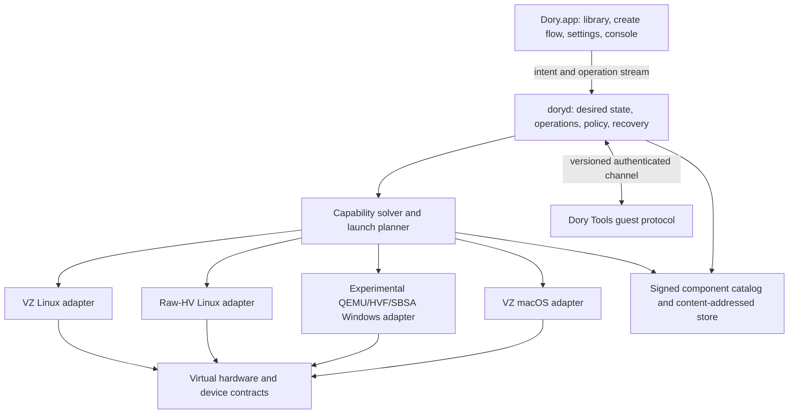
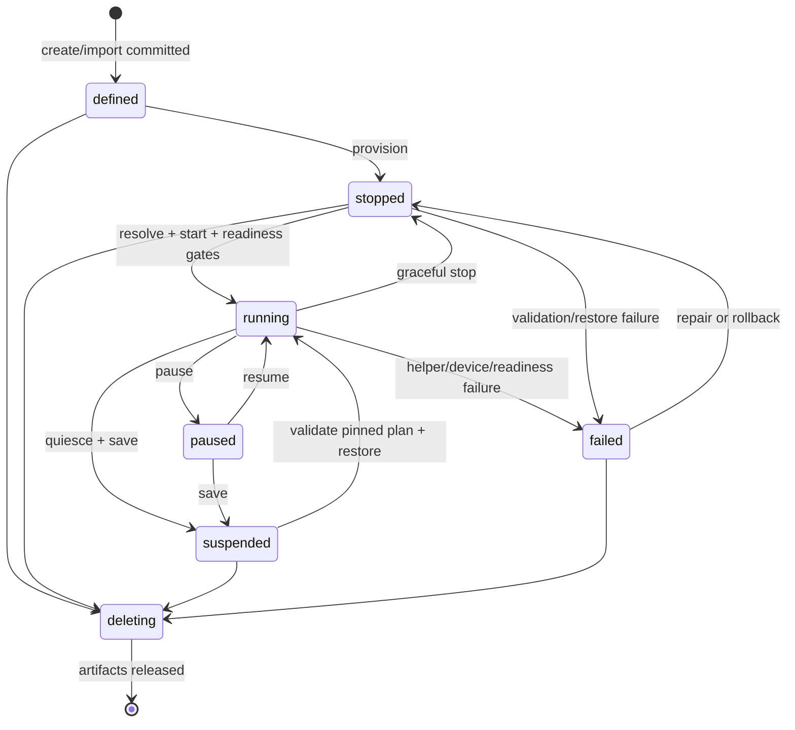

# ADR: Dory virtual workspace platform architecture

- **Status:** Accepted direction; implementation is staged
- **Date:** 2026-08-20
- **Owners:** Dory platform team
- **Scope:** Apple-silicon Dory host first; Linux, Windows, and macOS guests
- **First release target:** Production-qualified, accelerated ARM64 Linux desktops

## Decision

Dory will become a virtual-workspace platform, not a collection of distribution-specific VM
launch paths. A user installs one small, signed Dory application, chooses only the components and
guest media they need, and creates persistent workspaces through one consistent product surface.

The platform will have six explicit layers:

1. product UI;
2. orchestration and control plane;
3. virtualization backend adapters;
4. a backend-independent virtual device model;
5. versioned guest integration;
6. a signed component and artifact supply chain.

The control plane will select a backend by negotiating declared capabilities against a machine's
requirements. It will not select implementations by scattering checks such as “if Ubuntu,” “if
desktop,” or “if EFI” across the UI and daemon. Operating-system identity remains useful for
catalog presentation, image preparation, and guest-tools installation, but it is not the
virtualization architecture.

The existing Linux implementation is the foundation, not a prototype to discard. The immediate
work is to extract stable contracts around it, productize the accelerated path, and qualify it.
Windows and macOS are then added as new image families, guest-integration providers, and backend
capability combinations without cloning the control plane.

## Why this decision

Dory already has much of the difficult machinery:

- one per-user daemon owns local lifecycle and exposes authenticated XPC through
  [`DorydService`](../dory-core-swift/Sources/DorydKit/DorydService.swift);
- [`MachineManager`](../dory-core-swift/Sources/DorydKit/MachineManager.swift) persists machine
  configuration, supervises helpers, waits for readiness, and owns snapshot/clone/export/import;
- [`DoryVMM`](../dory-core-swift/Sources/DoryVMMKit/DoryVMM.swift) configures
  Virtualization.framework EFI/direct-kernel guests with storage, networking, display, input,
  audio, VirtioFS, NVRAM, and a persistent machine identity;
- [`DesktopMode`](../Packages/ContainerizationEngine/Sources/dory-hv/DesktopMode.swift) and the
  [`DoryHV`](../Packages/ContainerizationEngine/Sources/DoryHV) device implementations provide a
  custom Hypervisor.framework Linux runtime with VirtIO block, network, vsock, balloon, GPU,
  input, sound, and filesystem sharing;
- [`VirglRenderer`](../Packages/ContainerizationEngine/Sources/DoryHV/VirglRenderer.swift) provides
  capability-checked VirGL2 and Venus acceleration over Metal/MoltenVK rather than pretending
  `llvmpipe` is acceptable;
- [`DoryInstallerISOInspector`](../dory-core-swift/Sources/DoryOperations/DoryInstallerISO.swift)
  performs bounded, non-executing ISO architecture inspection and exact-media hashing before
  import;
- [`DoryInstalledLinuxBootBundle`](../dory-core-swift/Sources/DoryOperations/DoryInstalledLinuxBootBundle.swift)
  preserves a verified kernel/initrd/root-device contract for an EFI-installed Linux disk;
- [`DoryComponentCatalog`](../dory-core-swift/Sources/DoryOperations/DoryComponents.swift) already
  signs catalogs, verifies asset digests, resolves dependencies, installs immutably, and activates
  atomically on the selected Dory data drive;
- [`MachineBackupScheduler`](../dory-core-swift/Sources/DorydKit/MachineBackupScheduler.swift),
  [`HealthReporter`](../dory-core-swift/Sources/DorydKit/HealthReporter.swift), and
  [`IncidentWriter`](../dory-core-swift/Sources/DorydKit/IncidentWriter.swift) establish recovery
  and diagnostics foundations;
- [`guest/desktop`](../guest/desktop), [`guest/kernel`](../guest/kernel), and
  [`guest/mesa`](../guest/mesa) provide reproducible guest integration, kernels, and an isolated
  accelerated Vulkan runtime.

The present joining layer, however, still encodes product concepts in implementation switches.
For example, `DoryMachineConfiguration` combines kernel paths, rootfs paths, EFI media, display
mode, resources, shares, and an untyped environment dictionary. `MachineManager.processTarget`
then recognizes a particular combination as an “accelerated desktop.” The UI in
[`NewMachineSheet`](../Dory/Features/Sheets/NewMachineSheet.swift) similarly starts from “Linux
desktop” and “custom Linux ISO.” This works for proving Linux, but extending those switches to
Windows and macOS would produce three intertwined products and make qualification unreliable.

The new architecture keeps the proven engines and replaces the joining logic with durable,
versioned contracts.

## North-star user journey

1. The user downloads and opens Dory. The core app is useful by itself and clearly reports host
   compatibility.
2. A workspace gallery offers supported templates and **Install from image**. Templates display
   their download size, guest architecture, qualification level, license requirements, and needed
   Dory components before anything downloads.
3. Selecting Ubuntu, Windows 11 ARM, macOS, or a user-owned installer image creates one draft
   `WorkspaceSpec`. Dory inspects the media without executing it and shows facts separately:
   architecture compatibility, backend availability, device support, acceleration, guest-tools
   status, and whether the exact combination is qualified.
4. The settings editor presents CPU, memory, storage, graphics, displays, network adapters, audio,
   input, shared folders, clipboard, USB, and recovery in the same structure for every workspace.
   Controls unavailable for the chosen host/image are disabled with the missing capability and a
   supported alternative. Settings never silently downgrade.
5. **Create and Run** resolves components, downloads and verifies only missing artifacts, creates
   durable machine state transactionally, boots the installer or template, and opens its display.
6. The workspace card exposes start, stop, pause, resume, restart, duplicate, snapshot, restore,
   export, and delete. Closing a display window does not destroy or ambiguously stop the VM.
7. Dory Tools installs or becomes active when supported. Resize, clipboard, shared folders, time
   sync, graceful shutdown, telemetry, application launch, and recovery report their negotiated
   status in one **Integration health** surface.
8. Updates change replaceable components transactionally. User disks, firmware identity, license
   state, snapshots, and settings remain intact. A failed update returns to the last qualified
   component selection.
9. Diagnostics can answer “what ran?” exactly: Dory version, host build and hardware, backend,
   virtual-hardware ABI, component and media digests, guest-tools version, negotiated capabilities,
   and the failed lifecycle operation.

The product promise is a physical-machine-like development and testing environment. That means
durable state, correct device semantics, responsive accelerated graphics, and reproducible
configuration. It does **not** mean claiming physical GPU passthrough, nested virtualization, or
bit-identical hardware when the host platform cannot provide it.

## System boundaries and ownership



### 1. Product UI

The UI owns presentation, editing draft intent, and explaining support. It does not select helper
executables, mutate disks, or infer readiness from a process existing.

The machine surface should be reorganized around:

- **Workspace library:** all local VMs, grouped or filtered by guest family and state;
- **Create workspace:** source, requirements, resources, devices, integration, review;
- **Workspace inspector:** Summary, Hardware, Network, Sharing, Recovery, Integration, Diagnostics;
- **Components:** installed runtimes, templates, guest-tools packs, sizes, provenance, updates;
- **Operations:** durable progress with cancelability and recovery, not transient button spinners.

[`MachinesView`](../Dory/Features/Machines/MachinesView.swift) and
[`ComponentsView`](../Dory/Features/Components/ComponentsView.swift) remain the initial views, but
they consume control-plane projections. They must not reimplement compatibility decisions.

### 2. Orchestration and control plane

`doryd` remains the only production owner. Introduce the following logical contracts in a package
that both the app and daemon can import without linking UI or VM frameworks:

```swift
struct WorkspaceSpec: Codable, Sendable {
    let schemaVersion: Int
    let id: WorkspaceID
    var source: GuestSource
    var requirements: CapabilityRequirements
    var hardware: VirtualHardwareSpec
    var integration: GuestIntegrationPolicy
    var recovery: RecoveryPolicy
}

protocol MachineBackend: Sendable {
    var descriptor: BackendDescriptor { get }
    func probe(_ context: HostContext) async -> BackendProbe
    func plan(_ request: BackendPlanRequest) throws -> BackendLaunchPlan
    func start(_ plan: BackendLaunchPlan, events: MachineEventSink) async throws
    func requestStop(_ id: WorkspaceID, deadline: Duration) async throws
    func pause(_ id: WorkspaceID) async throws
    func resume(_ id: WorkspaceID) async throws
}
```

The concrete type names may change, but these boundaries may not collapse back into environment
variables or path tuples.

Control-plane responsibilities:

- validate and version desired state;
- serialize mutating operations per workspace;
- resolve and pin a launch plan before changing state;
- ensure required components and permissions;
- own helper process lifetime and readiness deadlines;
- reconcile observed state after daemon/host restart;
- own stable MAC addresses, device IDs, firmware files, and guest identity;
- journal every multi-step operation and perform recovery;
- publish ordered machine events and an immutable status projection over XPC;
- authorize access to files selected through the app and materialize security-scoped bookmarks;
- refuse unsupported or unqualified combinations rather than applying hidden workarounds.

[`MachineManager`](../dory-core-swift/Sources/DorydKit/MachineManager.swift) becomes the migration
host for a `WorkspaceCoordinator`, `WorkspaceRepository`, `OperationJournal`, and
`BackendRegistry`. Its existing persistence, helper supervision, readiness handoff, snapshot logic,
and artifact safety checks should move behind those focused types incrementally.

### 3. Backend adapters

Backends implement host mechanisms; they do not own product policy.

| Adapter | Initial scope | Existing foundation |
|---|---|---|
| `RawHVLinuxBackend` | Managed ARM64 Linux and supported installed ARM64 Linux with accelerated VirGL2/Venus | [`dory-hv`](../Packages/ContainerizationEngine/Sources/dory-hv), [`DoryHV`](../Packages/ContainerizationEngine/Sources/DoryHV) |
| `VZLinuxBackend` | ARM64 Linux direct boot and EFI installation; compatibility fallback | [`DoryVMMKit`](../dory-core-swift/Sources/DoryVMMKit) |
| `VZMacBackend` | macOS restore-image installation and macOS VM lifecycle | New adapter using Apple macOS-specific Virtualization.framework configuration |
| `QEMUHVFWindowsBackend` | Experimental Windows 11 ARM64 on an SBSA-style machine, accelerated by Hypervisor.framework through QEMU/HVF; unavailable in public builds until authorization, device, driver, and qualification gates pass | New, separately packaged adapter; not an extension of `DoryVMMKit` |
| `EmulatedBackend` | Possible future non-native whole-guest emulation, explicitly labeled and separately qualified | Not a release dependency |

Backend probes return structured facts, including host OS/API requirements, guest architectures,
boot mechanisms, supported device models, maximum vCPU/memory limits, pause/save support, and
graphics API levels. `automatic` is a solver policy, not a backend.

The current `DoryDesktopVMMPreference` and `DoryDesktopGraphicsPreference` in
[`DoryDesktopRuntimeContract`](../dory-core-swift/Sources/DoryOperations/DoryDesktopRuntimeContract.swift)
remain a compatibility input during migration. New persisted workspaces store typed preference and
requirements. Environment keys remain test/diagnostic overrides only and are recorded in
diagnostics when used.

### 4. Backend-independent device model

`VirtualHardwareSpec` describes stable guest-visible hardware. A backend must either map each
required device to an implementation with the declared semantics or reject the plan.

```text
VirtualHardwareSpec
  cpu: architecture, count, feature policy
  memory: boot size, minimum, balloon policy
  firmware: direct kernel | UEFI | macOS platform
  storage[]: stable ID, role, bus, format, durability, discard, read-only
  networks[]: stable MAC, attachment profile, MTU, forwards, filters
  displays[]: dimensions, scale, acceleration requirements
  input[]: keyboard, absolute pointer, relative pointer, tablet
  audio[]: direction, channels, format policy, host device policy
  shares[]: stable tag, host authorization, guest mount, read-only
  channels[]: console, agent, clipboard, file transfer, diagnostics
  security: secure boot, TPM, entropy, isolation policy
```

Device identity and ordering are part of a versioned **virtual-hardware ABI**. A backend update may
not reorder disks, change NIC MACs, replace firmware identity, or change a controller visible to an
installed OS without an explicit migration. This is essential for Windows activation, macOS
identity, Linux boot, snapshots, and reliable testing.

The raw-HV devices—[`VirtioBlk`](../Packages/ContainerizationEngine/Sources/DoryHV/VirtioBlk.swift),
[`VirtioNet`](../Packages/ContainerizationEngine/Sources/DoryHV/VirtioNet.swift),
[`VirtioGPU`](../Packages/ContainerizationEngine/Sources/DoryHV/VirtioGPU.swift),
[`VirtioInput`](../Packages/ContainerizationEngine/Sources/DoryHV/VirtioInput.swift),
[`VirtioSound`](../Packages/ContainerizationEngine/Sources/DoryHV/VirtioSound.swift),
[`VirtioFS`](../Packages/ContainerizationEngine/Sources/DoryHV/VirtioFS.swift), and
[`VirtioVsock`](../Packages/ContainerizationEngine/Sources/DoryHV/VirtioVsock.swift)—become one
implementation of those contracts. Virtualization.framework mappings in
[`DoryVMM`](../dory-core-swift/Sources/DoryVMMKit/DoryVMM.swift) become another.

### 5. Guest integration

“Dory Tools” is a versioned protocol with optional capabilities, not a monolithic Linux script.
The daemon authenticates the VM/channel established by the launch plan, then the guest reports a
protocol version and supported operations.

Capability groups:

- readiness, shutdown, reboot, clock synchronization, and health;
- display topology and resize acknowledgement;
- clipboard text/image and directional policy;
- shared-folder discovery and mount status;
- file transfer and drag/drop with progress and cancellation;
- network identity and telemetry;
- filesystem freeze/thaw for application-consistent snapshots;
- package/integration update with rollback health;
- process/app launch for qualification and developer automation.

Linux initially uses the existing Rust agent, vsock transport, and integration under
[`guest/desktop/rootfs-overlay/usr/lib/dory`](../guest/desktop/rootfs-overlay/usr/lib/dory).
Windows requires a signed Windows service and drivers where inbox drivers are insufficient. macOS
uses only supported guest-side mechanisms and Virtualization.framework facilities. Missing tools
must degrade individual integrations, not make the display or recovery console inaccessible.

### 6. Components and artifact supply chain

The current signed catalog is retained and generalized. A component is immutable content plus
declared capabilities; a template is metadata referencing components and permitted source media.
Examples include:

- raw-HV Linux runtime and renderer;
- VZ Linux runtime support files;
- Linux kernel/runtime packs;
- Ubuntu/Debian/Kali templates;
- experimental QEMU/HVF/SBSA Windows runtime;
- Windows VirtIO/guest-tools driver ISO;
- macOS integration support;
- architecture-specific CLI tools;
- qualification evidence packs.

Catalog v2 should add typed `provides`, `requires`, host constraints, artifact roles, provenance,
and qualification references while preserving v1 installation during migration:

```json
{
  "kind": "dev.dory.component",
  "schemaVersion": 2,
  "id": "runtime.rawhv-linux",
  "version": "0.5.0",
  "architectures": ["arm64"],
  "hostRequirements": { "platform": "macos", "minimumVersion": "15.0" },
  "provides": [
    "backend.rawhv-linux@2",
    "device.virtio-gpu.virgl2@1",
    "device.virtio-gpu.venus@1"
  ],
  "requires": ["app.dory-core>=0.5.0"],
  "artifacts": [
    {
      "role": "host-helper",
      "path": "dory-hv",
      "bytes": 123,
      "sha256": "<64 lowercase hex characters>",
      "executable": true,
      "codeRequirement": "<designated requirement>"
    }
  ],
  "provenance": {
    "sourceCommit": "<git sha>",
    "builder": "<builder identity>",
    "recipeDigest": "<sha256>",
    "sbomDigest": "<sha256>",
    "attestationDigest": "<sha256>"
  },
  "qualification": ["linux-desktop-arm64.apple-m2.macos-15"]
}
```

Supply-chain rules:

- the catalog is signed by an offline-rotatable root; metadata supports key IDs, expiry, and
  rollback/freeze protection;
- every downloaded byte has a declared size and digest and is fetched over HTTPS;
- executable host artifacts also pass code-signature/designated-requirement validation;
- guest images include an SBOM, package manifest, source/recipe digests, and reproducible build
  inputs;
- activation is an atomic pointer to an immutable installation; no consumer reads from a partial
  download;
- active launch plans pin component digests, so an update cannot change a running or restoring VM;
- removal is dependency- and lease-aware; artifacts referenced by workspaces/snapshots remain;
- rollback restores the exact prior component selection;
- local overrides are visibly “developer/unqualified,” never indistinguishable from release bits.

[`DoryComponentStore`](../dory-core-swift/Sources/DoryOperations/DoryComponents.swift) and
[`scripts/build-components.py`](../scripts/build-components.py) are the migration starting points.

## Capability negotiation

### Capability model

A capability has a stable identifier, semantic version, attributes, quality, and evidence:

```swift
struct Capability: Hashable, Codable, Sendable {
    let id: CapabilityID               // e.g. graphics.vulkan, lifecycle.pause
    let version: SemanticVersion
    let attributes: [String: Value]    // API level, limits, formats, directions
    let quality: CapabilityQuality     // native, accelerated, translated, emulated
    let evidence: EvidenceReference?
}

enum RequirementStrength: Codable { case required, preferred, optional }
```

Capabilities come from five sources:

1. the host probe;
2. installed backend components;
3. selected media/template metadata;
4. the virtual-hardware ABI implementation;
5. the live guest-tools handshake.

The resolver takes `WorkspaceSpec + HostCapabilities + ComponentInventory + MediaInspection` and
returns either a fully pinned `ResolvedMachinePlan` or an ordered list of unsatisfied requirements
and alternatives. Resolution is pure and testable. Starting a VM executes the pinned plan; it does
not resolve again halfway through launch.

Examples:

- a requirement for `graphics.vulkan >= 1.3, quality >= accelerated` selects raw-HV
  VirGL2/Venus only when renderer symbols, pinned MoltenVK, guest Mesa, and the relevant
  qualification evidence are present;
- a Linux ISO with ARM64 EFI can select VZ Linux installation even without Dory Tools, while clipboard
  remains `unavailable` until the guest reports it;
- an x86_64-only ISO on Apple silicon fails architecture resolution before disk allocation;
- Windows never selects the VZ Linux adapter. It requires the separately authorized and qualified
  QEMU/HVF/SBSA Windows backend and does not inherit Linux's `graphics.vulkan` result; graphics
  requires a Windows capability such as a qualified WDDM/DirectX level;
- macOS requires `platform.macos-vm`, a compatible restore image/hardware model, and the macOS VZ
  adapter; it never selects the generic Linux EFI adapter based only on ARM64.

### No hidden fallback

Preferred requirements may produce a user-approved alternative. Required requirements fail.
Every fallback is persisted in the plan and visible in the UI and diagnostics. In particular,
software rendering is not an acceptable automatic substitute when a template or app qualification
requires accelerated graphics.

## Lifecycle state machine

Persist a stable condition plus at most one durable mutating operation. Do not encode every
operation combination in a single ever-growing enum.

Stable conditions:

- `defined`: desired state and durable artifacts exist; never booted;
- `stopped`: bootable, not executing;
- `running`: backend and required readiness gates are healthy;
- `paused`: execution is resident but paused;
- `suspended`: durable saved state exists and no helper runs;
- `failed`: the last transition failed and includes a recovery disposition;
- `deleting`: tombstoned; only cleanup/recovery may proceed.

Durable operations:

- `importing`, `provisioning`, `resolving`, `starting`, `stopping`, `pausing`, `resuming`,
  `suspending`, `restoring`, `snapshotting`, `cloning`, `updating`, `repairing`, `deleting`.



Rules:

- every operation has an ID, expected source condition, target condition, step journal, deadline,
  cancellation policy, and rollback/recovery recipe;
- events carry monotonically increasing sequence numbers so UI reconnects cannot reorder state;
- readiness is a set of named gates (backend running, display frame where required, agent where
  required, network where required), not one generic handoff;
- closing the UI never changes desired power state;
- daemon restart reconstructs observed state from the journal, helper identity, locks, and durable
  artifacts before accepting another mutation;
- unexpected helper exit after readiness is `failed`, not an unbounded restart loop;
- retry budgets apply to individual, classified startup failures and are recorded;
- stop first requests guest shutdown, then a virtual power button when supported, then force-stops
  after a visible deadline;
- pause is not suspend; a paused VM still owns RAM and host resources;
- resource/device changes declare whether they are live, require restart, or require an explicit
  device-ABI migration.

The current `DoryMachineState` and `HvProcess` restart/readiness behavior are the compatibility
implementation while this model is introduced.

## Device and subsystem decisions

### Storage

- Store each workspace as a manifest referencing disks and firmware artifacts by stable IDs, not
  as paths embedded throughout UI/XPC models.
- Distinguish disk roles: boot, system, data, removable installer, tools, recovery.
- Default to sparse, host-native files with explicit logical/allocated size. Reject shrinking.
- Preserve write ordering and flush semantics. A backend is not qualified until power-loss and
  forced-exit tests prove filesystem recovery.
- EFI NVRAM, machine identifier, macOS auxiliary storage, secure-boot identity, and TPM state are
  first-class artifacts included in snapshot/export compatibility checks.
- A snapshot manifest records parent content, storage-controller ABI, component digests, and
  consistency level. Linked clones arrive only after reference counting and garbage collection are
  crash-safe.
- Keep imported user media immutable in daemon-owned storage and retain its original digest and
  source bookmark. Media ejection changes attachment state, not bytes.

The current selected-drive and private-materialization foundations live in
[`DoryDataDrive`](../dory-core-swift/Sources/DoryOperations/DoryDataDrive.swift),
[`DesktopMachineAssetProvisioner`](../Dory/Runtime/Machines/DesktopMachineAssets.swift), and
`MachineManager.prepareMachineArtifacts`.

### Networking

Represent networking per NIC through named attachment profiles:

- **Shared/NAT:** default, isolated inbound, optional explicit port forwarding;
- **Host-only:** deterministic private connectivity with no external route;
- **Bridged:** explicit interface choice and permission, only when the backend/host can implement
  and qualify it;
- **Disconnected:** device present, link down;
- future policy networks for test labs.

Each NIC has a stable MAC, MTU, DNS policy, address policy, firewall/ingress policy, and counters.
Port forwards are resources with conflict detection and lifecycle reconciliation. Network changes
must survive host sleep, Wi-Fi/interface changes, VPN route changes, and daemon restarts.

The Linux VZ and raw-HV adapters use the provenance-pinned `gvproxy` launch path in
[`GVProxyDesktopLaunchPlan`](../Packages/ContainerizationEngine/Sources/DoryHV/GVProxyDesktopLaunchPlan.swift)
and existing Dory DNS/routing. Shared/NAT, host-only, and disconnected are exact resolved device
contracts on both adapters. Host-only uses the audited `host-only-connectivity-v1` gvproxy policy:
guest TCP/UDP cannot open arbitrary host-network sockets, upstream DNS resolution is disabled, and
only explicit virtual-host mappings remain reachable. The historical schema value `isolated` is
retained on the wire for compatibility while product surfaces call it **Host-only**. Bridged mode
remains unavailable until an adapter and physical-host qualification prove it; the UI must not
imply that NAT or host-only is bridged networking.

New resolved Linux plans also carry a deterministic locally administered MAC and an exact MTU for
the primary `nic0`. Both adapters consume those values directly: VZ and raw-HV use the same
plan-owned address, gvproxy's DHCP lease is rewritten to that address, virtio-net advertises the
resolved MTU, and the privileged source-preserving LAN bridge targets the same MAC. Historical
plans with no NIC identity retain their prior adapter-specific behavior and cannot silently acquire
the new contract without replanning.

### Display and graphics

- A display is a stable device with point size, pixel size, scale, refresh policy, and color-space
  metadata. Backends report maximum display count and dimensions.
- Window resize is a negotiated display event completed only after the guest acknowledges a mode
  and renders a correctly sized frame.
- Retina scale and guest UI scale are distinct and recorded.
- The display surface and graphics acceleration capability are distinct: a VM can have a console
  without 3D acceleration.
- Graphics capabilities are guest-API specific: VirGL/OpenGL, Venus/Vulkan, Windows
  WDDM/DirectX, and macOS Metal are not interchangeable labels.
- Renderer and shader failures are fatal capability-health events with backend, context, and guest
  application evidence. They may not silently switch the machine to `llvmpipe`.
- Multi-display, full-screen, cursor shape/hotspot, capture/release, and sleep/wake are explicit
  qualification cases.

Linux accelerated display continues through [`DesktopMetalDisplay`](../Packages/ContainerizationEngine/Sources/dory-hv/DesktopMetalDisplay.swift),
`VirtioGPU`, and `VirglRenderer`. The VZ compatibility display remains
[`DoryVMMDesktopApplication`](../dory-core-swift/Sources/DoryVMMKit/DoryVMMDesktopApplication.swift).

### Input

- Model keyboard, absolute pointer, relative pointer, and tablet independently.
- Persist keyboard layout policy and translate host shortcuts in the display frontend, not the
  device backend.
- Keep input queues bounded and prioritize release events to avoid stuck keys/buttons.
- Clipboard shortcuts invoke negotiated clipboard actions; they are not a substitute for a
  clipboard transport.
- Accessibility, international layouts, key repeat, modifier chords, gaming/raw input, and focus
  changes require automated and live qualification.

### Audio

- Model output and input as separate optional devices with host permission and routing state.
- Negotiate sample formats/rates and perform bounded conversion behind the backend interface.
- Handle mute, underflow/overflow, host device changes, Bluetooth latency, sleep/wake, and
  microphone permission revocation.
- Never block a vCPU on host audio I/O. Metrics include queue depth, dropped frames, latency, and
  device reconnections.

The raw-HV foundation is [`VirtioSound`](../Packages/ContainerizationEngine/Sources/DoryHV/VirtioSound.swift)
with [`DoryMacAudioBackend`](../Packages/ContainerizationEngine/Sources/dory-hv/DesktopAudioBackend.swift).
VZ already configures host audio devices in `DoryVMM`.

### Shared folders, clipboard, and transfer

- Host paths are authorized through persistent security-scoped bookmarks, canonicalized, and
  opened with least privilege. A textual path is never authorization.
- Each share has a stable tag, explicit read-only/read-write mode, guest mount point, case and
  ownership policy, and backend compatibility result.
- Default shares are minimal; the user's entire home is never an implicit desktop-workspace grant.
- Runtime add/remove is transactional and requires guest acknowledgement or a documented restart.
- DAX-like direct mappings remain disabled unless coherence and invalidation are proven.
- Clipboard has off, host-to-guest, guest-to-host, and bidirectional modes, independently for text,
  image, and files.
- Drag/drop uses a versioned transfer protocol with staging, digest, conflict policy, cancellation,
  progress, quarantine metadata, and cleanup; it is not implemented as an unrestricted share.

Reuse [`DoryMachineShareConfiguration`](../dory-core-swift/Sources/DorydKit/MachineManager.swift),
[`VirtioFSShareConfiguration`](../Packages/ContainerizationEngine/Sources/DoryHV/VirtioFSShareConfiguration.swift),
and [`DoryDesktopClipboardCoordinator`](../dory-core-swift/Sources/DoryVMMKit/DoryDesktopClipboardCoordinator.swift)
behind these contracts.

## Snapshots, recovery, clone, and export

Snapshot consistency levels are explicit:

1. **stopped:** strongest default; backend stopped and all files flushed;
2. **guest-quiesced:** guest tools froze filesystems/applications, disks and optional device state
   captured, then thawed;
3. **crash-consistent:** storage barriers completed but the guest was not quiesced;
4. **saved-state:** CPU/RAM/device state captured by a backend that declares a compatible saved
   state format.

No live snapshot is labeled application-consistent without a successful guest quiesce receipt.
Snapshot metadata contains:

- workspace spec revision and virtual-hardware ABI;
- backend ID/version and required saved-state compatibility, if any;
- component catalog and artifact digests;
- disk graph and consistency level;
- firmware/NVRAM/machine identity/TPM/macOS auxiliary storage as applicable;
- guest-tools build and quiesce receipt;
- media identity, host qualification key, creation operation, and checksum tree.

Restore is transactional: verify all content, snapshot current replaceable state or retain a
rollback reference, materialize to temporary names, fsync, atomically publish, then boot-verify.
Export uses a versioned archive with a signed/checksummed manifest and never assumes another host
supports the original backend. Import first reports portability and missing components; it does not
partially create a workspace.

Extend the proven snapshot/export logic in `MachineManager`, rather than maintaining the older
container-image snapshots in [`MachineSnapshot`](../Dory/Runtime/Machines/MachineSnapshot.swift)
as a second VM truth.

## Security model

### Trust boundaries

| Boundary | Rule |
|---|---|
| Dory.app | Unprivileged presentation client. Sends typed intent over same-user, production-signature-authenticated XPC. |
| `doryd` | Per-user authority for desired state, artifacts, network policy, operations, and helper supervision. Validates every client input again. |
| VM helper | One process per VM or explicit shared engine. Holds only required VM entitlements/files/descriptors. Never becomes a second control plane. |
| Privileged network helper | Performs only a pre-derived, ownership-checked network plan. No general command execution. |
| Guest | Untrusted even for Dory-built images. Device parsers, queues, agent messages, filenames, and telemetry are hostile inputs. |
| Components/media | Untrusted until signature/digest/type/size/architecture checks succeed. User media is never executed on the host. |
| Host shares | Capability-granted by bookmark and mode, scoped to one workspace/device. |

Required controls:

- owner-only state directories, `O_NOFOLLOW`, regular-file/link-count/owner validation, atomic
  writes, fsync, and bounded parsers;
- authenticated, versioned XPC and guest channels with message-size/time limits;
- least-privilege entitlements and descriptor passing instead of global filesystem reach;
- no secrets in environment dictionaries, command lines, diagnostics, or component manifests;
- explicit network exposure and collision checks; localhost is the port-forward default;
- device fuzzing for VirtIO descriptor chains, protocol messages, ISO/GPT parsing, and archives;
- signed guest tools/drivers and verifiable updates; Windows kernel drivers require the appropriate
  Microsoft signing path before public distribution;
- no automatic mounting of untrusted installer media on the host;
- clear license/consent gates for Windows and macOS media and guest integration.

## Observability and supportability

Every lifecycle mutation receives an operation ID propagated through UI, daemon, backend, helper,
guest agent, and component installer. Emit structured events with:

- monotonic sequence and wall-clock time;
- workspace ID, operation ID, spec revision, backend/ABI IDs;
- host model/OS build and component/media digests;
- lifecycle transition, readiness gate, duration, deadline, and classified error;
- device health: queue stalls, resets, GPU fences/device loss, display frames, audio drops, storage
  flush latency, network reconnects, share invalidations;
- resource data: vCPU time, guest/host memory, balloon target, I/O, network, renderer memory, helper
  process tree, file descriptors, and threads.

Keep a bounded per-workspace flight recorder and serial/firmware console independent of Dory Tools.
Support bundles are opt-in, redacted, size-bounded, and show the user what will be included. Raw
clipboard, file contents, credentials, host paths, and keystrokes are excluded by default.

Build on `HealthReporter`, `IncidentWriter`, raw-HV serial logs, `DorydMachineStats`, and the current
VMM handoff. Replace string-only `lastError` as the primary diagnostic with stable error codes,
causal chains, recovery disposition, and relevant evidence references.

## Qualification and release gates

Code existence is not support. A capability may be advertised only when the exact release
candidate has evidence at all applicable levels:

1. **Schema and solver tests:** serialization, migration, deterministic resolution, rejection,
   fallback visibility, and stable hardware identity.
2. **Device conformance:** protocol/unit/property/fuzz tests, reset/error paths, queue saturation,
   flush/barrier semantics, and backend contract tests.
3. **Backend integration:** boot, readiness, shutdown, pause/resume, failure injection, daemon
   restart, host sleep/wake, component replacement, and low-disk recovery.
4. **Guest matrix:** every supported OS release/kernel/tools combination, clean install and update,
   with and without guest tools.
5. **Application workloads:** browser/video/audio, IDEs including Zed, terminals, file managers,
   package installers, compilers, containers where supported, graphics API probes, and sustained
   I/O/network/GPU stress.
6. **Lifecycle/data safety:** snapshot/restore/clone/export/import, corrupted/truncated artifacts,
   force-kill at every journal step, and boot verification of recovered data.
7. **Physical Macs:** every supported macOS major and qualified Apple-silicon generation, multiple
   display scales, sleep/wake, network/VPN changes, microphone permissions, and external storage.
8. **Signed-candidate binding:** app digest, helper code signatures, component catalog digest,
   artifact/media digests, guest package manifest, host model/build, and test result are inseparable.

The public compatibility UI has four levels:

- **Supported:** exact matrix passed and regressions gate release;
- **Preview:** bounded scope passed but the full release matrix has not;
- **Unqualified:** architecture appears possible but no exact evidence;
- **Unavailable:** a required capability is absent or policy forbids the combination.

Software fallback never turns a failed acceleration gate into a supported accelerated result.
[`LINUX_DESKTOP_PARITY.md`](../LINUX_DESKTOP_PARITY.md) remains the Linux product checklist until
its gates are represented in executable qualification manifests.

## Apple-silicon constraints and honest product scope

### Linux

- Hardware virtualization runs ARM64 guests on Apple silicon. An x86_64-only whole Linux ISO is
  not a hardware-virtualized VM on this host. Dory rejects it before allocation today through
  `DoryInstallerISOInspector`.
- A future whole-system emulator may run x86_64 media, but it must be labeled **emulated**, has a
  different performance/compatibility promise, and cannot satisfy native-workspace qualification.
- x86_64 **applications** can run inside an ARM64 Linux guest through a separately supported
  translation facility. Apple's Rosetta-for-Linux integration belongs to its
  Virtualization.framework path and has host/guest requirements; Dory's other backends need their
  own translated-app capability (the current Docker engine uses bundled FEX).
- Virtualization.framework supplies a reliable generic Linux display/device path, but Dory's
  current high-performance Linux 3D path is the custom raw-HV VirtIO GPU plus VirGL2/Venus. It is
  translated graphics, not PCIe GPU passthrough.
- Arbitrary installer compatibility is never inferred from ARM64 EFI alone. Kernel/device behavior
  and sustained workload tests remain tied to media digest, host build/model, backend, and
  virtual-hardware ABI.

### Windows

- The native target on Apple silicon is Windows 11 ARM64. Microsoft publishes ARM64 ISO media and
  states that ARM64 VMs can be created on Apple-silicon Macs. Dory must not present x64 Windows ISO
  installation as native virtualization.
- Apple's shipped Virtualization.framework headers document Linux boot and macOS platform/install
  configurations, but expose no Windows guest platform. `VZGenericPlatformConfiguration` and an
  EFI loader are not a Windows support contract. Dory will therefore not disguise Windows as a
  `DoryVMM`/VZ Linux variant.
- The engineering backend is an experimental QEMU ARM `virt`/SBSA-style machine accelerated by
  Hypervisor.framework through HVF. It is a separately packaged adapter with a separately versioned
  virtual-hardware ABI. QEMU's ability to reach an installer is research evidence, not public Dory
  support.
- Windows 11 on ARM can translate many x86/x64 user applications, but that does not make x64
  kernel drivers, anti-cheat, low-level hardware software, or every application compatible.
- A booting QEMU/HVF EFI VM is not a supported Windows product. Dory must qualify stable SBSA/UEFI
  firmware, TPM/Secure Boot policy, storage/network/input/audio devices, recovery, installer
  drivers, and a signed Dory Tools package.
- Linux VirGL/Venus does not provide Windows DirectX acceleration. Windows GPU support requires a
  signed and qualified ARM64 WDDM display driver plus a host graphics translation path. The
  Windows component cannot graduate from experimental, and Dory cannot advertise GPU acceleration,
  until that path passes DirectX conformance and application qualification. Linux renderer code is
  not a shortcut around this gate.
- Microsoft's current Apple-silicon support page names Windows 365 and Parallels Desktop 18–20 as
  the available solutions, calls those Parallels versions authorized, and documents DirectX 12 and
  nested-virtualization limitations. Before Dory distributes or advertises a local Windows product,
  it needs an explicit Microsoft support/authorization and licensing review; technical boot success
  cannot substitute for that review.
- Users supply or obtain Windows through an authorized Microsoft channel and are responsible for
  a valid license/activation. Dory does not redistribute Windows or bypass installation/security
  requirements.

### macOS

- macOS guests on Apple silicon use Apple's macOS-specific Virtualization.framework model, not
  the generic Linux EFI model, the experimental Windows SBSA machine, or Dory's raw-HV Linux device
  tree.
- Creation and installation use `VZMacOSRestoreImage`/`VZMacOSInstaller` with a host-supported IPSW,
  `VZMacPlatformConfiguration`, a restore-image-derived `VZMacHardwareModel`, a persistent
  `VZMacMachineIdentifier`, and matching `VZMacAuxiliaryStorage`. These artifacts are part of
  machine identity and snapshot/export compatibility.
- Dory must use Apple-provided macOS graphics/input/storage mechanisms and capability-probe the
  host API. The Linux VirGL/Venus stack is irrelevant to macOS guest Metal support.
- Dory will not bundle or mirror macOS restore images. The user selects an Apple-fetched IPSW or
  explicitly asks Dory to fetch Apple's latest image supported by the current host. Dory validates
  the restore image's supported configuration before allocation and clearly communicates applicable
  Apple software-license restrictions.
- Cross-Mac restore is conditional on restore-image/hardware-model compatibility; an archive being
  intact does not guarantee it is bootable on every Mac.

### Cross-cutting host limits

- Dory's current product is a macOS host application. “For everyone” first means a consistent
  workspace product on supported Macs; Windows/Linux host implementations require their own host
  adapters and qualification and are a later program.
- Nested virtualization, device passthrough, saved-state APIs, bridged networking, and other host
  features are capability-probed and version-qualified. They are not inferred from marketing names
  or macOS version alone.
- No public Apple API currently used by Dory provides general physical GPU passthrough. Product
  language must describe translated, API-level acceleration and its tested limits.

Primary platform references:

- [Apple: Running GUI Linux in a virtual machine on a Mac](https://developer.apple.com/documentation/virtualization/running-gui-linux-in-a-virtual-machine-on-a-mac)
- [Apple: Running macOS in a virtual machine on Apple silicon](https://developer.apple.com/documentation/virtualization/running-macos-in-a-virtual-machine-on-apple-silicon)
- [Apple: Hypervisor framework](https://developer.apple.com/documentation/hypervisor)
- [Microsoft: Windows 11 Arm ISO files](https://learn.microsoft.com/windows/arm/iso)
- [Microsoft: Options for using Windows 11 with Apple-silicon Macs](https://support.microsoft.com/en-US/Windows/Experience/Platform-variants/options-for-using-windows-11-with-mac-computers-with-apple-m1-m2-and-m3-chips)
- [Microsoft: How emulation works on Arm](https://learn.microsoft.com/windows/arm/apps-on-arm-x86-emulation)

## Delivery milestones

Each milestone ends in a demonstrable, releasable vertical slice. Parallel implementation is
welcome only after shared contracts and file ownership are assigned; merging uncoordinated backend
patches into `MachineManager` is not progress.

### Milestone 0 — Contract extraction and migration safety

**Goal:** Make the current Linux system expressible without behavior changes.

- Add `WorkspaceSpec v2`, capability, launch-plan, device, operation, and backend contracts.
- Add lossless migration between persisted `DoryMachineConfiguration` and the v2 Linux spec.
- Introduce `WorkspaceRepository`, `OperationJournal`, `BackendRegistry`, and pure
  `CapabilityResolver` behind existing XPC calls.
- Wrap current `dory-vmm` and `dory-hv` selection as adapters; keep current launch tests passing.
- Version the virtual-hardware ABI and record it in status, snapshots, exports, and diagnostics.
- Replace new persisted environment settings with typed fields; retain read compatibility.
- Gate: existing managed desktops, headless machines, custom ISO, snapshots, and backups pass with
  byte-compatible durable artifacts and rollback tests.

### Milestone 1 — Accelerated Linux as the first complete workspace

**Goal:** Ship a Linux desktop that users can trust for real application work.

- Make raw-HV VirGL2/Venus the resolved backend for qualified managed ARM64 Linux desktops;
  preserve VZ as an explicit compatibility/recovery backend.
- Productize import/install/eject/direct-boot for qualified ARM64 Linux ISOs without converting an
  installed disk into a distro-specific image.
- Finish reliable dynamic resolution, Retina scale, full screen, cursor, input, output/input audio,
  clipboard, shares, graceful shutdown, and host sleep/wake.
- Surface backend, GPU, guest tools, software fallback, and exact qualification in the UI.
- Run representative desktop/app stress, including Zed on native Venus, browsers, package updates,
  compilers, media, file I/O, networking, snapshot/restore, and forced recovery.
- Gate: no known login trap, invisible text/render corruption, `llvmpipe` substitution, installer
  freeze, or unexplained whole-guest stall in the signed-candidate matrix.

### Milestone 2 — Unified Dory Tools and integration health

**Goal:** Make integrations independently discoverable, updateable, and diagnosable.

- Formalize the guest handshake and capability versions.
- Turn Linux overlay scripts into a versioned tools pack with transactional update/rollback.
- Implement transfer/drag-drop and snapshot freeze/thaw.
- Add integration health, repair actions, and unambiguous missing-tools behavior.
- Define Windows service/driver and macOS guest-integration packaging contracts without claiming
  support yet.

### Milestone 3 — Storage, networking, and recovery parity

**Goal:** Make workspaces safe and configurable enough to replace a daily-use VM product.

- Add backend-neutral NAT, host-only, disconnected, and qualified bridged profiles.
- Finish runtime share mutation, stable NIC/device identity, port-forward reconciliation, and VPN
  recovery.
- Add guest-quiesced/live snapshot semantics, linked clones with safe reference accounting, durable
  suspend where supported, and cross-host portability reports.
- Complete low-disk, corruption, interruption, daemon crash, helper crash, and host-reboot gates.

### Milestone 4 — Windows 11 ARM workspace

**Goal:** Determine whether Dory can become an authorized, supportable Windows 11 ARM product, then
create, install, run, integrate, and recover it without special-case control-plane code.

- Complete Microsoft support/authorization, redistribution, driver-signing, and licensing review.
  The milestone remains research-only unless that gate passes.
- Build the optional `QEMUHVFWindowsBackend` around pinned QEMU/HVF with an explicit ARM
  `virt`/SBSA virtual-hardware ABI; do not route Windows through `DoryVMM`.
- Inspect/import user-authorized ARM64 ISO media and resolve only that Windows-capable backend/device
  ABI.
- Implement and qualify UEFI/SBSA firmware, TPM/Secure Boot policy, storage, network, display,
  input, audio, and removable/tools media.
- Deliver signed Dory Tools for readiness, shutdown, resize, clipboard, sharing, time sync,
  telemetry, and quiesced snapshots.
- Deliver a signed ARM64 WDDM driver and host graphics translation plan, then pass DirectX and
  representative application qualification before advertising acceleration or graduating the
  backend from experimental.
- Test ARM64 and Windows-translated x86/x64 development applications; report exclusions honestly.
- Gate: clean install, activation-preserving identity, update, sleep/wake, recovery, snapshots,
  app workloads, authorization/support sign-off, WDDM graphics evidence, and signed-candidate
  evidence on physical Macs.

### Milestone 5 — macOS workspace

**Goal:** Add supported macOS guests as a native VZ-backed workspace family.

- Add restore-image discovery/download consent and compatibility inspection.
- Implement `VZMacBackend` with stable hardware model, machine ID, auxiliary storage, display,
  input, network, audio, and lifecycle.
- Define macOS guest integration using supported mechanisms.
- Extend snapshot/export portability checks for macOS-specific identity and restore compatibility.
- Gate: installation, OS update, Xcode/developer workloads, graphics/display, sleep/wake, recovery,
  and applicable license UX.

### Milestone 6 — Broader host platform program

**Goal:** Evaluate Windows and Linux Dory hosts without contaminating guest/control-plane contracts.

- Implement host services and backends behind the same `MachineBackend` and artifact contracts.
- Keep workspace manifests portable where the destination capability solver proves compatibility.
- Do not announce a host until security boundaries, installers, updates, devices, and physical-host
  qualification reach the same standard as the Mac product.

## First implementation slices and agent ownership

To move quickly without creating another patch stack, assign agents to bounded seams:

| Workstream | First output | Must not edit |
|---|---|---|
| Contracts | Workspace/capability/device/operation types, schema fixtures, migration tests | Backend implementations and UI |
| Resolver | Pure capability solver, rejection diagnostics, deterministic-plan tests | VM process launch code |
| Linux backend | Adapters around existing `dory-hv`/`dory-vmm`, probes, readiness gates | Product policy and component catalog |
| Supply chain | Catalog v2/provenance/leases, v1 migration, builder/verifier tests | Machine lifecycle |
| Product UI | New create/settings projections driven by resolver fixtures | Direct file/process/backend selection |
| Qualification | Machine-readable matrices and signed-candidate runner | Runtime behavior except dedicated test hooks |

Integration order is contracts, resolver, adapters, daemon/XPC projection, UI, then release gates.
Every workstream supplies tests and an explicit migration story. One owner reviews virtual-hardware
ABI changes because a “small” disk/controller/device reorder can invalidate installed machines.

## Performance engineering rules

- Establish budgets before optimization: cold/warm start, first frame, input-to-present latency,
  sustained frame pacing, storage fsync latency, network throughput/latency, audio latency, idle CPU,
  and host memory overhead.
- Never block a vCPU on host UI, audio, network control, filesystem watching, logging, or component
  work. Use bounded queues and observable backpressure.
- Avoid whole-frame copies and synchronous GPU completion on presentation paths; preserve fence and
  resource lifetimes explicitly.
- Treat host memory as a VM process-tree cost. Balloon targets may not hide renderer/helper memory.
- Pin build inputs and benchmark the signed release configuration; debug/local artifacts are not
  performance evidence.
- Prefer a measured fast path with a correct qualified fallback. A fallback must preserve data and
  be visible; it need not claim equal performance.
- Any optimization that weakens flush, snapshot, share-coherence, or isolation semantics requires
  a new capability/ABI version and qualification, not a comment.

## Rejected approaches

### Add more OS checks to the existing create sheet and `MachineManager`

This is fast for one boot demo and expensive forever. It couples product, media, backend, devices,
guest tools, and qualification; Windows and macOS would multiply untestable state combinations.

### One backend for every guest

No current Apple host API provides the best device, graphics, firmware, and lifecycle path for all
three guest families. A common control plane and device contracts are valuable; forcing one helper
implementation is not.

### Treat “boots” as “supported”

Installer boot does not prove storage durability, graphics correctness, application behavior,
updates, sleep/wake, or recovery. Support requires exact-candidate evidence.

### Ship full operating systems in Dory.app

It makes the core download large, entangles update cadence, complicates licensing, and expands the
trusted payload. Signed optional components and user-authorized media keep installation focused and
replaceable.

### Promise physical hardware or GPU passthrough equivalence

Dory can provide excellent translated acceleration and stable virtual hardware, but unsupported
passthrough claims would be technically false and would make application test results misleading.

## Consequences

Positive consequences:

- Linux, Windows, and macOS share lifecycle, settings, recovery, diagnostics, and artifact logic;
- new backends or devices become capability providers rather than UI/daemon rewrites;
- the UI can explain precisely why a configuration is fast, degraded, unqualified, or impossible;
- signed components stay small and independently updateable;
- persistent device identity and transaction rules protect user work;
- performance work occurs in measurable device/backend paths;
- product claims become evidence-backed.

Costs and risks:

- contract extraction temporarily adds adapters and schema migration code;
- the capability vocabulary and virtual-hardware ABI require disciplined ownership;
- Windows graphics and drivers are a distinct engineering program, not reuse of Linux Vulkan;
- macOS restore/licensing/platform identity constrain distribution and portability;
- the full physical qualification matrix is expensive and must be automated aggressively;
- a platform this broad must say “unavailable” rather than accumulating hidden compatibility
  switches.

These costs are accepted because they are smaller than maintaining three separate VM products and
because correctness, performance, and user trust are the core differentiators Dory needs.
